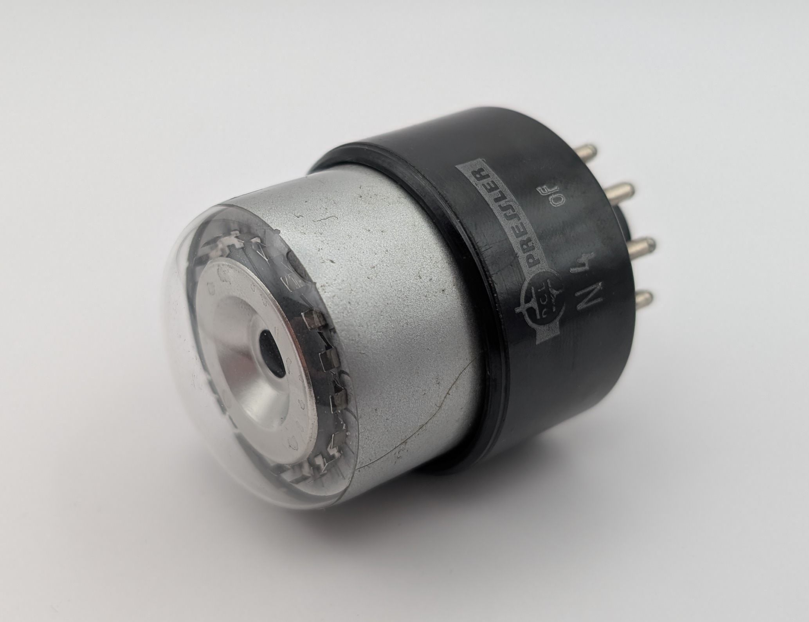

The N4 is a neon-filled decadic counting tube produced by the German company DGL Pressler (Deutsche Glimmlampen GmbH), mostly known for their special tubes. It functions in a unidirectional, single-pulse mode, with each of its ten stable cathodes accessible via separate pins. According to its datasheet, the tube is capable of up to 25,000 counts per second, making it exceptionally fast for a neon-filled Dekatron.

This unit's glass envelope is covered with a silver coating likely intended to reduce light bleeding in from the sides affecting readability. Unlike the tiny pins typically used as cathodes in Dekatrons, the N4 features small plates, which give the discharge a noticeably wider appearance. Images of a transparent version, available [here](https://www.jogis-roehrenbude.de/Roehren-Geschichtliches/Nixie/N3_N4.htm), reveal that the tube's interior is almost empty, explaining its unusually light weight. A variant of the tube featuring a smaller phenolic base was also produced under the designation N3.

It is worth noting that I believe the original datasheet for the tube contains an error in regards to the recommended anode resistor value (Ra). During my testing, a 50kΩ resistor proved to be far too small, resulting in multiple cathodes igniting simultaneously and preventing proper discharge transfer. I tested the tube with a 220kΩ resistor, which worked well, though it’s likely that even higher values could be used.

### Key Specifications

| Property          | Description       |
|-------------------|-------------------|
| Manufacturer      | DGL Pressler      |
| Time period       | 1960s             |
| Filling           | Neon              |
| Counting speed    | <25,000 c/s       |
| Envelope diameter | 36.6mm            |
| Socket            | B12A              |

### References

- [DGL Pressler N4 datasheet](assets/dgl_pressler_n4_datasheet.pdf) ([Archive](https://archive.org/details/dgl_pressler_n4_datasheet))

- [lampes-et-tubes.info](https://lampes-et-tubes.info/cd/cd060.php) ([Archive](https://web.archive.org/web/20250122205621/https://lampes-et-tubes.info/cd/cd060.php))

- [jogis-roehrenbude.de](https://www.jogis-roehrenbude.de/Roehren-Geschichtliches/Nixie/N3_N4.htm) ([Archive](https://web.archive.org/web/20240421201520/https://www.jogis-roehrenbude.de/Roehren-Geschichtliches/Nixie/N3_N4.htm))

<video controls width="100%" loop="true" autoplay="true" muted="muted">
  <source src="assets/video.mp4" type="video/mp4" />
</video>

