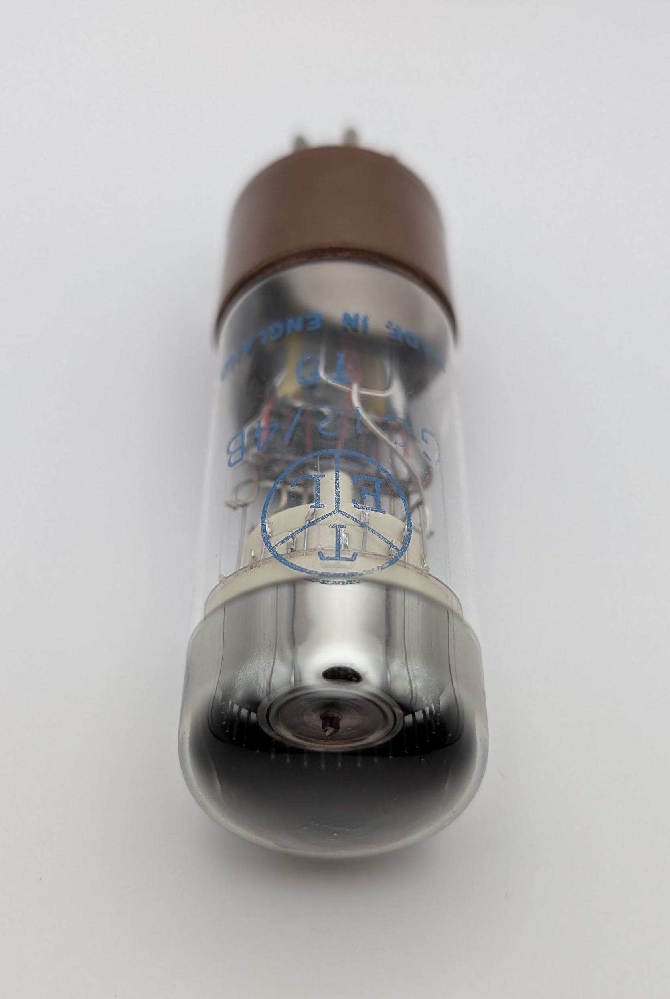
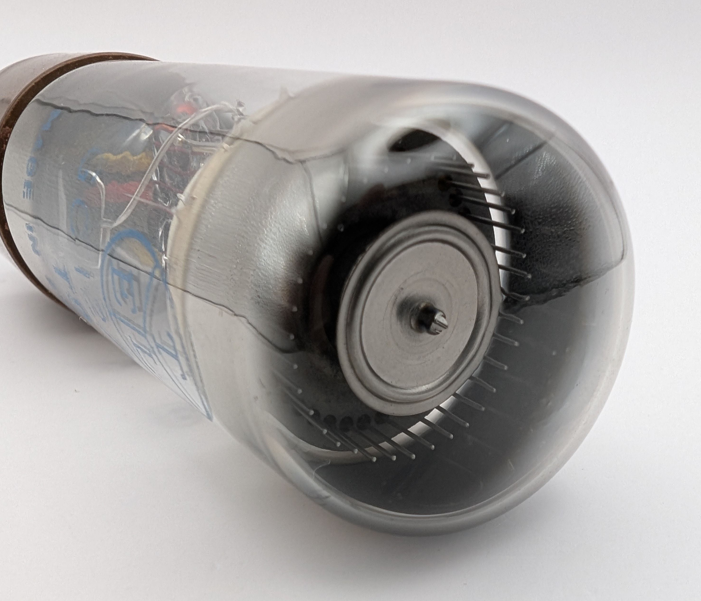

The GC12/4B is a neon-filled counting tube manufactured by ETL in Great Britain, capable of bi-directional operation and up to 4,000 counts per second. It features twelve stable cathodes, unlike the usual ten found in most Dekatrons, allowing it to count in base-12. Four of these cathodes are connected to output pins, enabling them to trigger actions such as advancing another Dekatron when active. Divide-by-12 Dekatrons like the GC12/4B were ideal for timekeeping applications since the division of hours, minutes, and seconds in a day aligns with multiples of twelve.

The GC12/4B is nearly identical to the GC10/4B, with the key distinction being that the latter has only the standard ten stable positions.

### Key Specifications

| Property          | Description       |
|-------------------|-------------------|
| Manufacturer      | ETL               |
| Time period       | ?                 |
| Filling           | Neon              |
| Counting speed    | <4,000 c/s        |
| Envelope diameter | 29.5mm            |
| Socket            | K8A               |

### References

- [ETL GC12/4B datasheet](https://www.tube-tester.com/sites/nixie/dat_arch/GC12-4B.pdf) ([Archive](https://web.archive.org/web/20240424052328/http://tube-tester.com/sites/nixie/dat_arch/GC12-4B.pdf))

- [industrialalchemy.org](https://www.industrialalchemy.org/articleview.php?item=544) ([Archive](https://web.archive.org/web/20240909174802/https://industrialalchemy.org/articleview.php?item=544))

- [lampes-et-tubes.info](http://lampes-et-tubes.info/cd/cd048.php?l) ([Archive](https://web.archive.org/web/20250120014754/http://lampes-et-tubes.info/cd/cd048.php?l))

- [tube-tester.com](https://www.tube-tester.com/sites/nixie/datdekat/GC12-4B_ETL/gc12-4b-etl.htm) ([Archive](https://web.archive.org/web/20240615074824/https://www.tube-tester.com/sites/nixie/datdekat/GC12-4B_ETL/gc12-4b-etl.htm))

- [radiomuesum.org](https://www.radiomuseum.org/tubes/tube_gc124b.html) ([Archive](https://web.archive.org/web/20210917182619/https://www.radiomuseum.org/tubes/tube_gc124b.html))

<video controls width="100%" loop="true" autoplay="true" muted="muted">
  <source src="assets/video.mp4" type="video/mp4" />
</video>