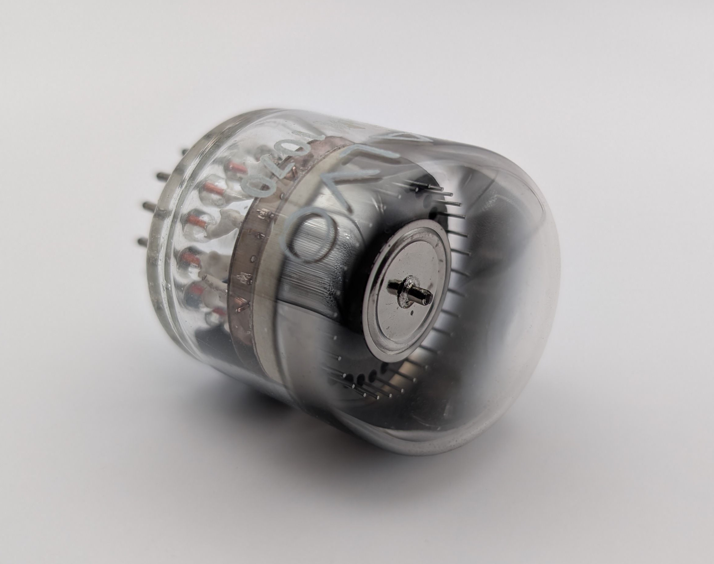
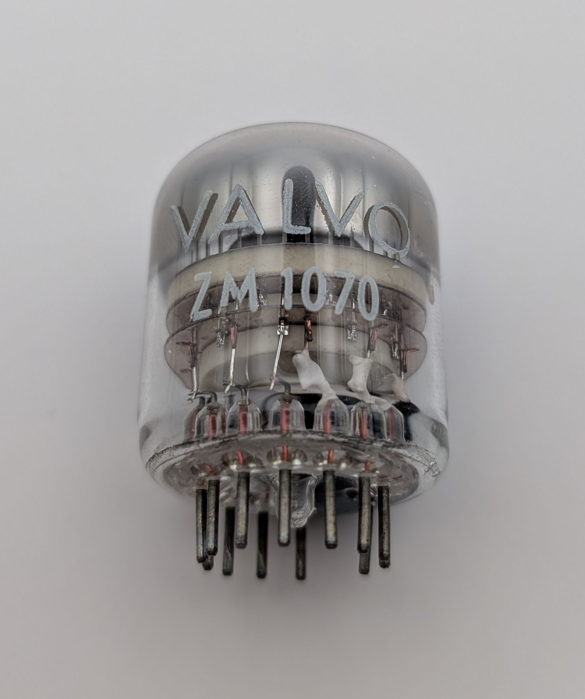
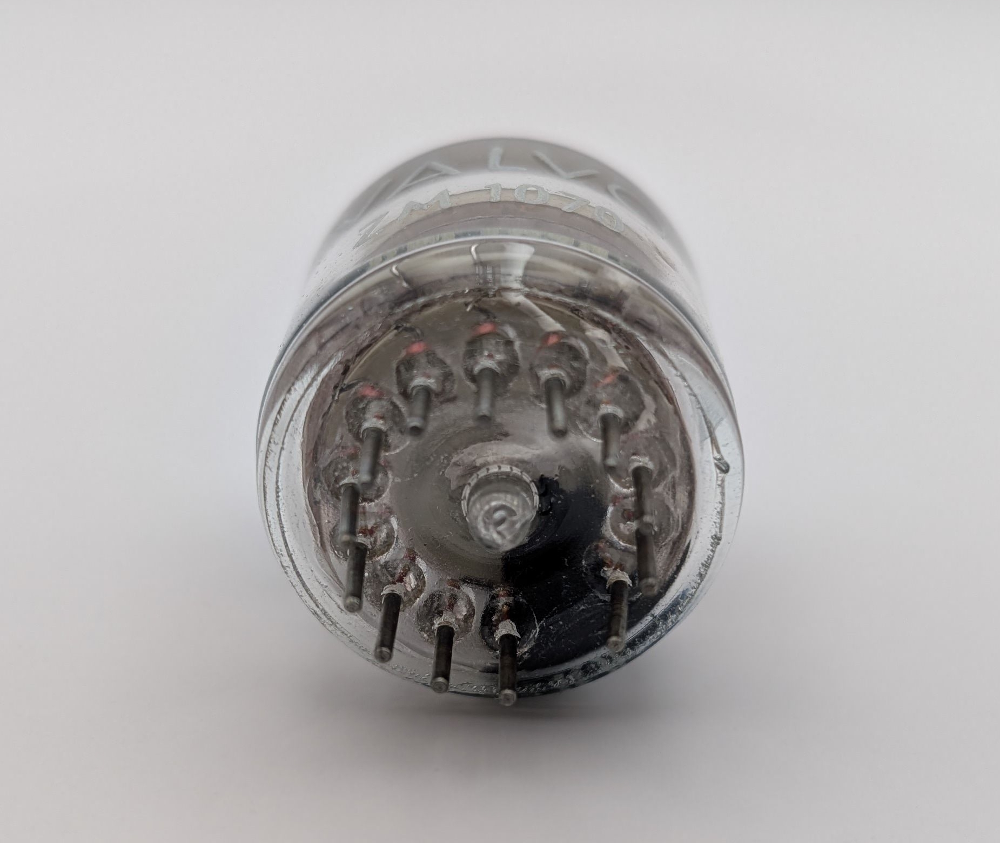
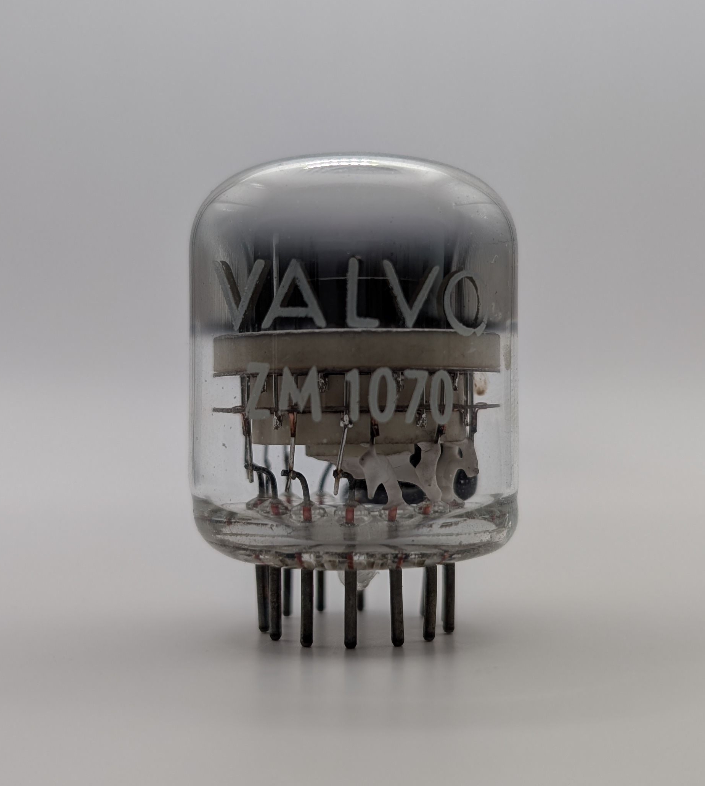
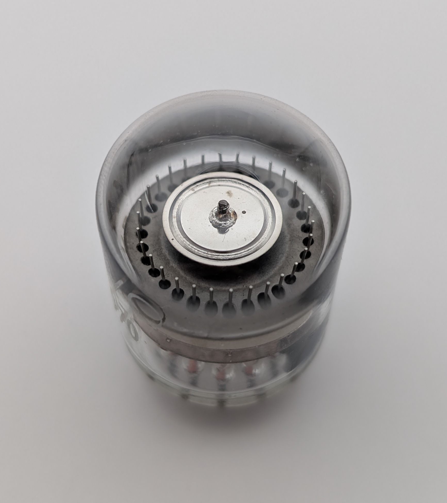
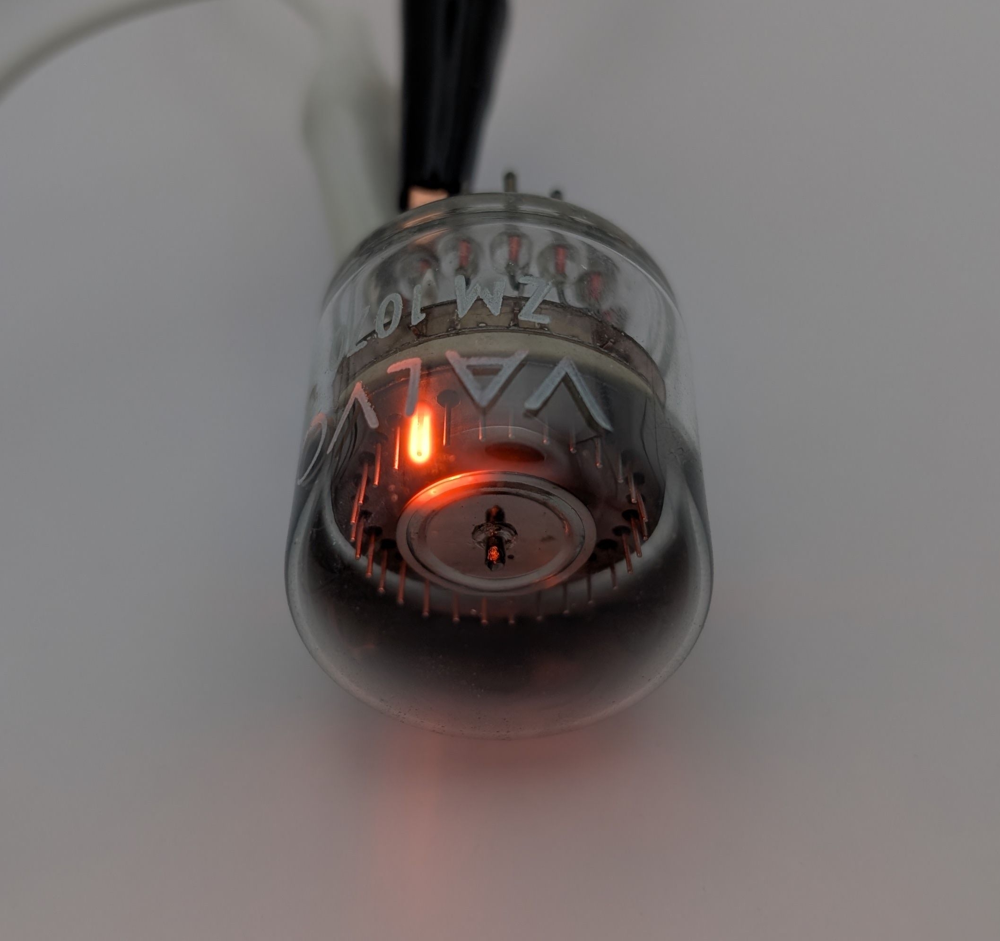
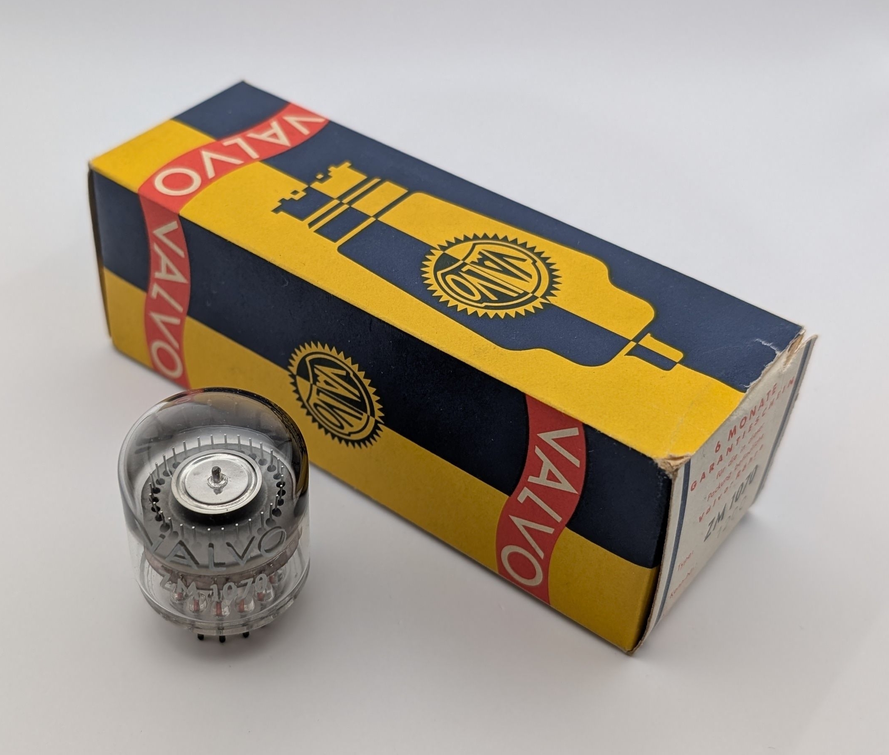

The ZM1070 is a neon-filled, double-pulse decadic counting tube manufactured by Valvo in Germany. It supports bi-directional counting and operates at speeds of up to 5,000 counts per second. Each of its ten stable cathodes is connected to a separate pin, allowing external actions to be triggered when a specific cathode is active. This design also enables the tube to be reset to any of its ten positions by applying a brief negative pulse to the desired electrode.

Compared to many other Dekatron tubes, such as the GC12/4B and GC10B/S from ETL in Great Britain, the ZM1070 features a more compact form factor. This makes it particularly well-suited for use in Nixie clocks, where Dekatrons are often employed as seconds indicators.

The equivalent British tube is the Z504S, which was manufactured by Mullard and other companies.

### Key Specifications

| Property          | Description       |
|-------------------|-------------------|
| Manufacturer      | Valvo             |
| Time period       | mid 1960s         |
| Filling           | Neon              |
| Counting speed    | <5,000 c/s        |
| Envelope diameter | ~28.5mm           |
| Envelope height   | ~34mm             |
| Socket            | B13B              |

### References

- [Valvo ZM1070 datasheet](https://www.tube-tester.com/sites/nixie/dat_arch/ZM1070_Z504S.pdf) ([Archive](https://web.archive.org/web/20241007102727/https://www.tube-tester.com/sites/nixie/dat_arch/ZM1070_Z504S.pdf))

- [tube-tester.com](https://www.tube-tester.com/sites/nixie/datdekat/z504s/zm1070.htm) ([Archive](https://web.archive.org/web/20250323043915/https://www.tube-tester.com/sites/nixie/datdekat/z504s/zm1070.htm))

- [jogis-roehrenbude.de](https://www.jogis-roehrenbude.de/Roehren-Geschichtliches/Nixie/ZM1070.htm) ([Archive](https://web.archive.org/web/20240421201503/https://www.jogis-roehrenbude.de/Roehren-Geschichtliches/Nixie/ZM1070.htm))

- [radiomuesum.org](https://www.radiomuseum.org/tubes/tube_zm1070.html) ([Archive](https://web.archive.org/web/20250301070200/https://www.radiomuseum.org/tubes/tube_zm1070.html))

<video controls width="100%" loop="true" autoplay="true" muted="muted">
  <source src="assets/video.mp4" type="video/mp4" />
</video>

