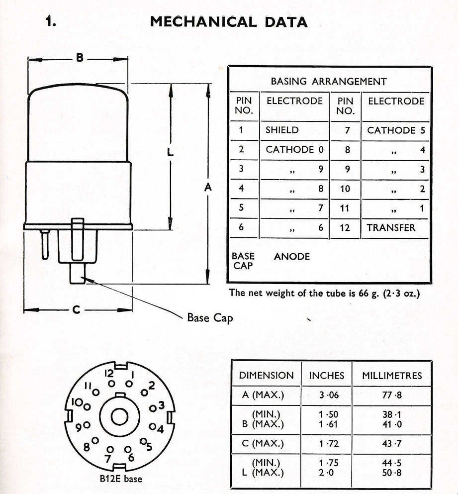
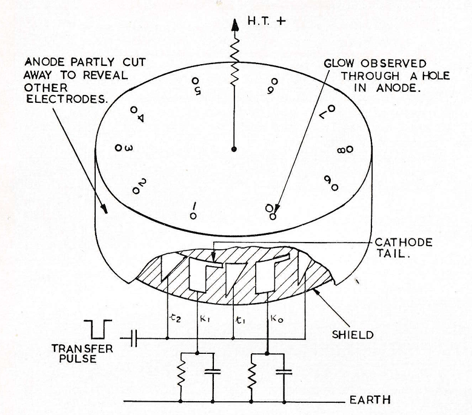
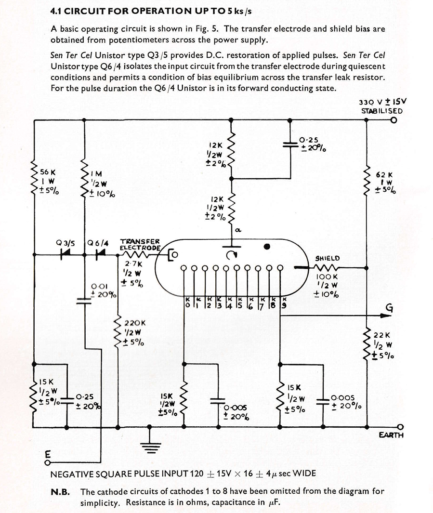

This document details the design, functionality, and application of the STC G10-241E Nomotron, a unidirectional single pulse counting and display tube. It describes its operation and highlights its applications in areas such as tachometry, counting and batching, and frequency and time measurement. Besides a general overview over its mechanism of operation, it also contains detailed diagrams of the tube and example circuits for many of its aforementioned use cases.

Detail pictures of the G10/241E can be found [here](/nomotron/stc-g10-241e/).

### Chapters

| Chapter                      |
|------------------------------|
| Mechanical Data              |
| Electrical Data              |
| Basic Mechanism of Operation |
| Principal Circuits and Note  |
| Auxiliary Circuits and Notes |
| Applications                 |
| References                   |

### Download

- [STC Valves Application Report G10-241E Nomotron.pdf](assets/STC%20Valves%20Application%20Report%20G10-241E%20Nomotron.pdf) ([Archive](https://archive.org/details/stc-valves-application-report-g-10-241-e-nomotron))

### Excerpts

