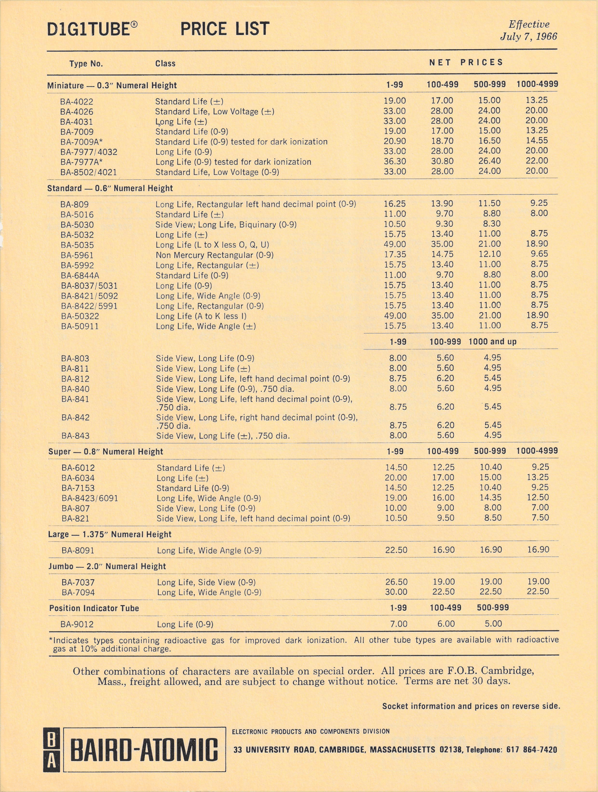
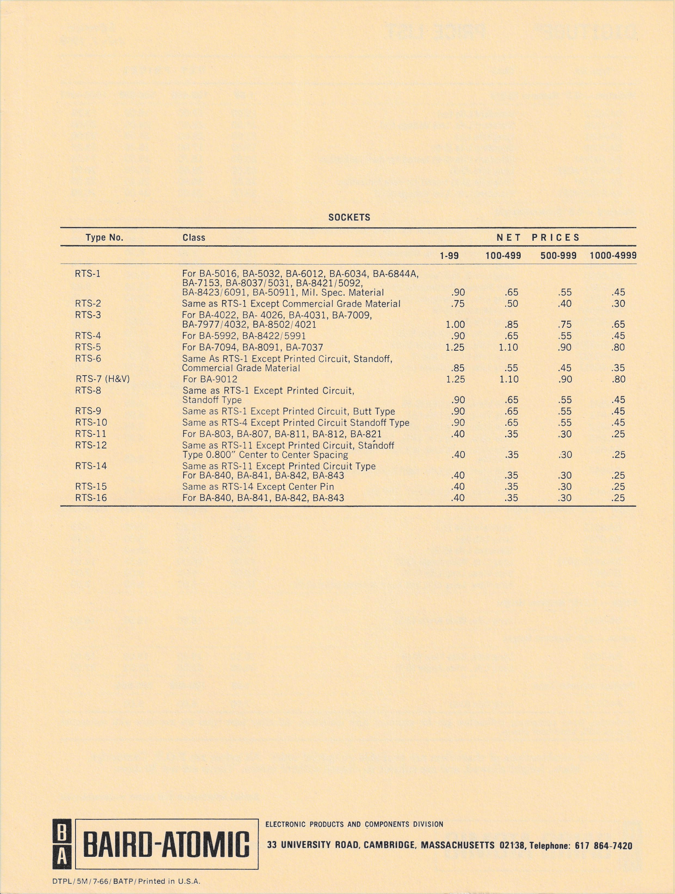

This document presents a price list of various common types of Nixie tubes and their corresponding sockets offered by Baird Atomic, effective July 7, 1966. The Nixie tubes were manufactured by National Electronics and distributed by Baird Atomic. Equivalent tubes were sold by National Electronics with the prefix 'NL' instead of 'BA'.

As of July 25, 2025, the cumulative inflation rate of the U.S. dollar since 1966 is approximately 900%. To adjust the listed prices for inflation, multiply each by ten.

**Miniature - 0.3" Numeral Height**
| Type No       | Class                                                        | 1966   | 2025    |
|---------------|--------------------------------------------------------------|--------|---------|
| BA-4022       | Standard Life (+/-)                                          | $19.00 | $190.00 |
| BA-4026       | Standard Life, Low Voltage (+/-)                             | $33.00 | $330.00 |
| BA-4031       | Long Life (+/-)                                              | $33.00 | $330.00 |
| BA-7009       | Standard Life (0-9)                                          | $19.00 | $190.00 |
| BA-7009A*     | Standard Life (0-9) tested for dark ionization               | $20.90 | $209.00 | 
| BA-7977/4032  | Long Life (0-9)                                              | $33.00 | $330.00 |
| BA-7977A*     | Long Life (0-9) tested for dark ionization                   | $36.30 | $363.00 |
| BA-8502/4021  | Standard Life, Low Voltage (0-9)                             | $33.00 | $330.00 |

**Standard - 0.6" Numeral Height**
| Type No       | Class                                                           | 1966   | 2025    | 
|---------------|-----------------------------------------------------------------|--------|---------|
| BA-8O9        | Long Life, Rectangular left hand decimal point (0-9)            | $16.25 | $162.50 | 
| BA-5016       | Standard Life (+/-)                                             | $11.00 | $110.00 |
| BA-5030       | Side View; Long Life, Biquinary (0-9)                           | $10.50 | $105.00 |
| BA-5032       | Long Life (+/-)                                                 | $15.75 | $157.50 |
| BA-5035       | Long Life (L to X less O, Q, U)                                 | $49.00 | $490.00 |
| BA-5961       | Non Mercury Rectangular (0-9)                                   | $17.35 | $173.50 |
| BA-5992       | Long Life, Rectangular (+/-)                                    | $15.75 | $157.50 |
| BA-6844A      | Standard Life (0-9)                                             | $11.00 | $110.00 |
| BA-8037/5031  | Long Life (0-9)                                                 | $15.75 | $157.50 |
| BA-8421/5092  | Long Life, Wide Angle (0-9)                                     | $15.75 | $157.50 |
| BA-8422/5991  | Long Life, Rectangular (0-9)                                    | $15.75 | $157.50 |
| BA-50322      | Long Life (A to K less I)                                       | $49.00 | $490.00 |
| BA-50911      | Long Life, Wide Angle (+/-)                                     | $15.75 | $157.50 |
| BA-803        | Side View, Long Life (0-9)                                      | $8.00  | $80.00  |
| BA-811        | Side View, Long Life (+/-)                                      | $8.00  | $80.00  |
| BA-812        | Side View, Long Life, left hand decimal point (0-9)             | $8.75  | $87.50  |
| BA-840        | Side View, Long Life (0-9), .750 dia.                           | $8.00  | $80.00  |
| BA-841        | Side View, Long Life, left hand decimal point (0-9), .750 dia.  | $8.75  | $87.50  |
| BA-842        | Side View, Long Life, right hand decimal point (0-9), .750 dia. | $8.75  | $87.50  |
| BA-843        | Side View, Long Life (+/-), .750 dia.                           | $8.00  | $80.00  |

**Super - 0.8" Numeral Height**
| Type No       | Class                                                        | 1966   | 2025     |
|---------------|--------------------------------------------------------------|--------|----------|
| BA-6012       | Standard Life (+/-)                                          | $14.50 | $145.00  |
| BA-6034       | Long Life (+/-)                                              | $20.00 | $200.00  |
| BA-7153       | Standard Life (0-9)                                          | $14.50 | $145.00  |
| BA-8423/6091  | Long Life, Wide Angle (0-9)                                  | $19.00 | $190.00  |
| BA-807        | Side View, Long Life (0-9)                                   | $10.00 | $100.00  |
| BA-821        | Side View, Long Life, left hand decimal point (0-9)          | $10.50 | $105.00$ |

**Large - 1.375" Numeral Height**
| Type No       | Class                                                        | 1966   | 2025    |
|---------------|--------------------------------------------------------------|--------|---------|
| BA-8091       | Long Life, Wide Angle (0-9)                                  | $22.50 | $225.00 |

**Jumbo - 2.0" Numeral Height**
| Type No       | Class                                                        | 1966   | 2025    |
|---------------|--------------------------------------------------------------|--------|---------|
| BA-7037       | Long Life, Side View (0-9)                                   | $26.50 | $265.00 |
| BA-7094       | Long Life, Wide Angle (0-9)                                  | $30.00 | $300.00 |

**Position lndicator Tube**
| Type No       | Class                                                        | 1966   | 2025   |
|---------------|--------------------------------------------------------------|--------|--------|
| BA-9012       | Position Indicator Tube, Long Life (0-9)                     | 7.00   | $70.00 |

### Download

- [baird-atomic-nixie-price-list.pdf](assets/baird-atomic-nixie-price-list.pdf) ([Archive](https://archive.org/details/baird-atomic-nixie-price-list))

### Excerpts

