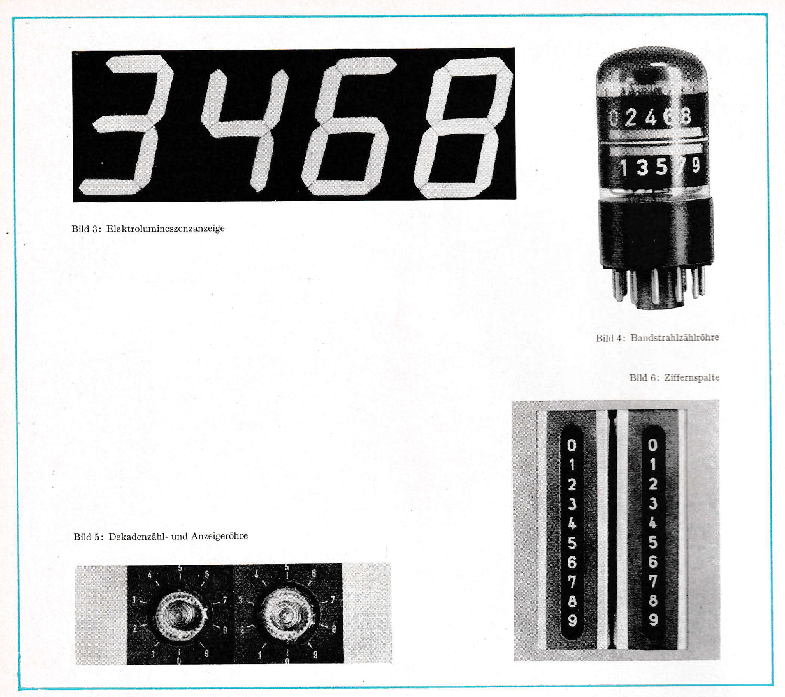
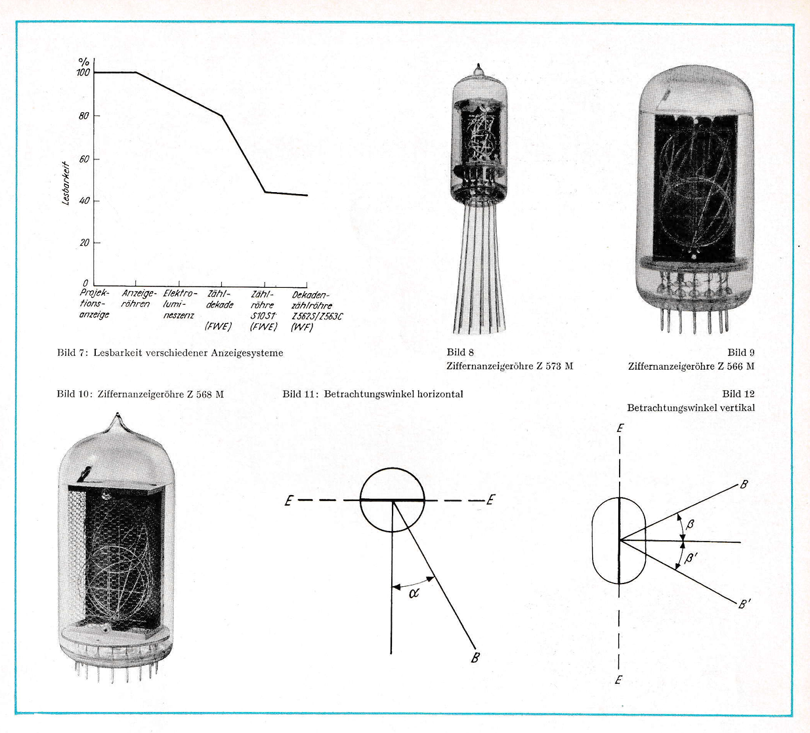
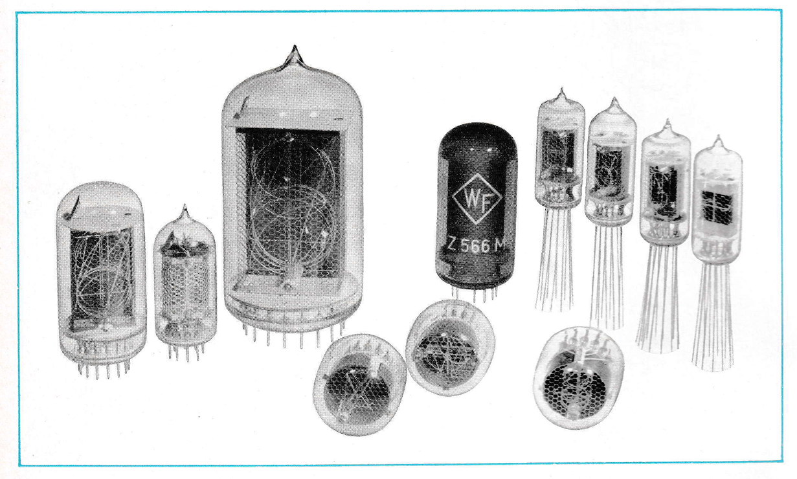
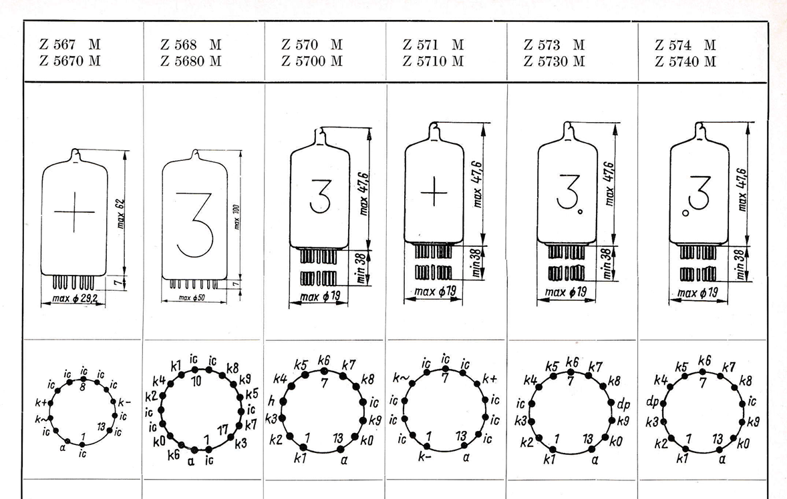

**English title**: Notes on the use of indicator tubes

This document contains information on various East German display tubes and examines their respective areas of application as well as their advantages and disadvantages. In particular, the different operating modes of Nixie tubes are discussed. At the end of the document the technical data of some common Nixie tubes can be found.

The content of the booklet differs from that of the similarly titled "Hinweise zur Anwendung von Anzeigeröhren - Sonderausgabe 3/1968".

### Chapters

| Original name                                                                                     | Translated name                                                                               |
|---------------------------------------------------------------------------------------------------|-----------------------------------------------------------------------------------------------|
| Anzeigeröhren - ihre Vorteile und Anwendungsmöglichkeiten                                         | Display tubes - their advantages and possible applications                                    |
| Ansteuerung von Ziffernanzeigeröhren durch Transistoren unter Berücksichtigung der Sonderspannung | Control of digit display tubes by transistors under consideration of special voltage          |
| Hinweise zum Betrieb gasgefüllter Anzeigeröhren mit Gleichspannung                                | Notes on operating gas-filled indicator tubes with DC voltage                                 |
| Halbwellenbetrieb von gasgefüllten Anzeigeröhren                                                  | Half-wave operation of gas-filled display tubes                                               |
| Hinweise zum Pulsbetrieb von Anzeigeröhren                                                        | Notes on pulse operation of display tubes                                                     |
| Betrachtung zum Parallel- und Zeitmultiplex-Betrieb von Anzeigeröhren                             | Consideration of parallel and time-division multiplex operation of display tubes              |
| Der Zähl- und Anzeigebaustein A 1 H/Z 1 bzw. A 1 V/Z 1                                            | The counter and display module A 1 H/Z 1 or A 1 V/Z 1                                         |
| Ein Netzteil zur Stromversorgung des Zähl- und Anzeigebausteins A 1 H/Z 1 bzw. A 1 V/Z 1          | A power supply unit to provide power to the counter and display module A 1 H/Z 1 or A 1 V/Z 1 |
| Anzeigeröhren zur Stockwerkanzeige für Aufzüge                                                    | Display tubes for the floor display of elevators                                              |

### Download

- [Hinweise zur Anwendung von Anzeigeröhren.pdf](assets/Hinweise%20zur%20Anwendung%20von%20Anzeigeröhren.pdf) ([Archive](https://archive.org/details/hinweise-zur-anwendung-von-anzeigerohren))

### Excerpts

