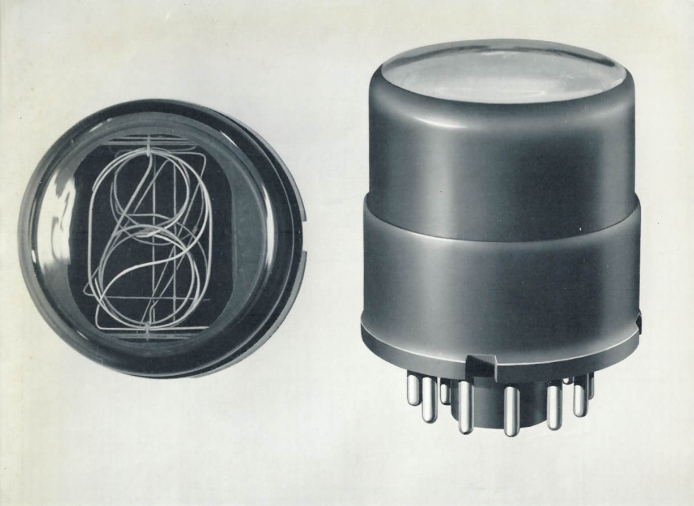
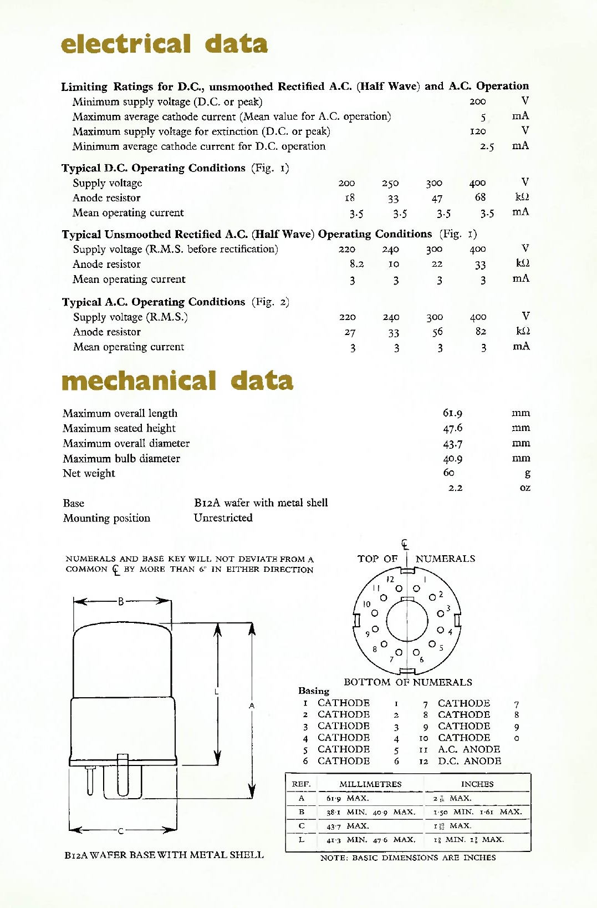

This document provides information on STC's GN-1 Nixie tube. It includes a datasheet outlining the electrical specifications for both DC and rectified AC operation, as well as mechanical details such as tube dimensions and digit height. Additionally, it features circuit diagrams illustrating how the tube can be used in conjunction with the [G10/241E counting tube](https://display-tubes.org/nomotron/stc-g10-241e/). This document describes a very early version of the GN-1 without an anode grid. Later units included one, likely to achieve more even illumination.

Pictures of the STC GN-1 can be found [here](/nixie/stc-gn-1/).

The scan of this document was provided to me by Paduraru Bogdan.

### Download

- [numeral-indicator-tube-type-gn-1.pdf](assets/numeral-indicator-tube-type-gn-1.pdf) ([Archive](https://archive.org/details/numeral-indicator-tube-type-gn-1))

### Excerpts

