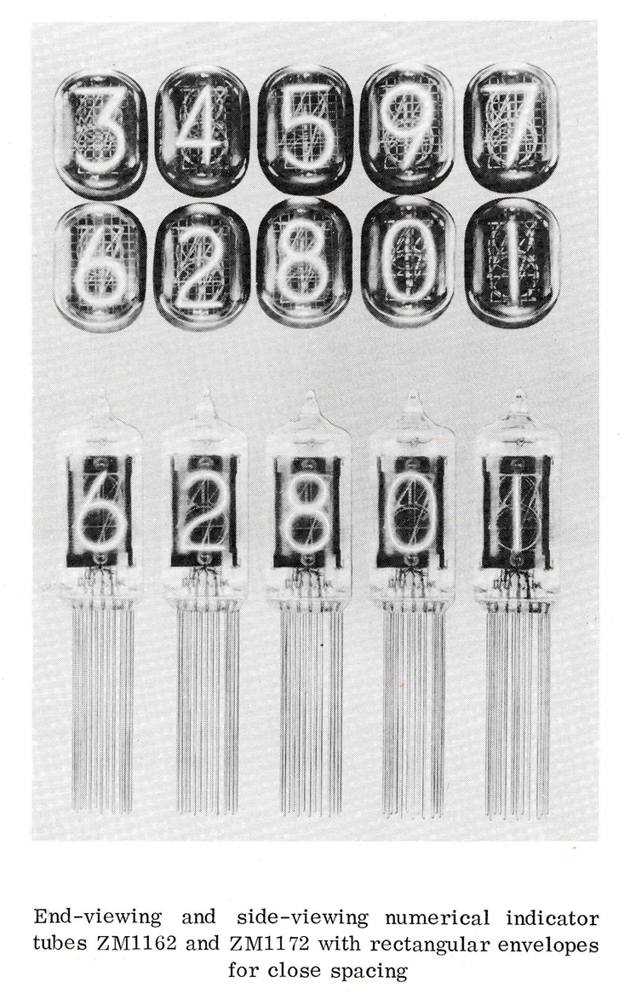
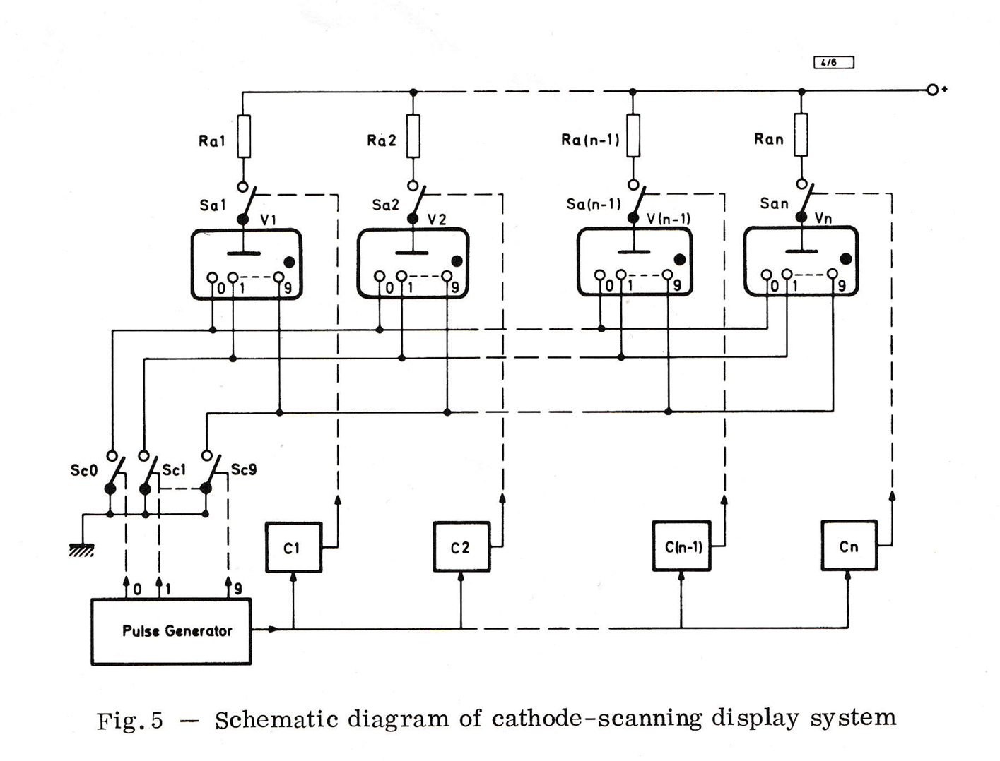
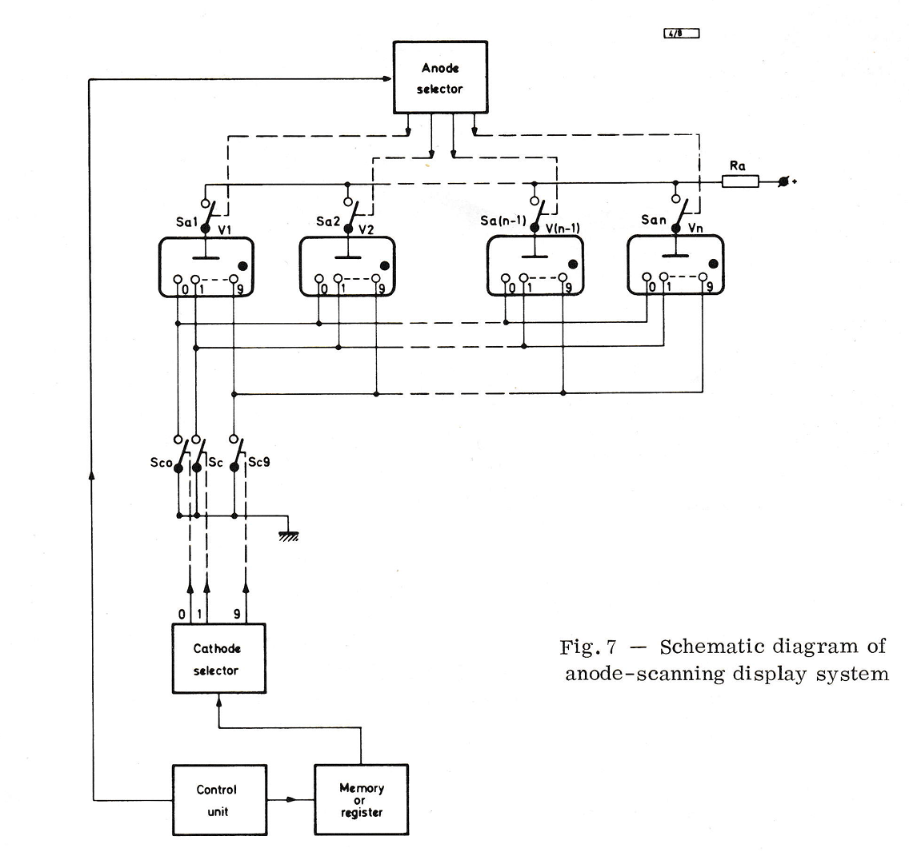

This document released by Mullard explains the operating principles of glow discharge tubes and their internal construction. Additionally, it includes schematics for various applications, beginning with a simple static display and progressing to two different approaches for implementing a multiplexed display. In addition to describing the anode-scanning method, which is the most widely used approach today, it also presents an alternative cathode-scanning technique and discusses the various drawbacks associated with this method.

### Download

- [numerical-indicator-tubes-application-note.pdf](assets/numerical-indicator-tubes-application-note.pdf) ([Archive](https://archive.org/details/numerical-indicator-tubes-application-note))

### Excerpts

