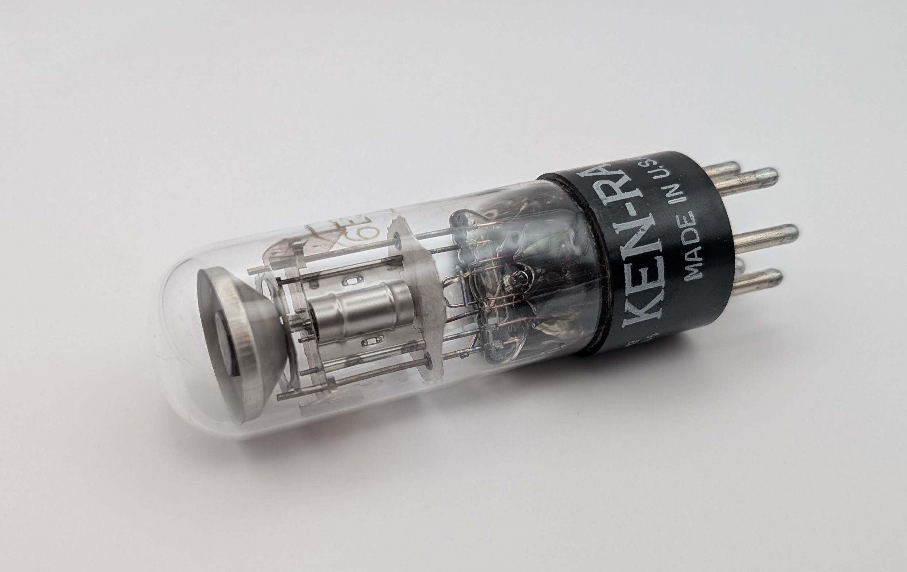
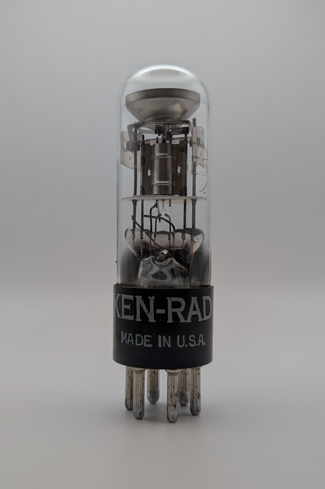
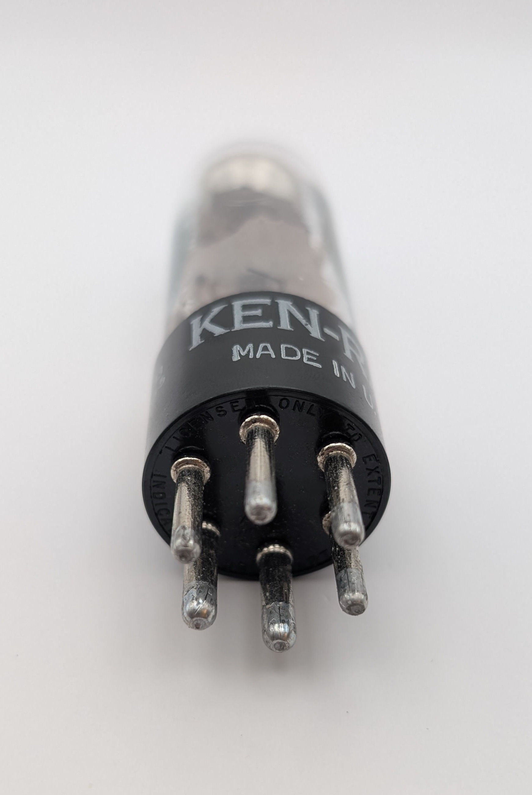
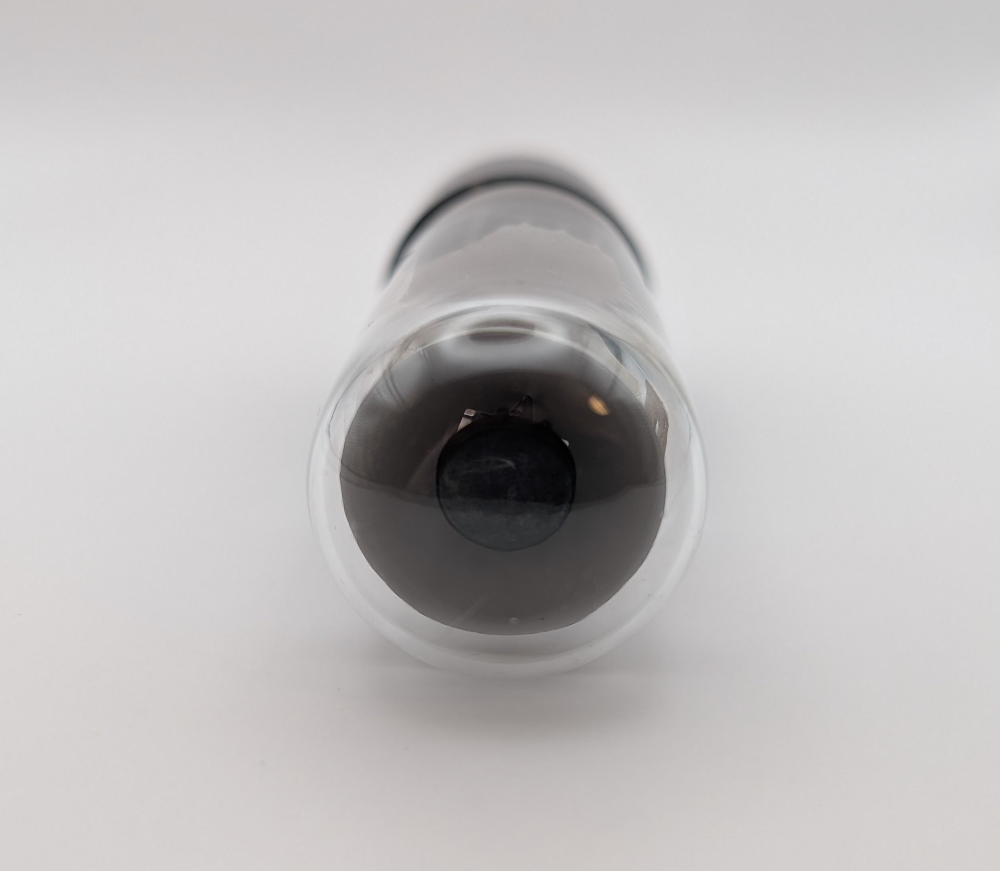
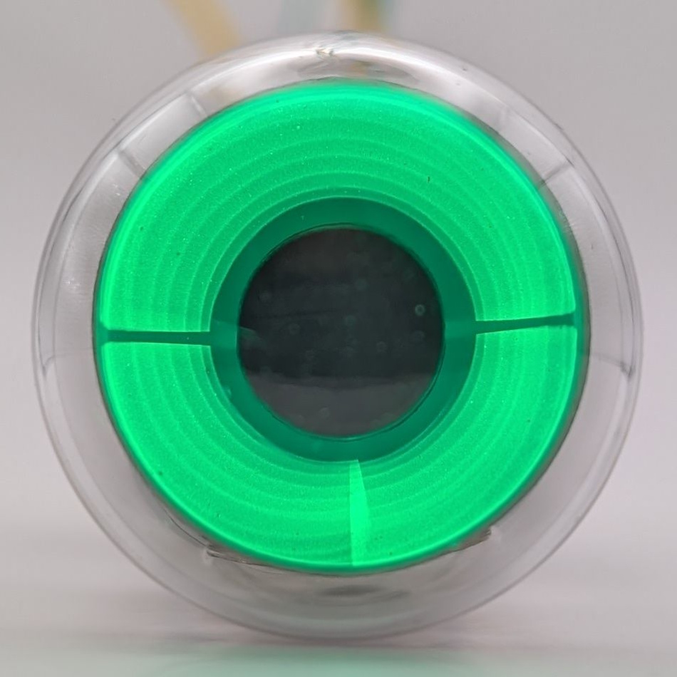
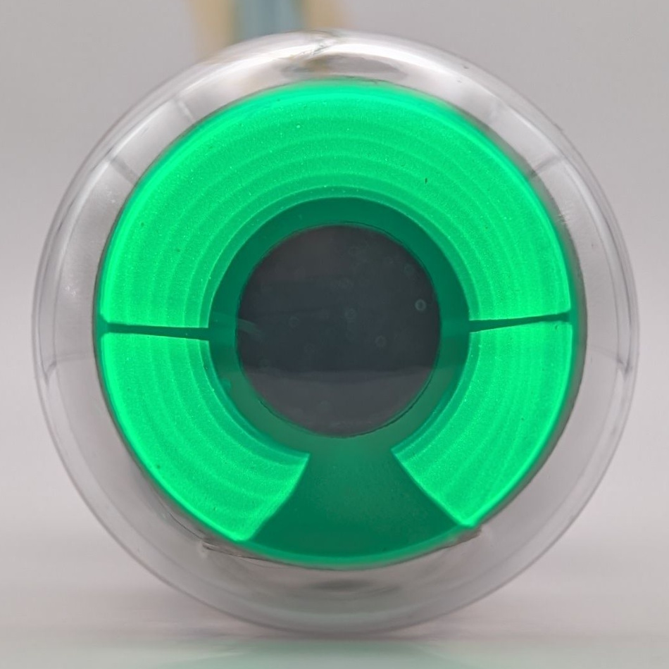
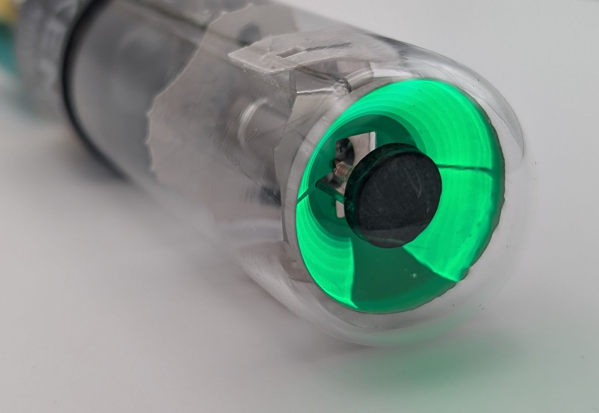
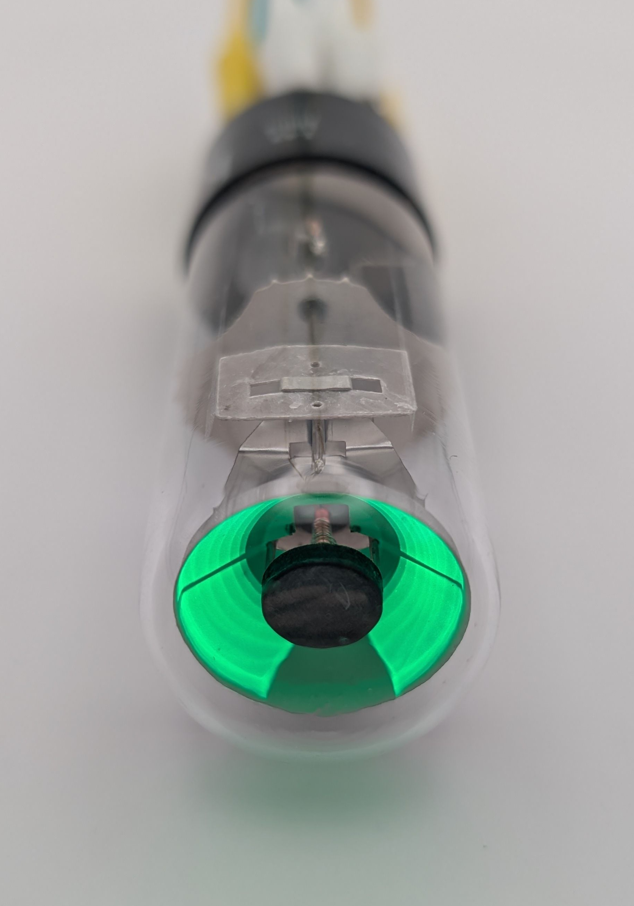
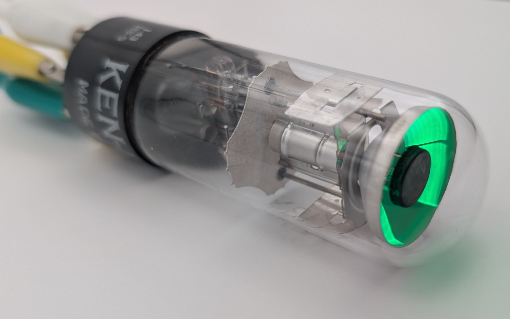
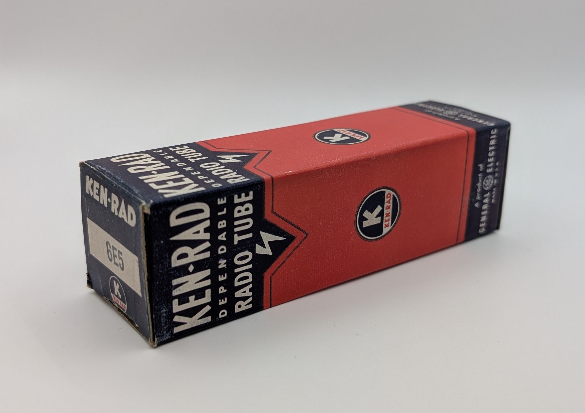

The 6E5 is one of the earliest examples of a magic eye tube, invented in 1932 by American electrical engineer Alan DuMont. Designed as a cost-effective alternative to expensive needle indicators, it was intended for use in devices like radios that required user tuning without high precision. The first commercially available 6E5 tubes, sold by RCA starting in 1935, featured a coke-bottle-shaped glass envelope common in early vacuum tubes.

Unlike more modern magic eye tubes, the 6E5 has a relatively simple display characteristic, consisting of a single shadow that expands or contracts based on the supplied input voltage.

Several variations of the 6E5 were developed, including the 6G5 and 6U5, which introduced minor differences in sensitivity and design. This particular unit was manufactured by KEN-RAD, though other companies such as RCA, Sylvania, and Tung-Sol also produced the tube.

### Key Specifications

| Property          | Description |
|-------------------|-------------|
| Manufacturer      | RCA/various |
| Time period       | 1930s       |
| Envelope diameter | ~30mm       |
| Envelope height   | ~65mm       |
| Socket            | U6A         |

### References

- [6E5 datasheet](https://frank.pocnet.net/sheets/201/6/6E5.pdf) ([Archive](https://web.archive.org/web/20230204023545/https://frank.pocnet.net/sheets/201/6/6E5.pdf))

- [Wikipedia](https://en.wikipedia.org/wiki/Magic_eye_tube) ([Archive](https://web.archive.org/web/20241210094135/https://en.wikipedia.org/wiki/Magic_eye_tube))

- [industrialalchemy.org](https://www.industrialalchemy.org/articleview.php?item=1065) ([Archive](https://web.archive.org/web/20240909192620/https://industrialalchemy.org/articleview.php?item=1065))

- [radiomuseum.org](https://www.radiomuseum.org/tubes/tube_6e5.html) ([Archive](https://web.archive.org/web/20241009111552/https://www.radiomuseum.org/tubes/tube_6e5.html))

- [jogis-roehrenbude.de](https://www.jogis-roehrenbude.de/Roehren-Geschichtliches/Mag_Augen/Mag_Augen2/6E5.htm) ([Archive](https://web.archive.org/web/20241128134313/https://www.jogis-roehrenbude.de/Roehren-Geschichtliches/Mag_Augen/Mag_Augen2/6E5.htm))

<video controls width="100%" loop="true" autoplay="true" muted="muted">
  <source src="assets/video.mp4" type="video/mp4" />
</video>

<table>
    <tr>
        <td>
            
        </td>
        <td>
            
        </td>
    </tr>
</table>

