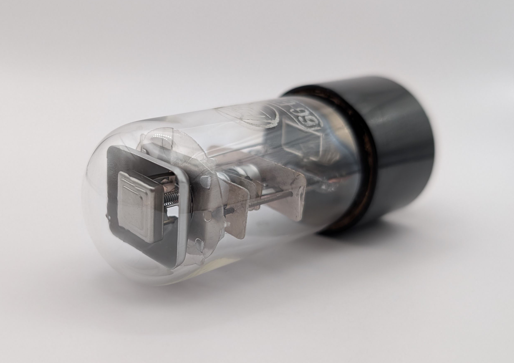
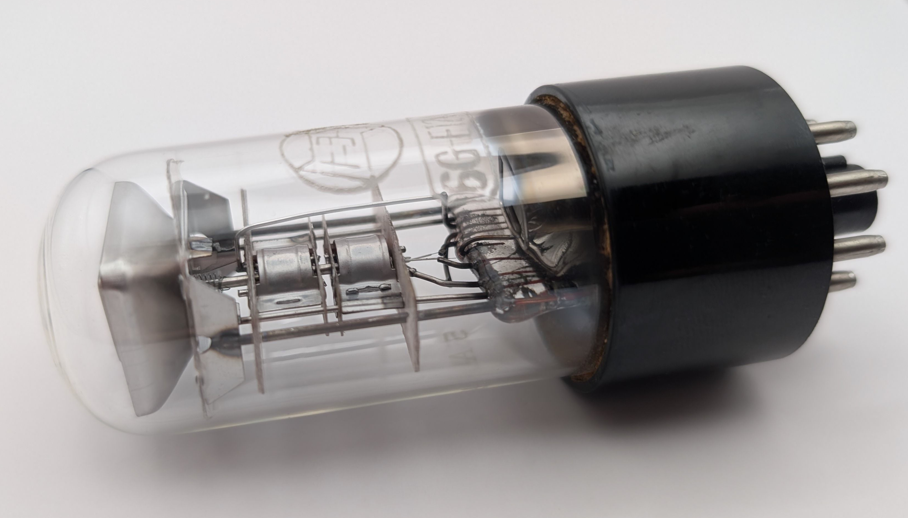
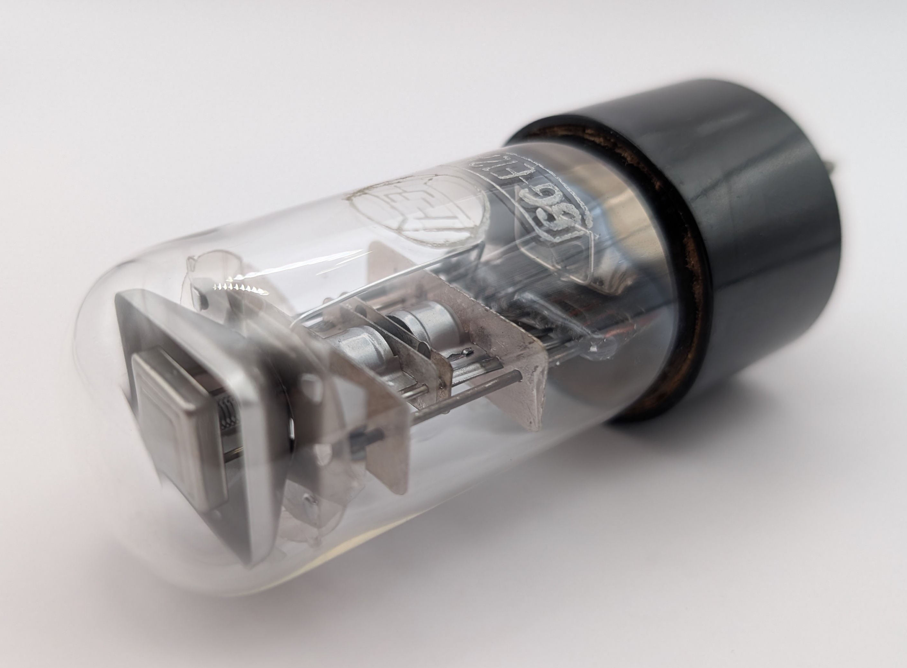
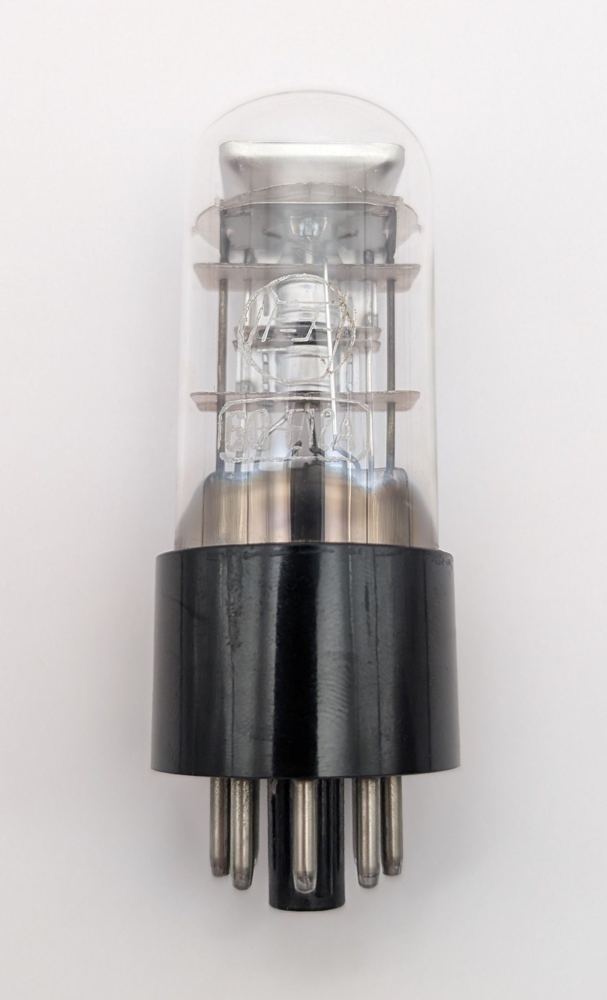
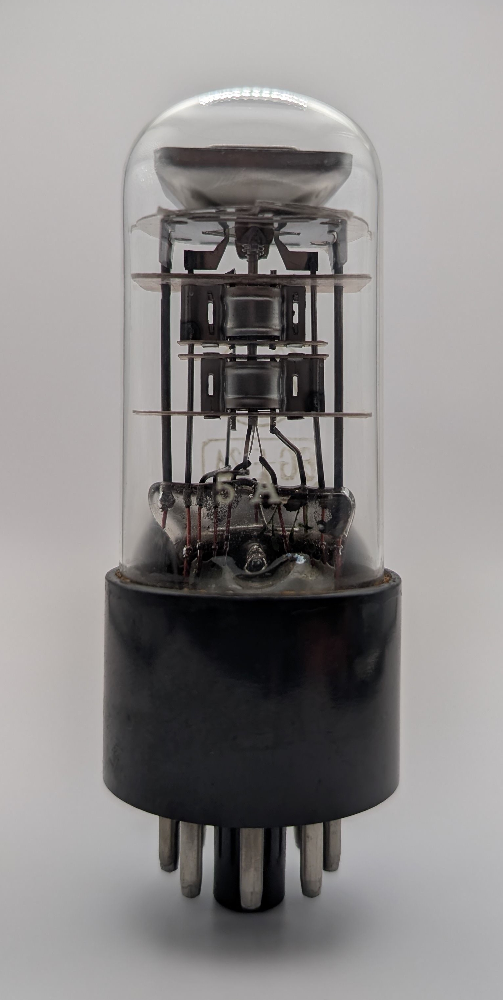
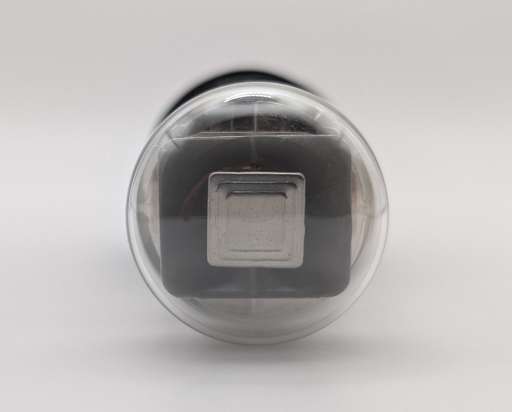
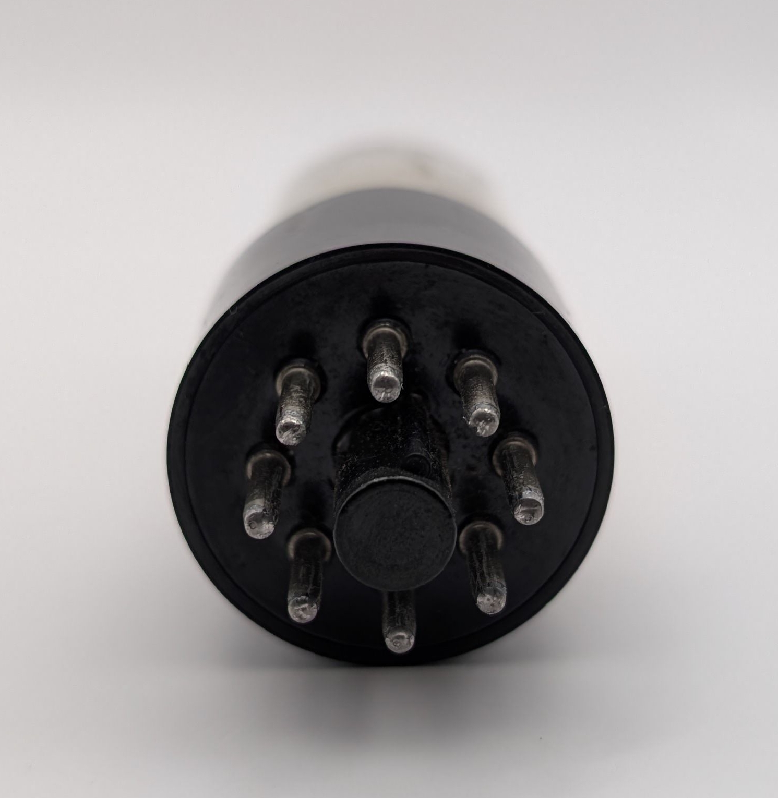
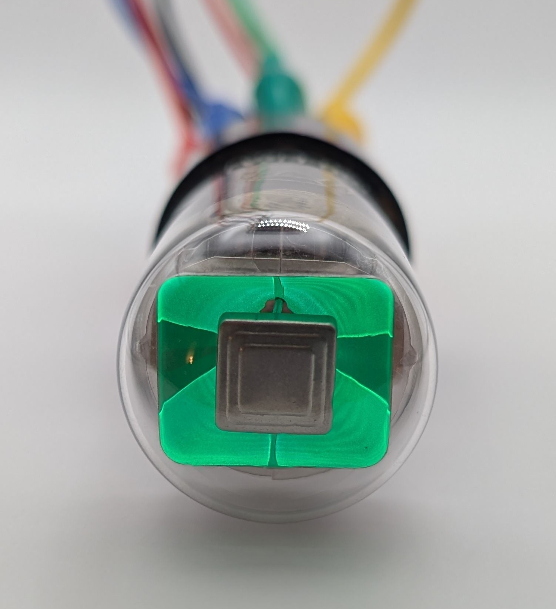
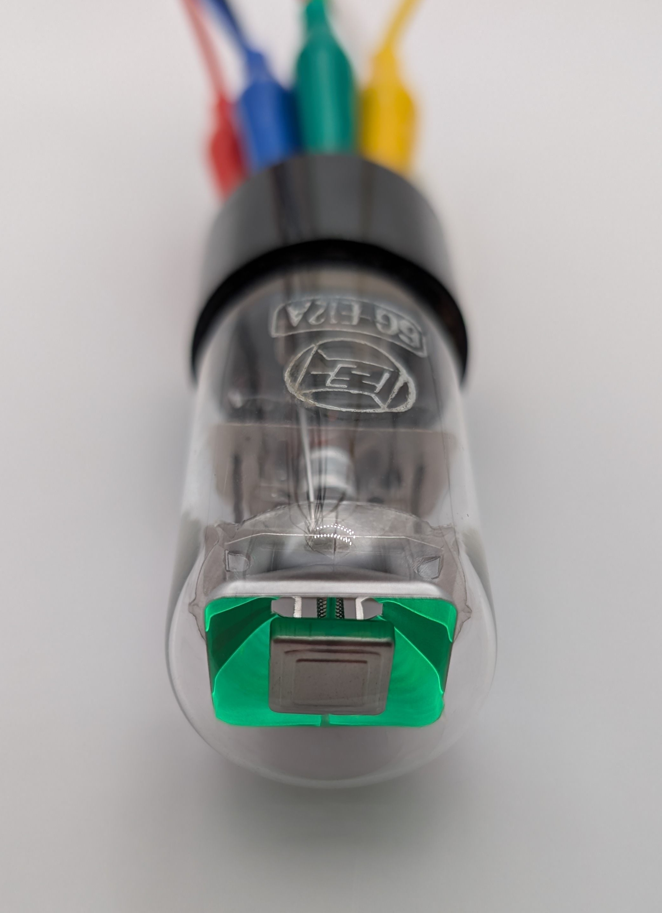
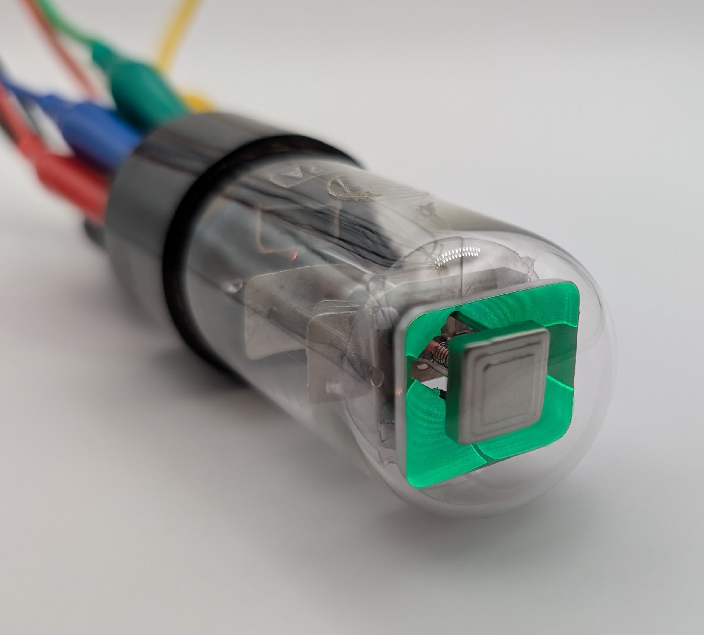

The 6G-E12A is peculiar magic eye tube manufactured by the Japanese company TOYO. Unlike most top-viewing magic eyes tubes, such as the common [6E5](/magic-eye/ken-rad-6e5/), which feature circular screens, the 6G-E12A's screen is rectangular. It is the successor to the 6G-E12 tube, which features a similar rectangular screen design but has a different display characteristic.

The 6G-E12A is a so-called double indicator tube, meaning it has two independently controlled shadow angles. This allows it to visualize two signals simultanously which made it particularly suitable for FM stereo indication. For simplicity, I connected both channels together in the video shown below.

Very few devices ever made use of the 6G-E12A, and as a result, it is now quite hard to find.

### Key Specifications

| Property          | Description |
|-------------------|-------------|
| Manufacturer      | TOYO        |
| Time period       | 1960s       |
| Envelope diameter | ~29mm       |
| Envelope height   | ~50mm       |
| Base diamater     | ~32mm       |
| Base height       | ~22mm       |
| Socket            | K8A         |

### References

- [radiomuseum.org](https://www.radiomuseum.org/tubes/tube_6ge12a.html) ([Archive](https://web.archive.org/web/20250224045348/https://www.radiomuseum.org/tubes/tube_6ge12a.html))

- [lampes-et-tubes.info](https://lampes-et-tubes.info/ti/ti013.php) ([Archive](https://web.archive.org/web/20190911063916/http://lampes-et-tubes.info/ti/ti013.php))

<video controls width="100%" loop="true" autoplay="true" muted="muted">
  <source src="assets/video.mp4" type="video/mp4" />
</video>