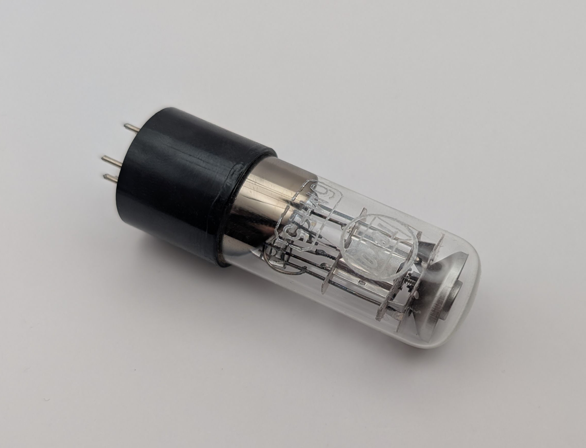
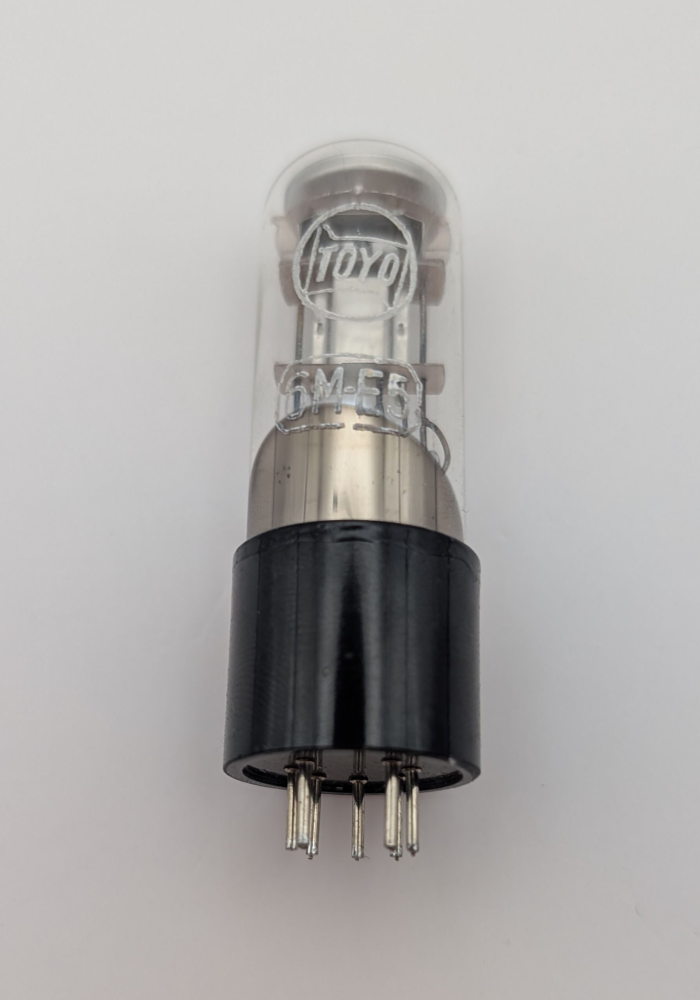
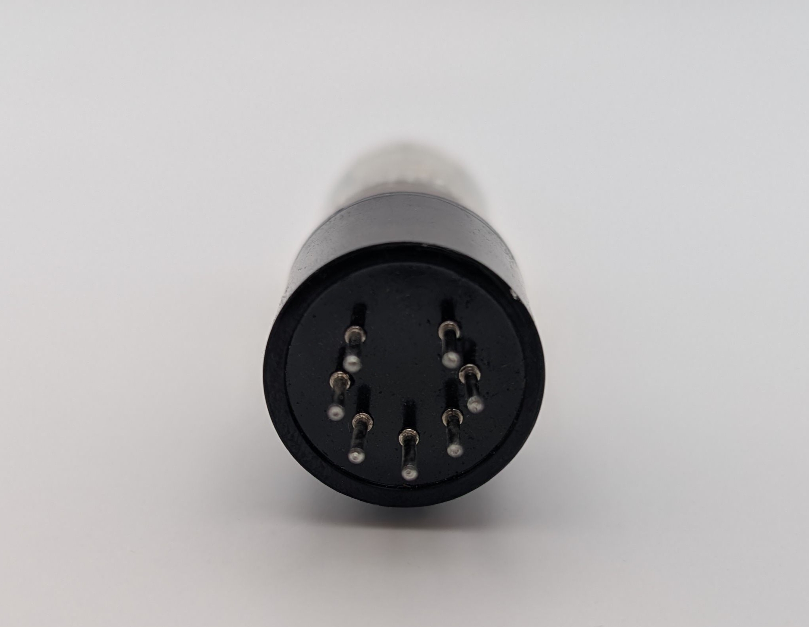
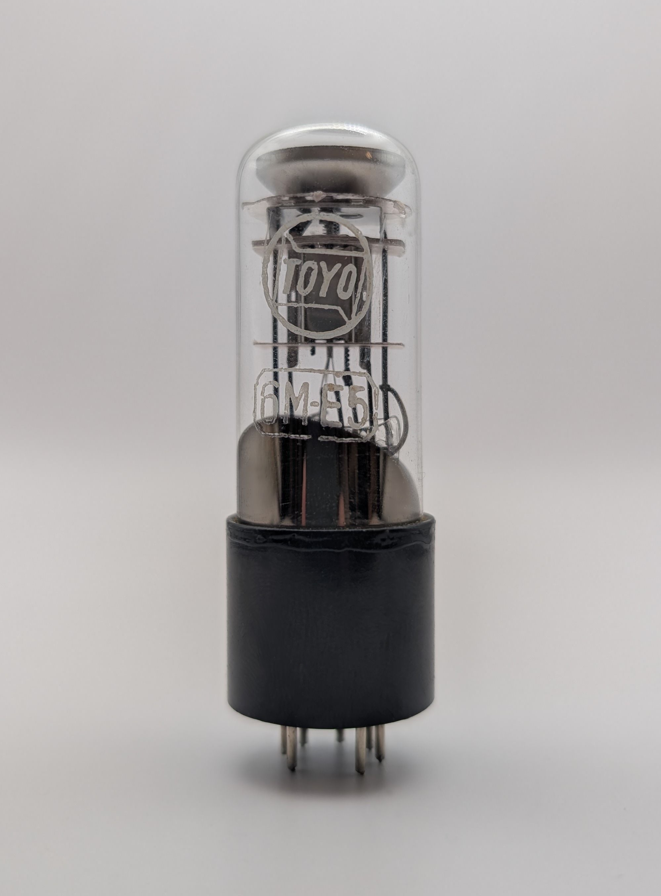
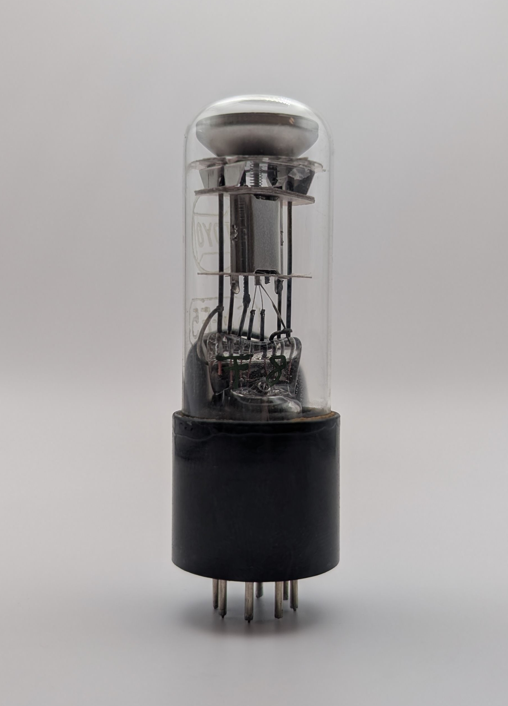
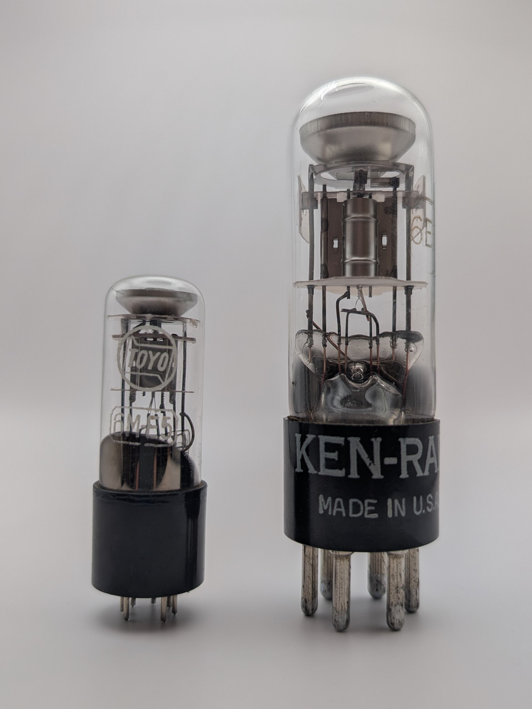
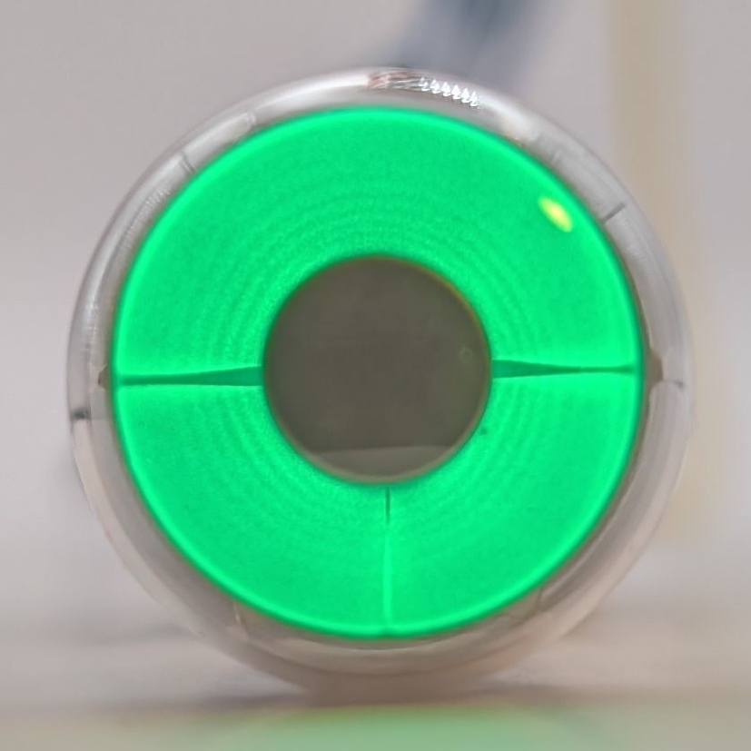
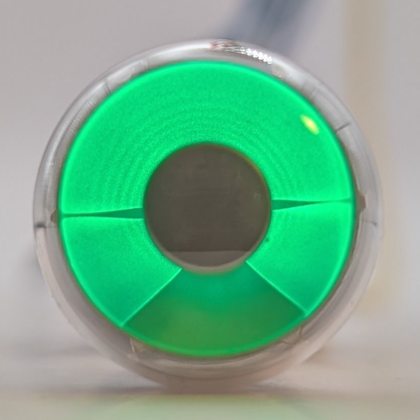
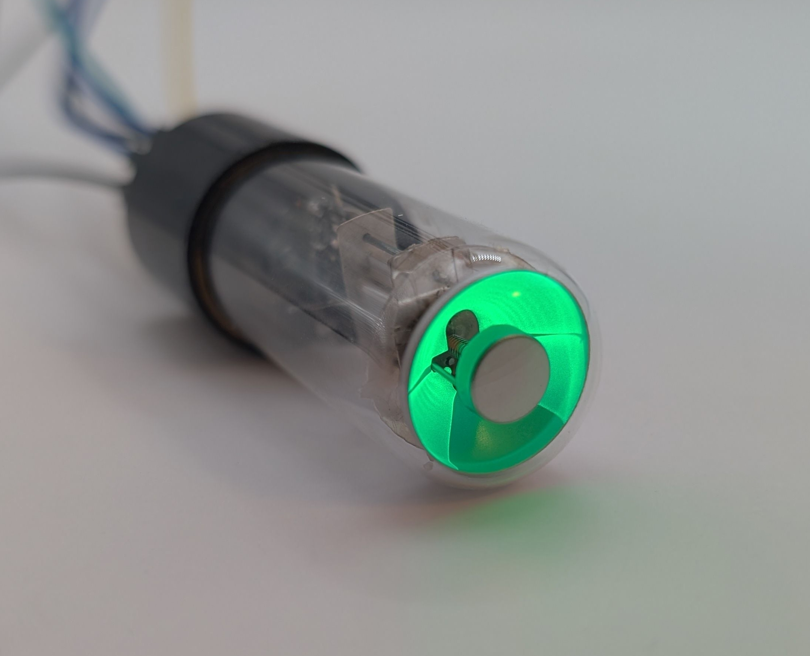

The 6ME5 (also known as 6M-E5) is a miniature magic eye tube manufactured by TOYO in Japan. It closely resembles the common [6E5 tube](/magic-eye/ken-rad-6e5/), but in a smaller form factor, featuring the same basic display characteristic of a single shadow that opens or closes according to the applied input voltage. The tube operates at a relatively low target voltage of 180V, while a similar variant, the 6ME10, works at an even lower target voltage of just 100V.

Although it was used in certain radios, such as the Heathkit GR-21, the 6ME5 remains a rare and unusual tube.

### Key Specifications

| Property          | Description |
|-------------------|-------------|
| Manufacturer      | TOYO        |
| Time period       | 1950s       |
| Envelope diameter | ~19mm       |
| Envelope height   | ~37mm       |
| Base diamater     | ~21mm       |
| Base height       | 18mm        |
| Socket            | B7G         |

### References

- [industrialalchemy.org](https://www.industrialalchemy.org/articleview.php?item=1088) ([Archive](https://web.archive.org/web/20240421194335/http://industrialalchemy.org/articleview.php?item=1088))

- [radiomuseum.org](https://www.radiomuseum.org/tubes/tube_6m-e5.html) ([Archive](https://web.archive.org/web/20250224151359/https://www.radiomuseum.org/tubes/tube_6m-e5.html))

- [radiomuseum.org on Heathkit GR-21](https://www.radiomuseum.org/r/heath_gr_21_gr2.html) ([Archive](https://web.archive.org/web/20250404213210/https://www.radiomuseum.org/r/heath_gr_21_gr2.html))

- [solorb.com's collection](https://www.solorb.com/elect/misc/magiceye/) ([Archive](https://web.archive.org/web/20250113210331/https://www.solorb.com/elect/misc/magiceye/))

<video controls width="100%" loop="true" autoplay="true" muted="muted">
  <source src="assets/video.mp4" type="video/mp4" />
</video>

<table>
    <tr>
        <td>
            
        </td>
        <td>
            
        </td>
    </tr>
</table>

