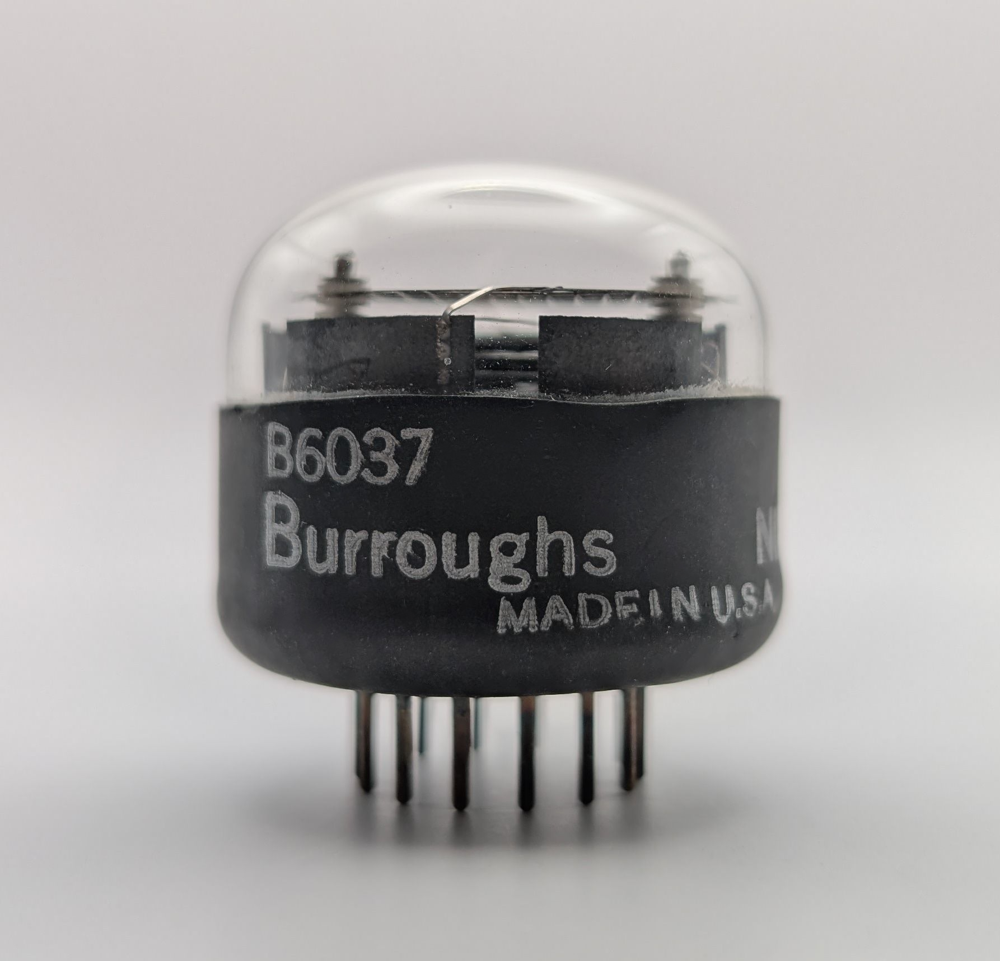
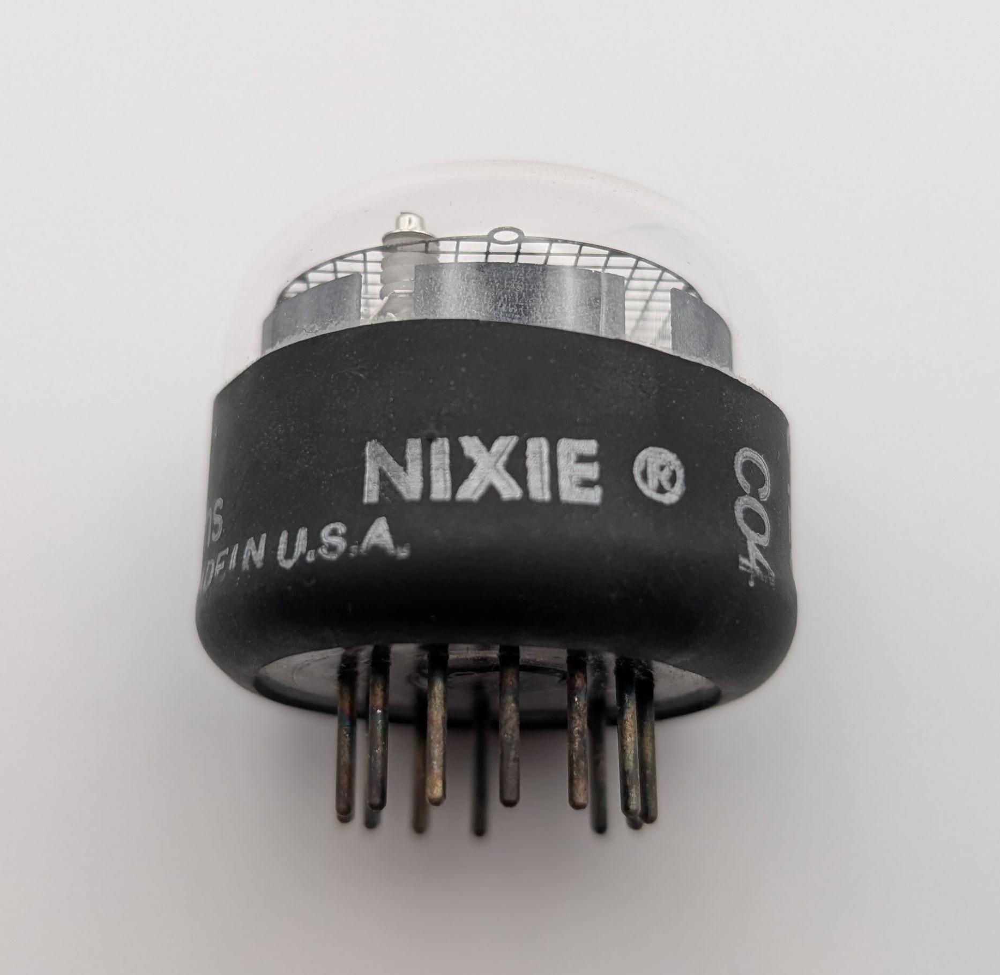
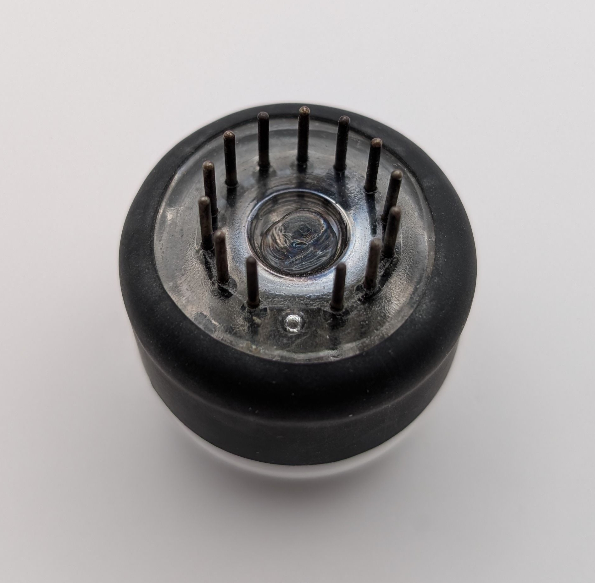
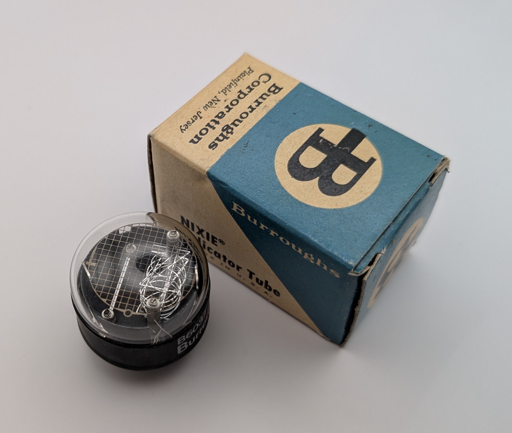
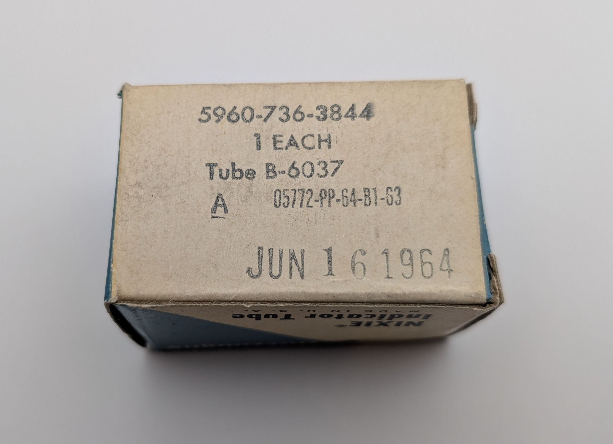

The B6037 is an unusual Nixie tube manufactured by Burroughs, making it an “official” Nixie tube as indicated by the labeling on its glass envelope. Unlike most Nixie tubes, which display only the digits 0–9, the B6037 includes an extra cathode shaped as a “1” placed next to the standard stack of digits. This allows the tube to display numbers from 0 to 19.

Its glass envelope is relatively large to accommodate the two digit stacks, though it still uses the same 15.5 mm characters found in many smaller Nixie tubes. The envelope is also covered with black shrink wrap. Interestingly, the anode grid was apparently not designed specifically for this model. In most tubes, the anode is supported by the same posts that hold the digits, but in this case it has been shifted to the right and is instead held in a somewhat awkward position at the upper right of the tube.

An additional cathode resistor should be connected in series with the left “1” cathode. Without it, the left “1” will glow much brighter than the digits on the right and may even suck the discharge away from them entirely.

### Key Specifications

| Property          | Description      |
|-------------------|------------------|
| Manufacturer      | Burroughs        |
| Time period       | Likely mid 1960s |
| Digit height      | ~15.5mm          |
| Envelope diameter | ~32mm            |
| Envelope height   | ~30m             |
| Socket            | B13B             |

### References

None

<table>
    <tr>
        <td>
            
        </td>
        <td>
            
        </td>
        <td>
            
        </td>
         <td>
            
        </td>
        <td>
            
        </td>
    </tr>
    <tr>
        <td>
            
        </td>
        <td>
            
        </td>
        <td>
            
        </td>
         <td>
            
        </td>
        <td>
            
        </td>
    </tr>
        <tr>
        <td>
            
        </td>
        <td>
            
        </td>
        <td>
            
        </td>
         <td>
            
        </td>
        <td>
            
        </td>
    </tr>
        <tr>
        <td>
            
        </td>
        <td>
            
        </td>
        <td>
            
        </td>
         <td>
            
        </td>
        <td>
            
        </td>
    </tr>
</table>

