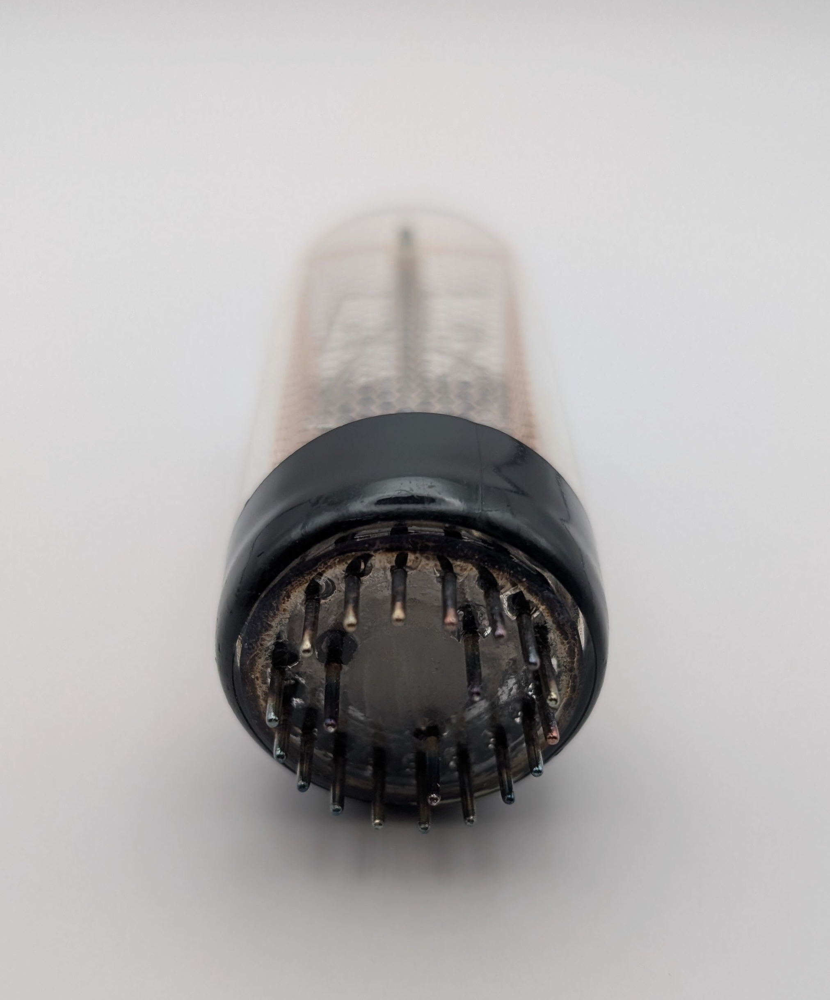

The GA12 is a large Nixie tube distributed by Swiss manufacturer Cerberus, though it was not originally produced by them. Instead, it is a rebranded version of the GR10J tube manufactured by ETL in Great Britain as part of their DIGITRON line of display tubes.

This tube stands out for several reasons. Firstly, it features a copper-colored anode, an unusual characteristic shared by only a handful of other Nixie tubes, such as the XN12. Secondly, the base of the tube is wrapped in black shrinkwrap, concealing the internal electrode connections to both the anode and cathodes. This covering might serve a functional purpose, as occasional discharges can occur at the electrodes themselves, and the shrinkwrap could be intended to hide it in such cases.

Another notable feature is the tube’s distinctive base design. It uses a dual-ring configuration: the outer ring includes 17 pins, while the inner ring has three additional pins that remain unused. This is similar to the [GR10G](/nixie/etl-gr10g/) model, also from ETL, which uses the same 17-pin outer ring but has nine unused pins in the inner ring. As a result, the GR10J is compatible with sockets made for the GR10G.

Performance-wise, the GR10J avoids one of the drawbacks of its relative. Unlike the GR10G, which requires an unusually high striking voltage of 220V and has a recommended minimum cathode current of 6 mA, the GR10J operates reliably at the more standard 170V used in most modern Nixie driver circuits. Its recommended cathode current of 4mA is also more typical for tubes of its size.

### Key Specifications

| Property          | Description      |
|-------------------|------------------|
| Manufacturer      | ETL              |
| Time period       | ?                |
| Digit height      | 30mm             |
| Envelope diameter | ~30mm            |
| Envelope height   | ~75mm            |
| Socket            | B17A, B26A, B27A |

### References

- [Cerberus GA10 datasheet](https://www.tube-tester.com/sites/nixie/dat_arch/Cerberus_GA.pdf) ([Archive](https://web.archive.org/web/20241014122547/https://www.tube-tester.com/sites/nixie/dat_arch/Cerberus_GA.pdf))

- [ETL GR10J datasheet](http://www.jb-electronics.de/downloads/elektronik/nixies/GR10J.pdf) ([Archive](https://web.archive.org/web/20240421195633/http://www.jb-electronics.de/downloads/elektronik/nixies/GR10J.pdf))

- [jb-electronics.de (GA12)](http://www.jb-electronics.de/html/elektronik/nixies/n_ga12.htm) ([Archive](https://web.archive.org/web/20240421194556/http://www.jb-electronics.de/html/elektronik/nixies/n_ga12.htm))

- [jb-electronics.de (GR10J)](http://www.jb-electronics.de/html/elektronik/nixies/n_gr10j.htm) ([Archive](https://web.archive.org/web/20250807104454/http://jb-electronics.de/html/elektronik/nixies/n_gr10j.htm))

- [swissnixie.com (GA12)](https://www.swissnixie.com/tubes/GA12/) ([Archive](https://web.archive.org/web/20240424051918/https://www.swissnixie.com/tubes/GA12/))

- [swissnixie.com (GR10J)](https://www.swissnixie.com/tubes/GR10J/) ([Archive](https://web.archive.org/web/20250326074748/https://www.swissnixie.com/tubes/GR10J/))

- [nixies.us](https://www.nixies.us/bwg_gallery/gr10j/) ([Archive](https://web.archive.org/web/20250524043451/https://www.nixies.us/bwg_gallery/gr10j/))

- [tube-tester.com](https://www.tube-tester.com/sites/nixie/data/V600/GR10J/gr10j.htm) ([Archive](https://web.archive.org/web/20241007122124/https://www.tube-tester.com/sites/nixie/data/V600/GR10J/gr10j.htm))

- [r-type.org](https://r-type.org/exhib/acf0340.htm) ([Archive](https://web.archive.org/web/20250719235943/https://r-type.org/exhib/acf0340.htm))

- [lampes-et-tubes.info](https://lampes-et-tubes.info/cd/cd028.php) ([Archive](https://web.archive.org/web/20251026174748/https://lampes-et-tubes.info/cd/cd028.php))

- [radiomuseum.org (GA12)](https://www.radiomuseum.org/tubes/tube_ga12.html) ([Archive](https://web.archive.org/web/20250421073755/https://www.radiomuseum.org/tubes/tube_ga12.html))

- [radiomuseum.org (GR10J)](https://www.radiomuseum.org/tubes/tube_gr10j.html) ([Archive](https://web.archive.org/web/20250711030829/https://www.radiomuseum.org/tubes/tube_gr10j.html))

- [jogis-roehrenbude.de](https://www.jogis-roehrenbude.de/Roehren-Geschichtliches/Nixie/GR10J.htm) ([Archive](https://web.archive.org/web/20240421201518/https://www.jogis-roehrenbude.de/Roehren-Geschichtliches/Nixie/GR10J.htm))

<table>
    <tr>
        <td>
            
        </td>
        <td>
            
        </td>
        <td>
            
        </td>
         <td>
            
        </td>
        <td>
            
        </td>
    </tr>
    <tr>
        <td>
            
        </td>
        <td>
            
        </td>
        <td>
            
        </td>
         <td>
            
        </td>
        <td>
            
        </td>
    </tr>
</table>