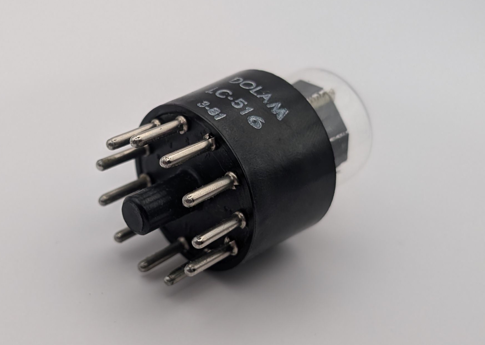

The LC-516, produced by Polish tube manufacturer Dolam (later known as Unitra Dolam), is pin-compatible with and visually similar to the Soviet [IN-1 Nixie](/nixie/anod-in-1/) tube. However, unlike the IN-1—an early model with a relatively short lifespan—the LC-516 is mercury-doped, significantly enhancing its durability and giving its glow a subtle bluish tint. The LC-516 features a slightly smaller glass envelope and digits compared to the IN-1; a comparison between the two is shown below. Additionally, Dolam manufactured a version without the phenolic base, designated as the LC-513.

As I am not aware of a datasheet specifically for this tube, I have provided a link to the IN-1's datasheet below. Since the tubes are compatible, the relevant specifications should be identical.

**Update from 2025-05-18**

I was able to acquire a slightly different version of the LC-516, featuring a larger glass envelope and digit sizes comparable to the IN-1. This variant appears to lack mercury vapor and has a slightly different digit arrangement. I suspect it may be an earlier revision of the model. Photos are provided below.

### Key Specifications

| Property          | Description |
|-------------------|-------------|
| Manufacturer      | Dolam       |
| Time period       | ?           |
| Digit height      | ~15mm       |
| Envelope diameter | 27mm        |
| Base diameter     | 35mm        |
| Socket            | U11         |

### References

- [IN-1 datasheet](https://www.tube-tester.com/sites/nixie/dat_arch/IN-1.pdf) ([Archive](https://web.archive.org/web/20240424052339/https://www.tube-tester.com/sites/nixie/dat_arch/IN-1.pdf))

- [swissnixie.com](https://www.swissnixie.com/tubes/LC516/) ([Archive](https://web.archive.org/web/20240424051904/https://www.swissnixie.com/tubes/LC516/))

- [jogis-roehrenbude.de](https://www.jogis-roehrenbude.de/Roehren-Geschichtliches/Nixie/LC-516.htm) ([Archive](https://web.archive.org/web/20240421201524/https://www.jogis-roehrenbude.de/Roehren-Geschichtliches/Nixie/LC-516.htm))

- [tube-tester.com](https://www.tube-tester.com/sites/nixie/data/lc-516.htm) ([Archive](https://web.archive.org/web/20240620130847/https://www.tube-tester.com/sites/nixie/data/lc-516.htm))

- [radiomuesum.org](https://www.radiomuseum.org/tubes/tube_lc516.html) ([Archive](https://web.archive.org/web/20240417001750/https://www.radiomuseum.org/tubes/tube_lc516.html))

<table>
    <tr>
        <td>
            
        </td>
        <td>
            
        </td>
        <td>
            
        </td>
         <td>
            
        </td>
        <td>
            
        </td>
    </tr>
    <tr>
        <td>
            
        </td>
        <td>
            
        </td>
        <td>
            
        </td>
         <td>
            
        </td>
        <td>
            
        </td>
    </tr>
</table>

## Different LC-516 model

