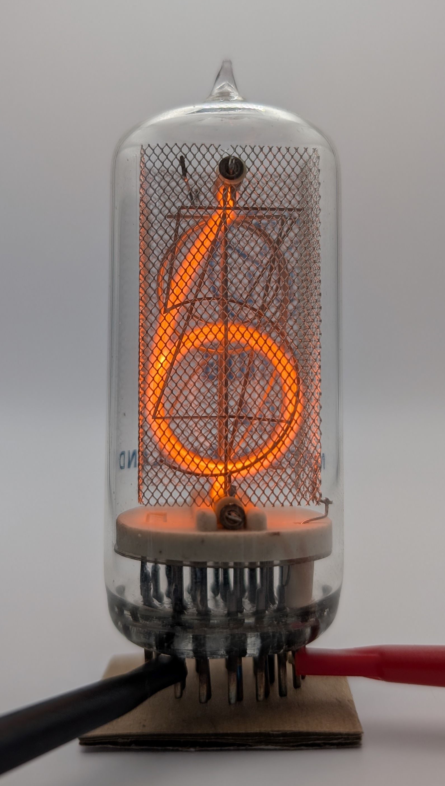

The GR10G (also known as CV8090) is a large Nixie tube produced by the British manufacturer ETL. It stands out due to its unconventional design: notably, it lacks a solid back plate on the anode cage, allowing the digits to be viewed clearly even from behind the tube.

Its unusual characteristics extend to its electrical specifications. According to the datasheet, the recommended supply voltage is at least 220V, with an internal voltage drop of approximately 180V across the ionizing tube. Furthermore, the recommended minimum operating current of 6mA is higher than typical for Nixie tubes of similar size. Its gas mixture does not appear to contain mercury vapor, which likely contributes to its poor average lifespan rating of only 5000 hours. This short lifespan restricts its practical use in many projects, despite its distinctive visual appeal.

Another peculiar aspect of the tube is its uncommon base design, which features two rings with a total of 26 pins. Of these, 15 pins remain unused, and none of the pins on the inner ring connect to any electrode. This unusual layout was possibly intended to provide better mechanical stability and firm support to the tube.

### Key Specifications

| Property          | Description |
|-------------------|-------------|
| Manufacturer      | ETL         |
| Time period       | Mid 1960s   |
| Digit height      | 30mm        |
| Envelope diameter | ~30mm       |
| Envelope height   | ~75mm       |
| Socket            | B26A        |

### References

- [ETL GR10G datasheet](https://www.tube-tester.com/sites/nixie/dat_arch/GR10G.pdf) ([Archive](https://web.archive.org/web/20241014115342/https://www.tube-tester.com/sites/nixie/dat_arch/GR10G.pdf))

- [jb-electronics.de](http://www.jb-electronics.de/html/elektronik/nixies/n_gr10g.htm) ([Archive](https://web.archive.org/web/20240421194600/http://www.jb-electronics.de/html/elektronik/nixies/n_gr10g.htm))

- [nixies.us](https://www.nixies.us/bwg_gallery/gr10g/) ([Archive](https://web.archive.org/web/20250120124412/https://www.nixies.us/bwg_gallery/gr10g/))

- [tube-tester.com](https://www.tube-tester.com/sites/nixie/data/gr10g/gr10g.htm) ([Archive](https://web.archive.org/web/20241008121443/https://www.tube-tester.com/sites/nixie/data/gr10g/gr10g.htm))

- [r-type.org](http://r-type.org/exhib/aad0216.htm) ([Archive](https://web.archive.org/web/20240423233419/http://r-type.org/exhib/aad0216.htm))

- [radiomuseum.org](https://www.radiomuseum.org/tubes/tube_gr10g.html) ([Archive](https://web.archive.org/web/20241125044705/https://www.radiomuseum.org/tubes/tube_gr10g.html))

<table>
    <tr>
        <td>
            
        </td>
        <td>
            
        </td>
        <td>
            
        </td>
         <td>
            
        </td>
        <td>
            
        </td>
    </tr>
    <tr>
        <td>
            
        </td>
        <td>
            
        </td>
        <td>
            
        </td>
         <td>
            
        </td>
        <td>
            
        </td>
    </tr>
</table>

