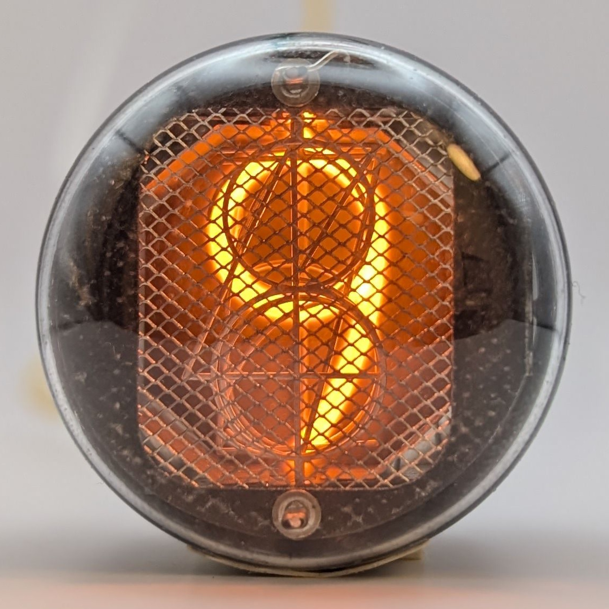

The GR10H is an early Nixie tube produced by ETL, featuring digits visible through a small viewing window, with the majority of its envelope coated in black paint—likely intended to enhance contrast and minimize light bleed from adjacent tubes. Shown at the end of this page is a transparent GR10H revealing that, like in the [STC GN-1](/nixie/stc-gn-1/), the digits are connected to the tube's pins via thick wires and an evaporative getter was used.

Unfortunately, this particular unit shows significant wear and requires increased current to maintain a stable discharge.

### Key Specifications

| Property          | Description |
|-------------------|-------------|
| Manufacturer      | ETL         |
| Time period       | Early 1960s |
| Digit height      | 19mm        |
| Envelope diameter | 33mm        |
| Socket            | B17A        |

### References

- [ETL GR10H datasheet](http://www.jb-electronics.de/downloads/elektronik/nixies/GR10H.pdf) ([Archive](https://web.archive.org/web/20240421195500/http://www.jb-electronics.de/downloads/elektronik/nixies/GR10H.pdf))

- [jb-electronics.de](http://www.jb-electronics.de/html/elektronik/nixies/n_gr10h.htm) ([Archive](https://web.archive.org/web/20240421194554/http://www.jb-electronics.de/html/elektronik/nixies/n_gr10h.htm))

- [nixies.us](https://www.nixies.us/bwg_gallery/gr10h/) ([Archive](https://web.archive.org/web/20240422040424/https://www.nixies.us/bwg_gallery/gr10h/))

- [tube-tester.com](https://www.tube-tester.com/sites/nixie/data/GR10H/GR10H.htm) ([Archive](https://web.archive.org/web/20240424052213/https://www.tube-tester.com/sites/nixie/data/GR10H/GR10H.htm))

- [swissnixie.com](https://www.swissnixie.com/tubes/GR10H/) ([Archive](https://web.archive.org/web/20240424051922/https://www.swissnixie.com/tubes/GR10H/))

- [radiomuseum.org](https://www.radiomuseum.org/tubes/tube_gr10h.html)

<table>
    <tr>
        <td>
            
        </td>
        <td>
            
        </td>
        <td>
            
        </td>
         <td>
            
        </td>
        <td>
            
        </td>
    </tr>
    <tr>
        <td>
            
        </td>
        <td>
            
        </td>
        <td>
            
        </td>
         <td>
            
        </td>
        <td>
            
        </td>
    </tr>
</table>

