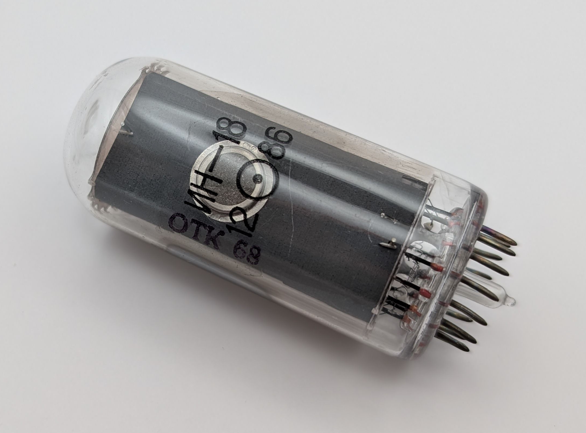

With its 40mm digits, the IN-18 ("NH-18") is the largest Nixie tube mass-manufactured in the Soviet Union. It shares the same envelope diameter with smaller Nixie tubes, such as the ZM1040 and [Z566M](/nixie/rft-z566m/), which gives the IN-18's digits a slightly elongated appearance. Today, the IN-18 is among the most popular Nixie tubes, often used in large Nixie clocks. Although vast quantities were manufactured and remain readily available on online marketplaces like eBay, IN-18 tubes have become quite expensive. Unlike many Soviet Nixie tubes, the IN-18 features a proper cathode for the number five rather than an inverted two. Its gas mixture includes trace amounts of mercury vapor, which significantly extends the tube's lifespan and imparts a faint bluish tint to its glow.

Curiously, despite their large production numbers, I have only ever encountered a single period device that actually utilized IN-18 tubes. The tube pictured below is a used example, evident from the slightly bent pins and the sputter deposits visible on either side of the envelope.

### Key Specifications

| Property          | Description |
|-------------------|-------------|
| Manufacturer      | Gazotron    |
| Time period       | ?           |
| Digit height      | 40mm        |
| Envelope diameter | 31mm        |
| Envelope height   | 71mm        |
| Socket            | PL31        |

### References

- [Gazotron IN-18 datasheet](https://www.tube-tester.com/sites/nixie/dat_arch/IN-18_04.pdf) ([Archive](https://web.archive.org/web/20240727103051/http://tube-tester.com/sites/nixie/dat_arch/IN-18_04.pdf))

- [nixies.us](https://www.nixies.us/bwg_gallery/in-18/) ([Archive](https://web.archive.org/web/20240812135515/https://www.nixies.us/bwg_gallery/in-18/))

- [jogis-roehrenbude.de](https://www.jogis-roehrenbude.de/Roehren-Geschichtliches/Nixie/IN18.htm) ([Archive](https://web.archive.org/web/20240421201516/https://www.jogis-roehrenbude.de/Roehren-Geschichtliches/Nixie/IN18.htm))

- [tube-tester.com](https://www.tube-tester.com/sites/nixie/data/in18.htm) ([Archive](https://web.archive.org/web/20240905150502/https://www.tube-tester.com/sites/nixie/data/in18.htm))

- [swissnixie.com](https://www.swissnixie.com/tubes/IN18/) ([Archive](https://web.archive.org/web/20240424051838/https://www.swissnixie.com/tubes/IN18/))

<table>
    <tr>
        <td>
            
        </td>
        <td>
            
        </td>
        <td>
            
        </td>
         <td>
            
        </td>
        <td>
            
        </td>
    </tr>
    <tr>
        <td>
            
        </td>
        <td>
            
        </td>
        <td>
            
        </td>
         <td>
            
        </td>
        <td>
            
        </td>
    </tr>
</table>