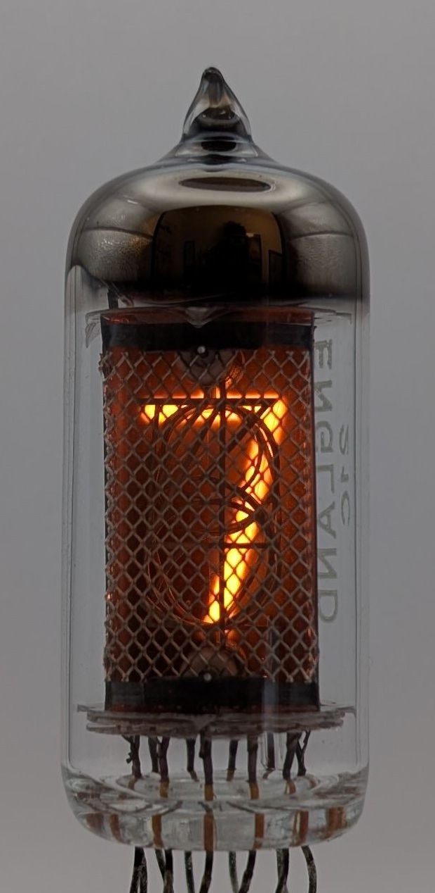

The XN1 is an early Nixie tube produced by Hivac in Great Britain and Lorenz in Germany. The earliest documentation referencing this tube I could find is dated September 9, 1961, shortly after the invention of Nixie tubes. This particular unit features an evaporative getter at the top, giving it a distinctive appearance typically associated with vacuum tubes (often seen in VFDs). However, versions with a getter located behind the anode cage were also manufactured. The tube’s anode cage is notably restrictive, limiting visibility to mostly straight-on angles. Unlike many other tubes of similar size, the XN1 does not include any decimal points.

### Key Specifications

| Property          | Description   |
|-------------------|---------------|
| Manufacturer      | Hivac         |
| Time period       | early 1960s   |
| Digit height      | 14mm          |
| Envelope diameter | 19mm          |
| Envelope height   | 47.6mm        |
| Socket            | N/A           |

### References

- [XN1 technical data](http://www.jb-electronics.de/downloads/elektronik/nixies/XN-1.pdf) ([Archive](https://web.archive.org/web/20240421195434/http://www.jb-electronics.de/downloads/elektronik/nixies/XN-1.pdf))

- [tube-tester.com](https://www.tube-tester.com/sites/nixie/data/XN1/XN1.htm) ([Archive](https://web.archive.org/web/20240620131049/https://www.tube-tester.com/sites/nixie/data/XN1/XN1.htm))

- [jb-electronics.de](http://www.jb-electronics.de/html/elektronik/nixies/n_xn1.htm?lang=en) ([Archive](https://web.archive.org/web/20240421194610/http://www.jb-electronics.de/html/elektronik/nixies/n_xn1.htm?lang=en))

- [swissnixie.com](https://www.swissnixie.com/tubes/XN1/) ([Archive](https://web.archive.org/web/20240424051831/https://www.swissnixie.com/tubes/XN1/))

- [r-type.org](http://www.r-type.org/exhib/aaa1770.htm) ([Archive](https://web.archive.org/web/20240423234315/http://r-type.org/exhib/aaa1770.htm))

<table>
    <tr>
        <td>
            
        </td>
        <td>
            
        </td>
        <td>
            
        </td>
         <td>
            
        </td>
        <td>
            
        </td>
    </tr>
    <tr>
        <td>
            
        </td>
        <td>
            
        </td>
        <td>
            
        </td>
         <td>
            
        </td>
        <td>
            
        </td>
    </tr>
</table>