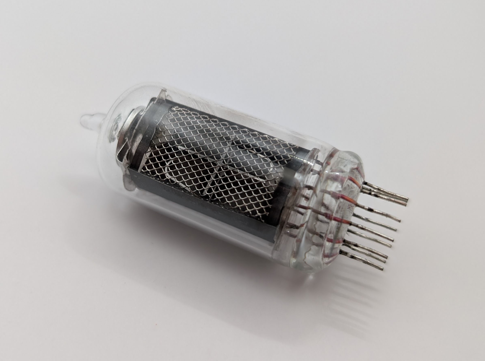
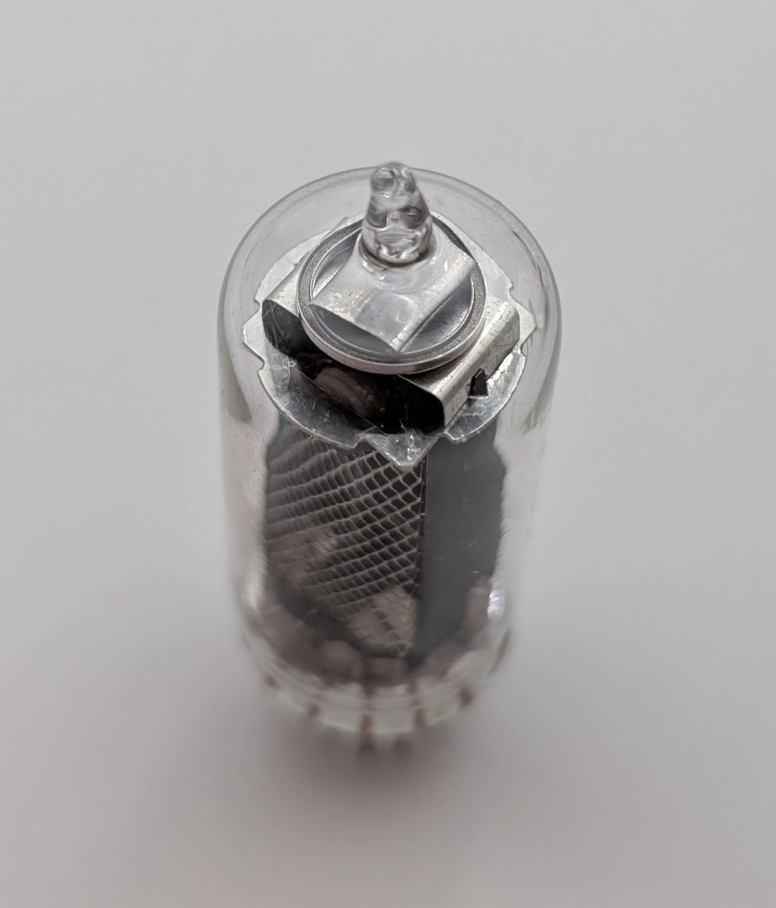
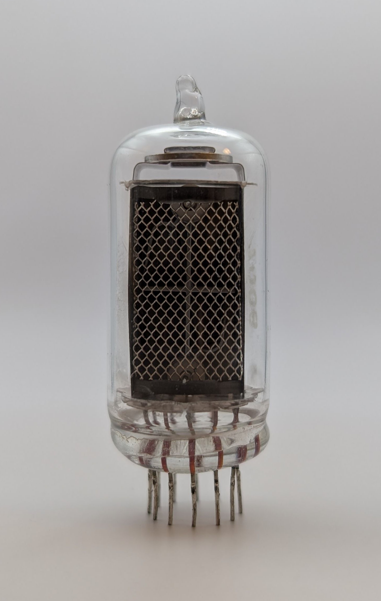
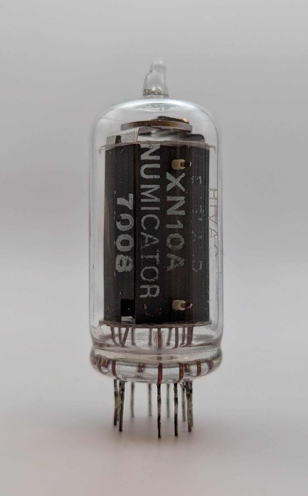
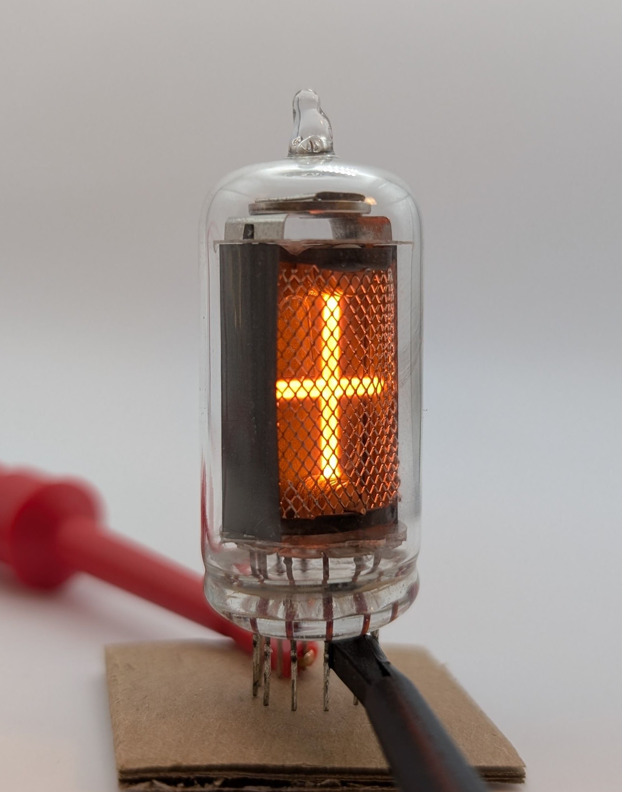
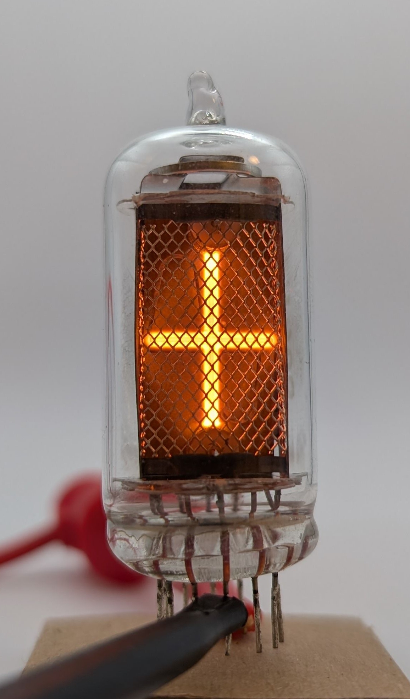
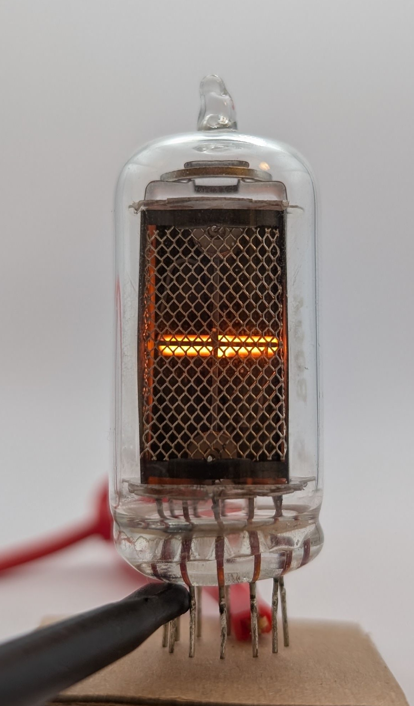
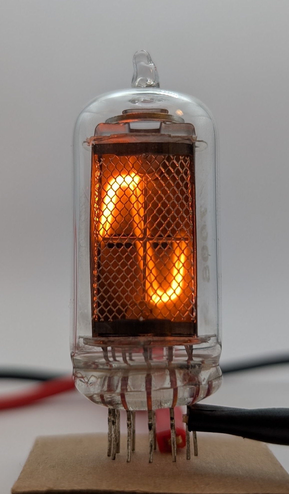

The XN10A is a medium-sized symbolic Nixie tube manufactured by Hivac in Great Britain as part of their ‘Numicator’ line of display tubes. It displays a plus sign, minus sign, and sine wave symbol. Its size made it compatible with other numeric tubes in the XN series, such as the [XN1](/nixie/hivac-xn1/), [XN3](/nixie/hivac-xn3/), and XN12. The tube also has the same restrictive anode cage found in the aforementioned tubes, which limits visibility primarily to front-facing angles. Tubes like the XN10A were commonly used in digital multimeters, where the sine wave symbol would have indicated the presence of an AC voltage.

The unit shown below is used and shows some signs of wear. The sine wave symbol is affected by cathode poisoning and no longer lights up completely. This type of degradation typically occurs in cathodes that are seldom activated, suggesting the symbol was rarely, if ever, used in the device from which the tube was removed. Fortunately, cathode poisoning is usually reversible.

The tube appears to be exceptionally rare, as no information about it could be found online.

### Key Specifications

| Property          | Description      |
|-------------------|------------------|
| Manufacturer      | Hivac            |
| Time period       | likely mid 1960s |
| Digit height      | 14mm             |
| Envelope diameter | 19mm             |
| Envelope height   | 47.6mm           |
| Socket            | N/A              |

### References

None

<table>
    <tr>
        <td>
            
        </td>
        <td>
            
        </td>
        <td>
            
        </td>
    </tr>
</table>