The XN3 is a medium-sized Nixie tube manufactured by Hivac in Great Britain and Lorenz in Germany and part of their 'Numicator' line of display tubes. According to its datasheet, it is the direct successor to the [XN1](/nixie/hivac-xn1/), featuring pin compatibility and primarily differing in its increased lifespan. Unlike many later long-life tubes, however, the XN3's discharge does not exhibit the characteristic bluish glow associated with mercury vapor. The XN3 also lacks the evaporative getter present in some XN1 units; instead, it uses a more conventional, non-evaporative getter positioned at the tube's top, typical of Nixie tubes. Like the XN1, its anode cage restricts digit visibility, making the display primarily readable from straight-on viewing angles. In addition to the transparent version shown below, a variant coated in a red filter was also produced.

### Key Specifications

| Property          | Description   |
|-------------------|---------------|
| Manufacturer      | Hivac         |
| Time period       | mid 1960s     |
| Digit height      | 14mm          |
| Envelope diameter | 19mm          |
| Envelope height   | 47.6mm        |
| Socket            | N/A           |

### References

- [XN3 datasheet](https://www.tube-tester.com/sites/nixie/dat_arch/XN3.pdf) ([Archive](https://web.archive.org/web/20241203005837/https://www.tube-tester.com/sites/nixie/dat_arch/XN3.pdf))

- [nixies.us](https://www.nixies.us/bwg_gallery/xn3/) ([Archive](https://web.archive.org/web/20241203085454/https://www.nixies.us/bwg_gallery/xn3/))

- [jogis-roehrenbude.de](https://www.jogis-roehrenbude.de/Roehren-Geschichtliches/Nixie/XN3.htm) ([Archive](https://web.archive.org/web/20240421201523/https://www.jogis-roehrenbude.de/Roehren-Geschichtliches/Nixie/XN3.htm))

- [swissnixie.com](https://www.swissnixie.com/tubes/XN3/) ([Archive](https://web.archive.org/web/20240424051835/https://www.swissnixie.com/tubes/XN3/))

[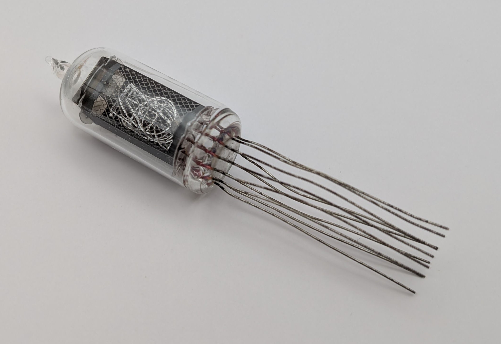](assets/1.jpg)

[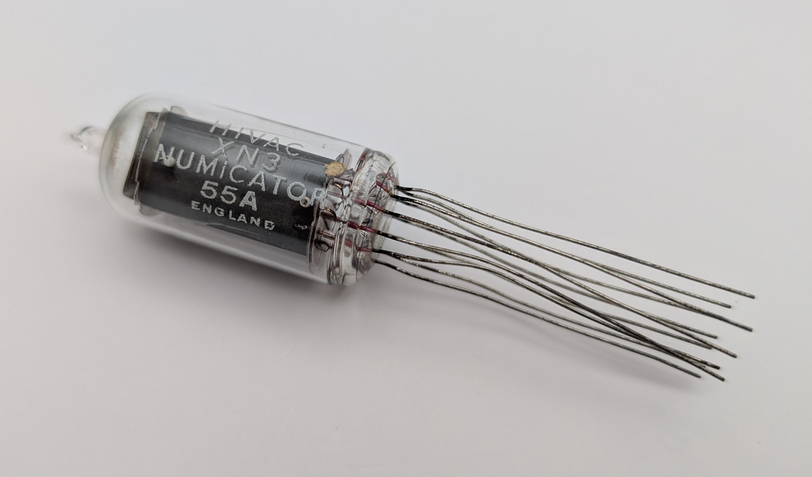](assets/2.jpg)

[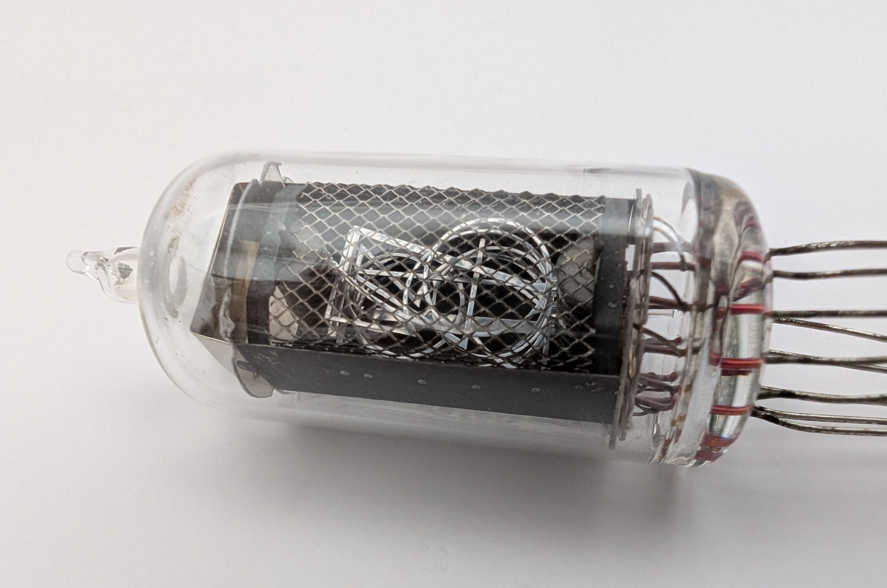](assets/3.jpg)

[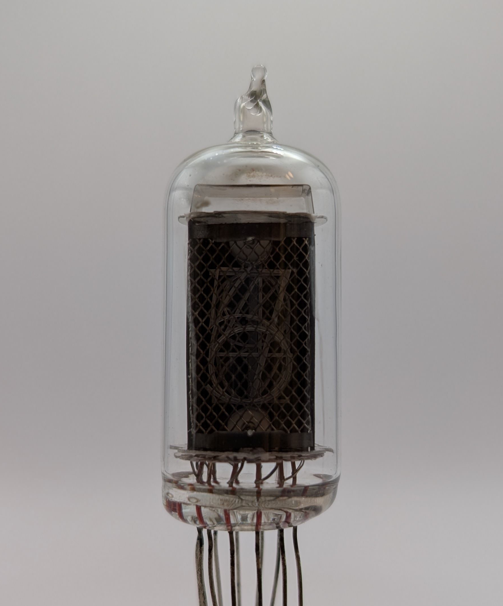](assets/4.jpg)

[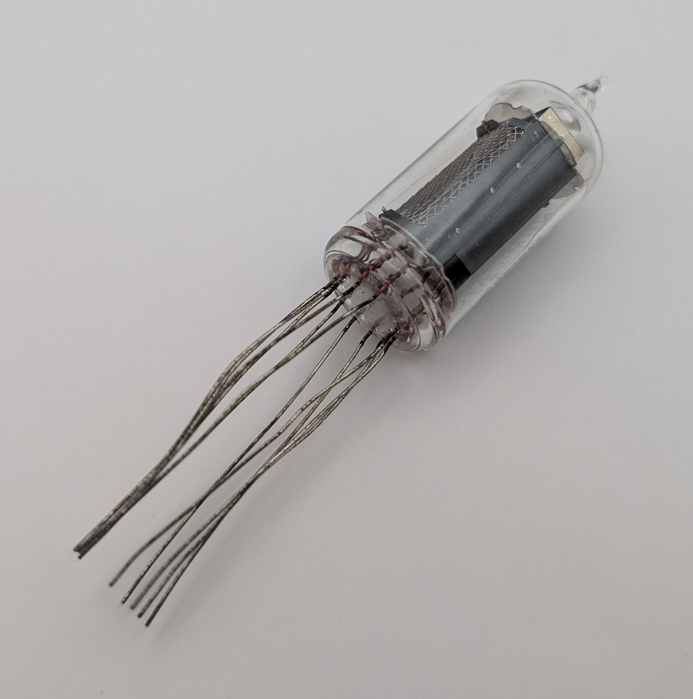](assets/16.jpg)

[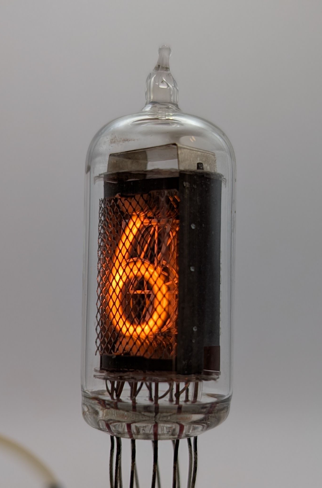](assets/5.jpg)

<table>
    <tr>
        <td>
            <a href="assets/6.jpg">
                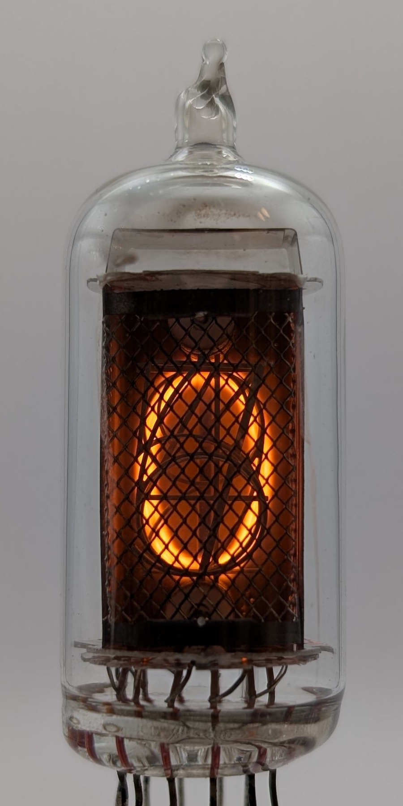
            </a>
        </td>
        <td>
            <a href="assets/7.jpg">
                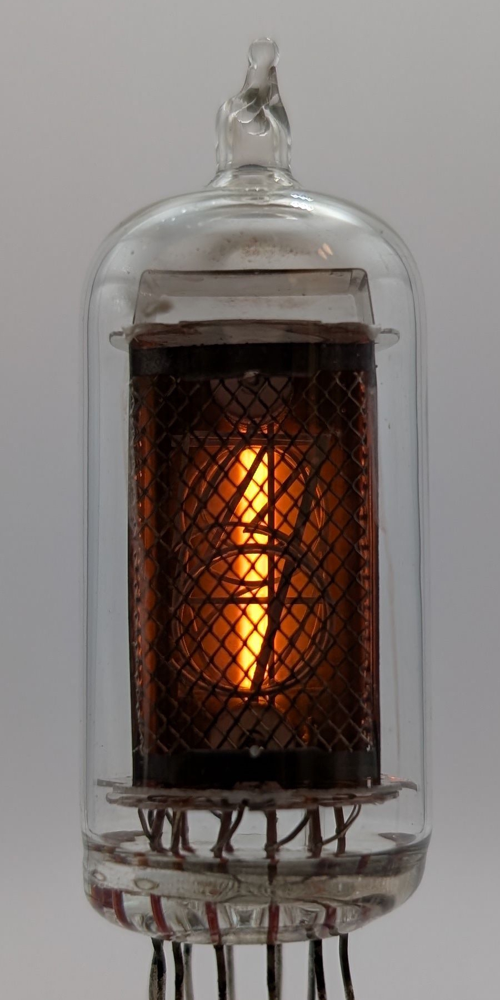
            </a>
        </td>
        <td>
            <a href="assets/8.jpg">
                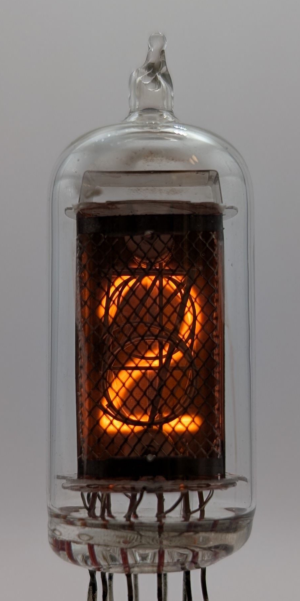
            </a>
        </td>
         <td>
            <a href="assets/9.jpg">
                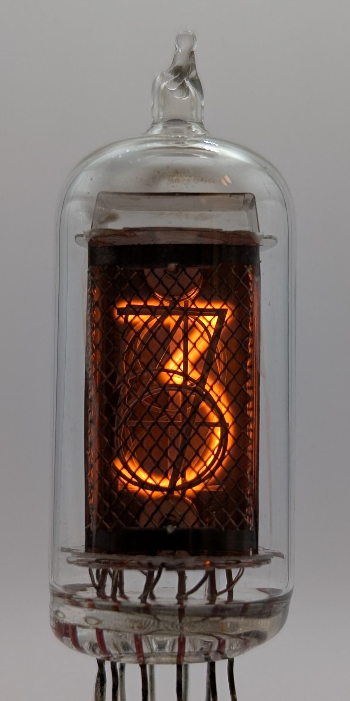
            </a>
        </td>
        <td>
            <a href="assets/10.jpg">
                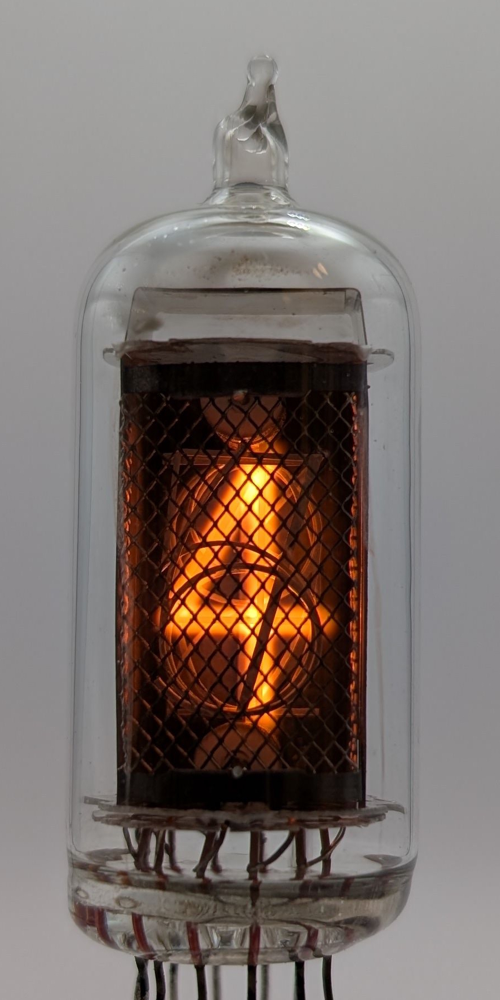
            </a>
        </td>
    </tr>
    <tr>
        <td>
            <a href="assets/11.jpg">
                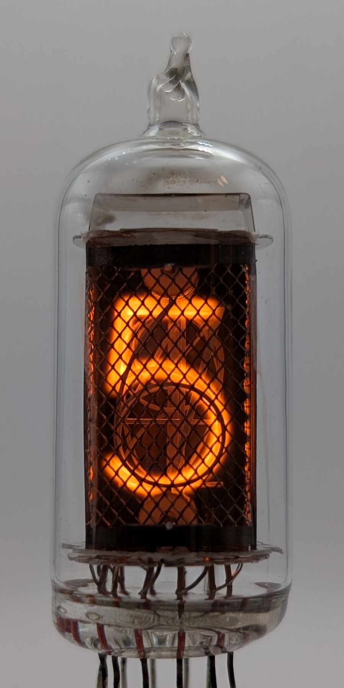
            </a>
        </td>
        <td>
            <a href="assets/12.jpg">
                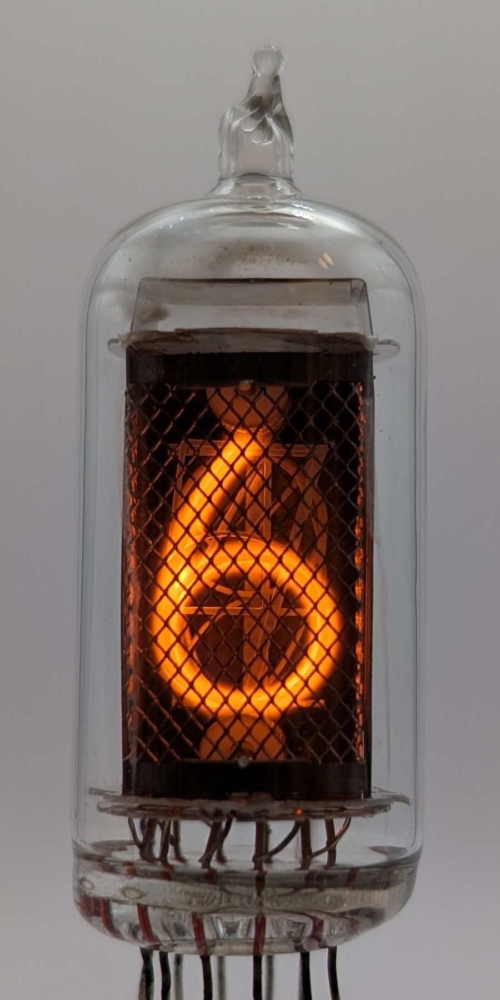
            </a>
        </td>
        <td>
            <a href="assets/13.jpg">
                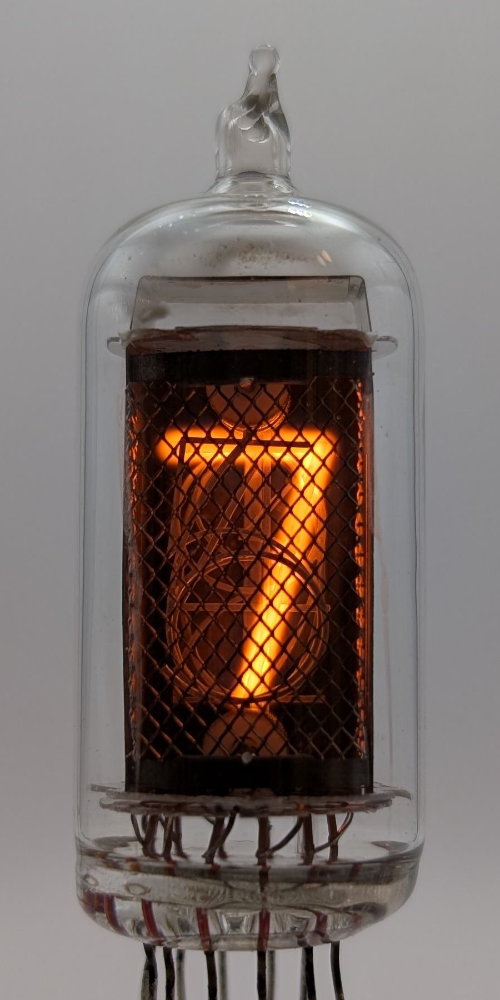
            </a>
        </td>
         <td>
            <a href="assets/14.jpg">
                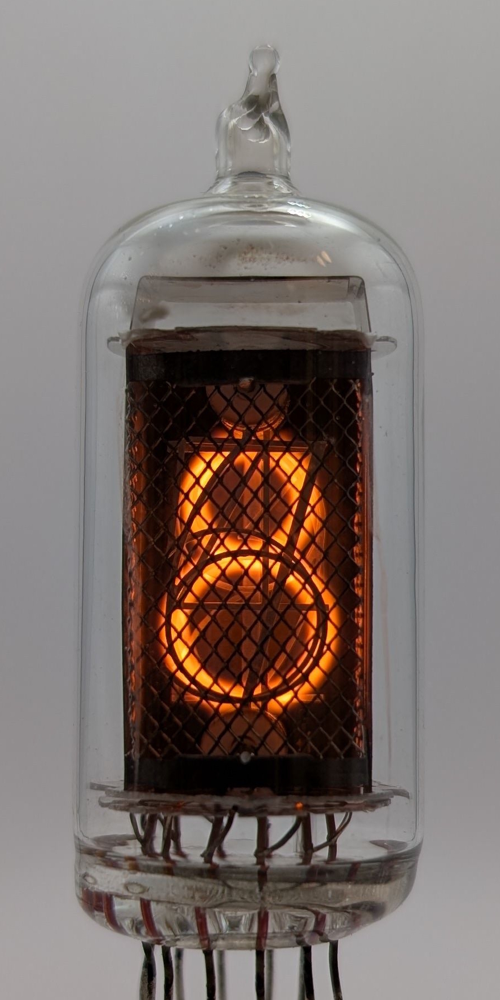
            </a>
        </td>
        <td>
            <a href="assets/15.jpg">
                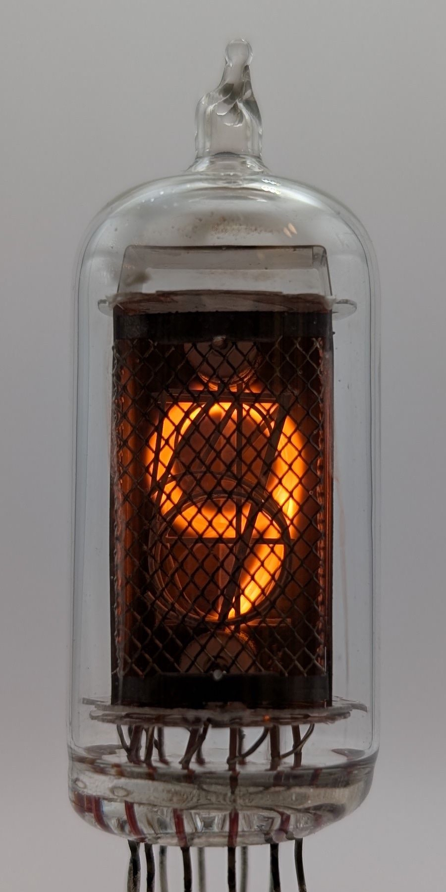
            </a>
        </td>
    </tr>
</table>