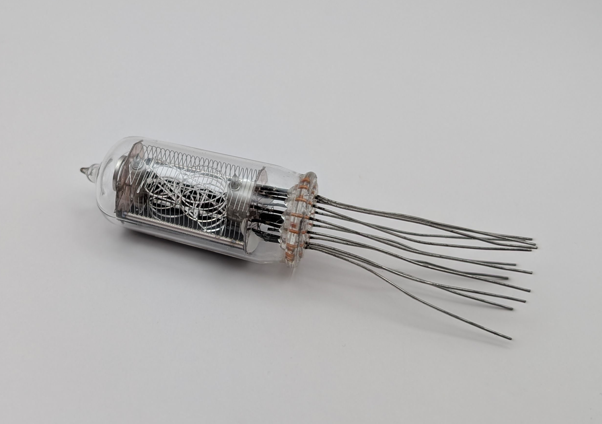

The CD66A, produced by NEC in Japan, is a medium-sized Nixie tube capable of displaying all ten digits along with a right decimal point. It features a distinctive anode design made up of multiple horizontal wires, differing from the typical hexagonal or square grids stamped from sheet metal in most Nixie tubes. A variant of the CD66 with a left decimal point was also available. Additionally, the CD66A is pin-compatible with the European ZM1242, which has a more conventional design.

### Key Specifications

| Property          | Description   |
|-------------------|---------------|
| Manufacturer      | NEC           |
| Time period       | ?             |
| Digit height      | 16mm          |
| Envelope diameter | 19mm          |
| Envelope height   | 47.6mm        |
| Socket            | N/A           |

### References

- [CD66A datasheet](https://www.tube-tester.com/sites/nixie/dat_arch/NEC_catalog_02.pdf) ([Archive](https://web.archive.org/web/20241014112915/https://www.tube-tester.com/sites/nixie/dat_arch/NEC_catalog_02.pdf))

- [nixies.us](https://www.nixies.us/bwg_gallery/cd66a/) ([Archive](https://web.archive.org/web/20241203083120/https://www.nixies.us/bwg_gallery/cd66a/))

- [tube-tester.com](https://www.tube-tester.com/sites/nixie/data/cd66.htm) ([Archive](https://web.archive.org/web/20241107023058/https://www.tube-tester.com/sites/nixie/data/cd66.htm))

<table>
    <tr>
        <td>
            
        </td>
        <td>
            
        </td>
        <td>
            
        </td>
         <td>
            
        </td>
        <td>
            
        </td>
    </tr>
    <tr>
        <td>
            
        </td>
        <td>
            
        </td>
        <td>
            
        </td>
         <td>
            
        </td>
        <td>
            
        </td>
    </tr>
</table>