The LD-836 is a medium-sized Nixie tube manufacured by NEC in Japan, notable for its highly unusual, nearly rectangular glass envelope. This distinctive shape makes the tube's front face significantly narrower than that of comparable Nixies and allows multiple tubes to be placed closer together in display assemblies. In addition to displaying the digits 0 through 9, the LD-836 also includes a right-hand decimal point. Its internal design closely resembles that of NEC's [CD66A](/nixie/nec-cd66a/), sharing a similar wire anode assembly, which leads to significantly improved digit visibility compared to the more typical grid design. The LD-836 is an exceptionally rare Nixie tube, with barely any information being available on it publicly.

### Key Specifications

| Property          | Description   |
|-------------------|---------------|
| Manufacturer      | NEC           |
| Time period       | ?             |
| Digit height      | 16mm          |
| Envelope diameter | ~11mm/16mm    |
| Envelope height   | ~43mm         |
| Socket            | N/A           |

### References

None

[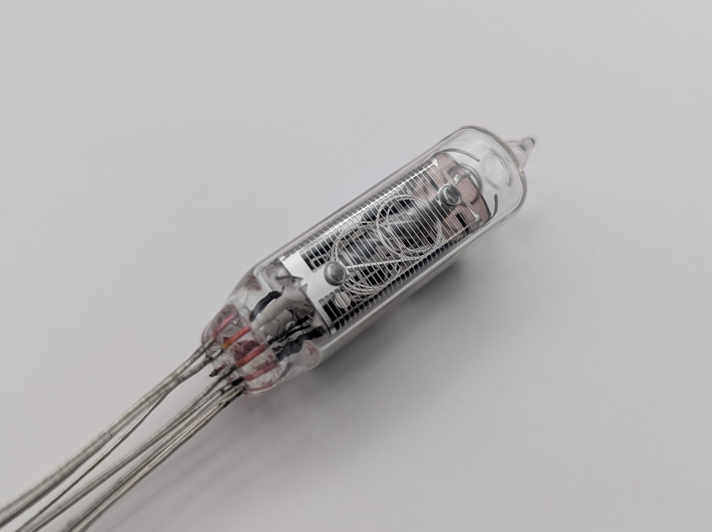](assets/1.jpg)

[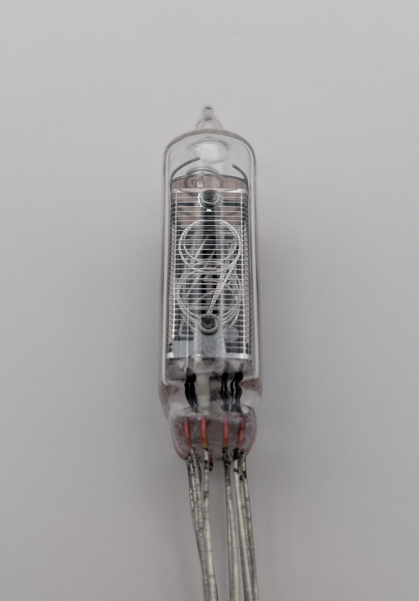](assets/2.jpg)

[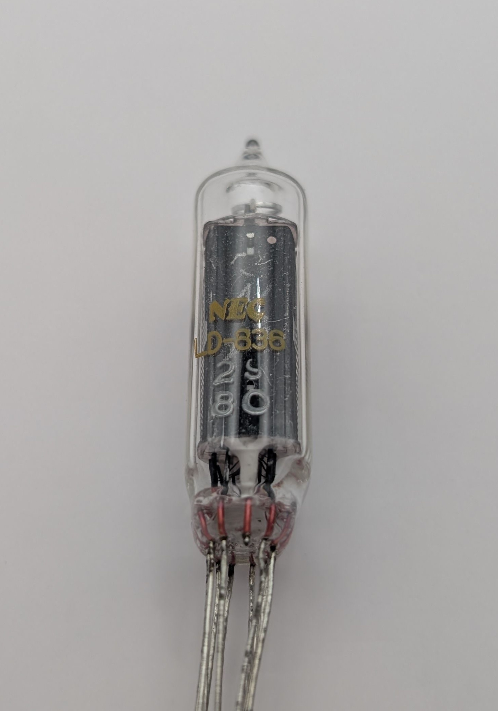](assets/3.jpg)

[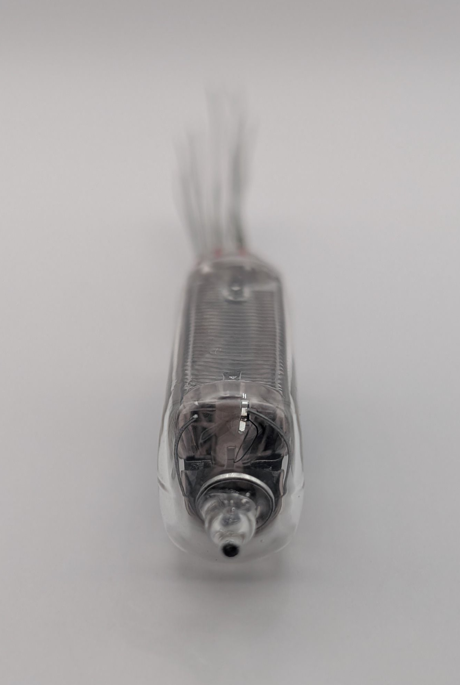](assets/4.jpg)

[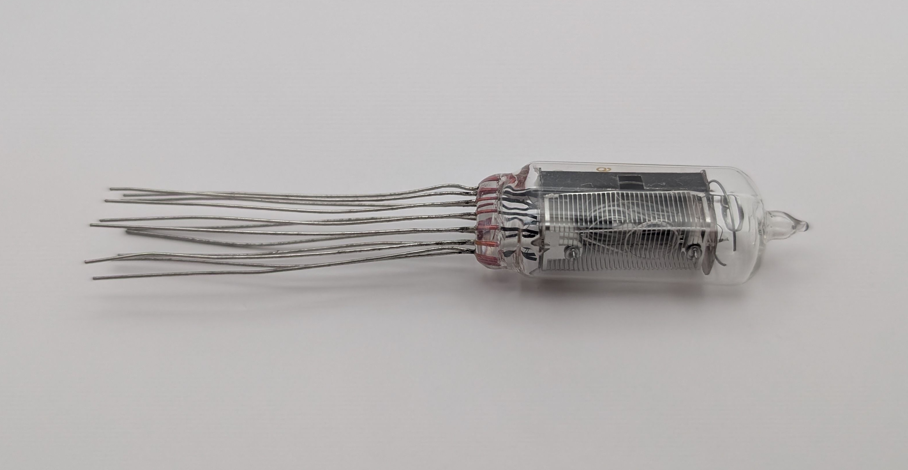](assets/5.jpg)

[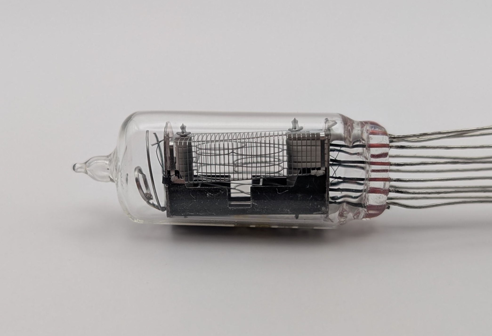](assets/6.jpg)

[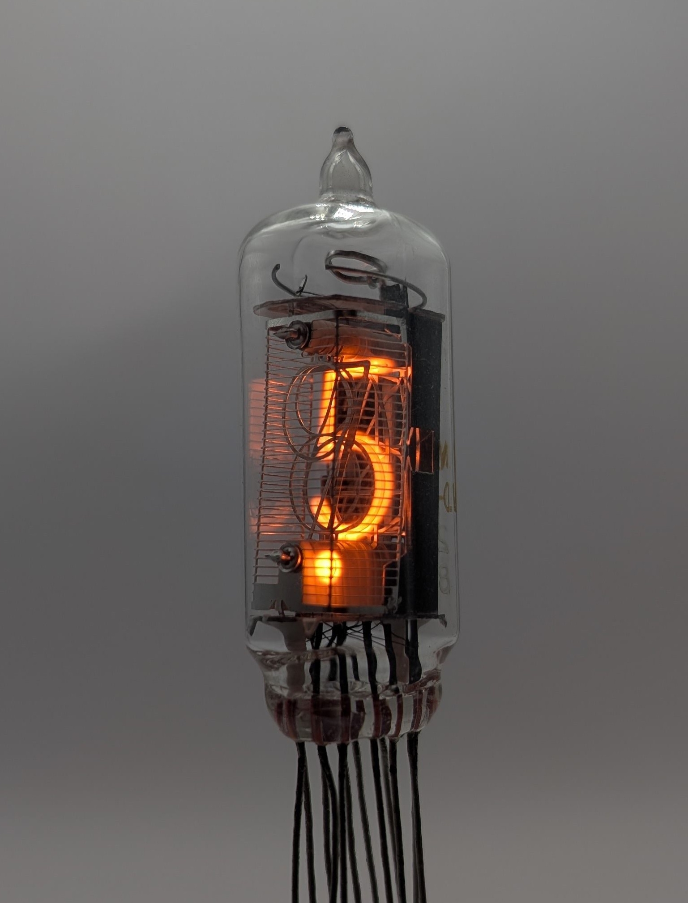](assets/7.jpg)

<table>
    <tr>
        <td>
            <a href="assets/8.jpg">
                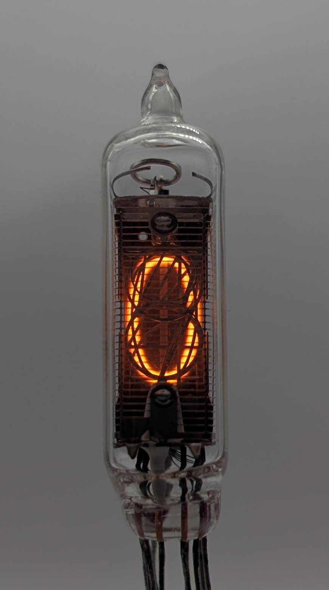
            </a>
        </td>
        <td>
            <a href="assets/9.jpg">
                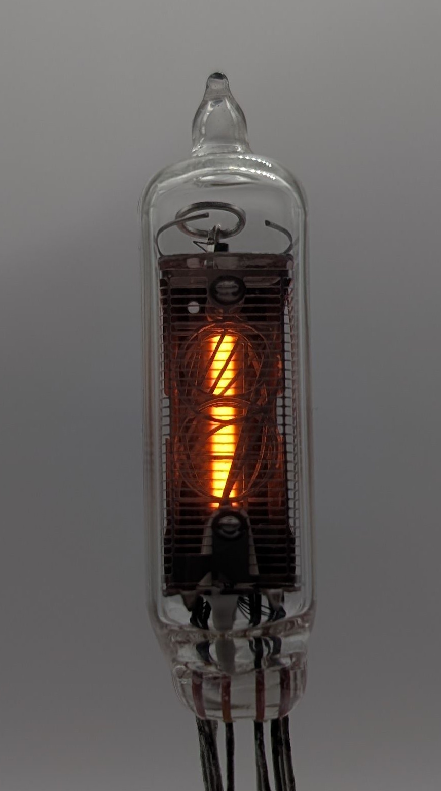
            </a>
        </td>
        <td>
            <a href="assets/10.jpg">
                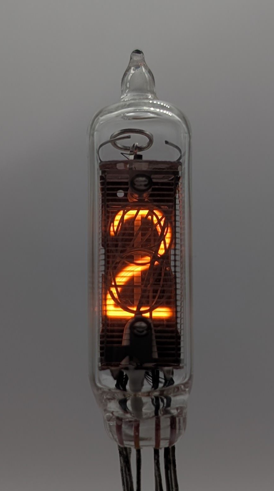
            </a>
        </td>
         <td>
            <a href="assets/11.jpg">
                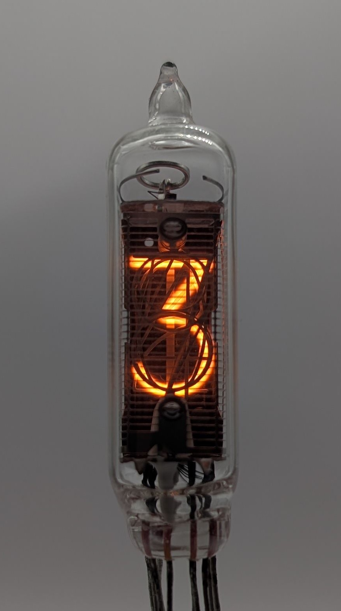
            </a>
        </td>
        <td>
            <a href="assets/12.jpg">
                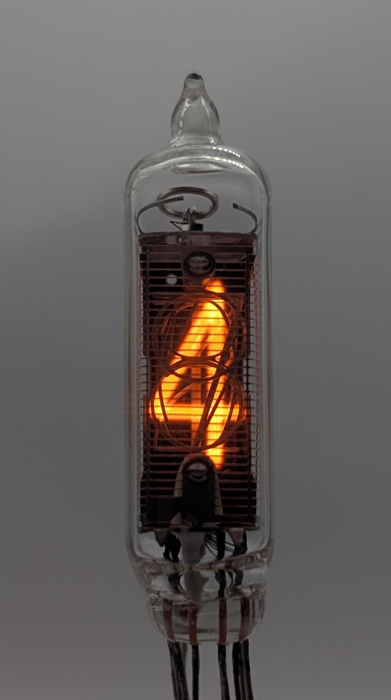
            </a>
        </td>
    </tr>
    <tr>
        <td>
            <a href="assets/13.jpg">
                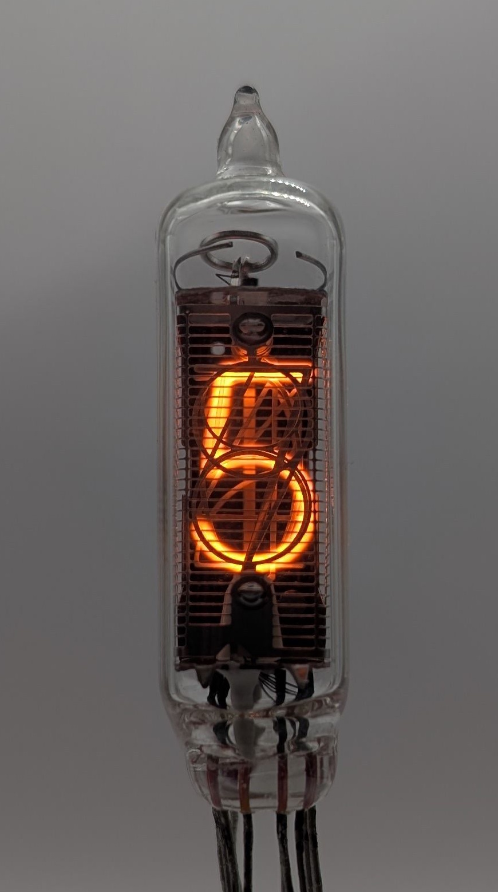
            </a>
        </td>
        <td>
            <a href="assets/14.jpg">
                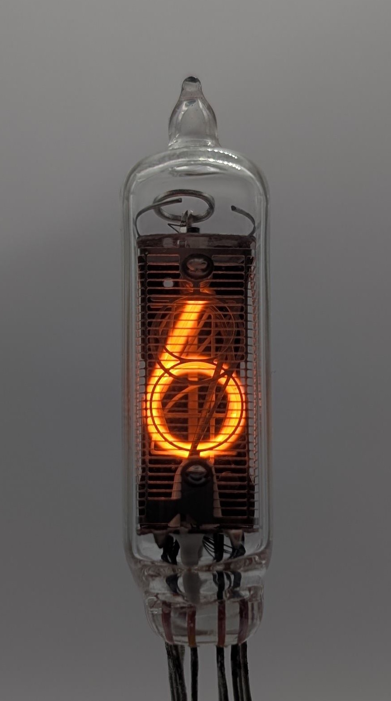
            </a>
        </td>
        <td>
            <a href="assets/15.jpg">
                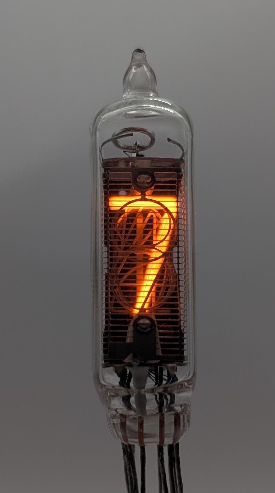
            </a>
        </td>
         <td>
            <a href="assets/16.jpg">
                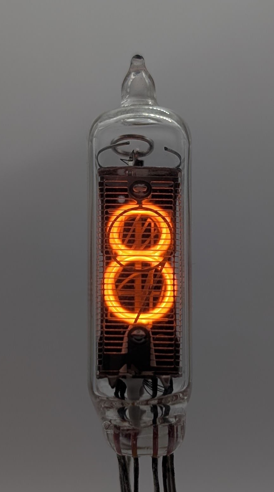
            </a>
        </td>
        <td>
            <a href="assets/17.jpg">
                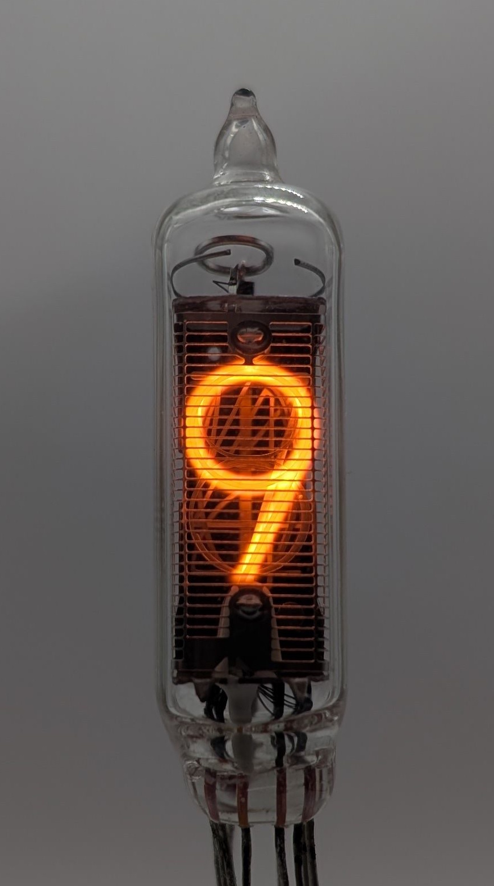
            </a>
        </td>
    </tr>
</table>