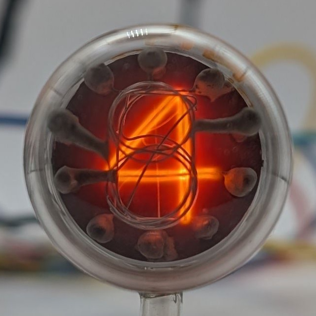

The National Union GI-10 is likely the first Nixie tube ever produced, belonging to National Union's Inditron series of display tubes. Patented applied for in 1954 (and granted in 1956), it predates the original "NIXI" tube developed by Haydu Brothers and later Burroughs by at least a few months. Similar to other early Nixie tubes, such as the [STC GN-1](/nixie/stc-gn-1/), its digits are not stamped from sheet metal but are crafted from wire. These digits are connected to the tube’s 10 pins via long rods covered in an insulating layer of ceramic that also serve to hold them in place. In contrast to more modern Nixie tubes, where the digits are arranged to minimize obstruction of each other, the digits in the GI-10 are organized in a straightforward, sequential manner. The zero digit is positioned at the very front, while the one is located at the farthest point in the stack. Unlike most later Nixie designs, the GI-10 lacks a dedicated anode; instead, activating a specific digit requires all other electrodes to be held at anode potential, which complicates the driving circuitry and makes it difficult to achieve uniform brightness across all digits. The tube uses a standard Noval 9-pin socket with an additional central pin.

The development of more sophisticated Nixie tubes rendered the GI-10 obsolete in a short time. No commercial device using the tubes is known to me. According to its box, my tube was packaged in March 1961, suggesting it was likely among the last of its kind to be produced.

A lot more information about the design choices behind the GI-10 can be found in the US patent linked below.

### Key Specifications

| Property          | Description    |
|-------------------|----------------|
| Manufacturer      | National Union |
| Time period       | Mid 1950s      |
| Digit height      | ~12mm          |
| Envelope diameter | ~20mm          |
| Socket            | Modified Noval |

### References

- [National Union GI-10 datasheet](https://www.tube-tester.com/sites/nixie/dat_arch/GI-10.pdf) ([Archive](https://web.archive.org/web/20240424052319/https://www.tube-tester.com/sites/nixie/dat_arch/GI-10.pdf))

- [US Patent](https://lampes-et-tubes.info/cd/US2756366.pdf) ([Archive](https://web.archive.org/web/20240422001121/https://lampes-et-tubes.info/cd/US2756366.pdf))

- [Inditron Advertisment](https://www.tube-tester.com/sites/nixie/dat_arch/inditron.pdf) ([Archive](https://web.archive.org/web/20240424052327/http://tube-tester.com/sites/nixie/dat_arch/inditron.pdf))

- [jb-electronics.de](http://www.jb-electronics.de/html/elektronik/nixies/n_gi10.htm) ([Archive](https://web.archive.org/web/20240421194434/http://www.jb-electronics.de/html/elektronik/nixies/n_gi10.htm))

- [nixies.us](https://www.nixies.us/bwg_gallery/gi-10/) ([Archive](https://web.archive.org/web/20240422043238/https://www.nixies.us/bwg_gallery/gi-10/))

- [lampes-et-tubes.info](https://lampes-et-tubes.info/cd/cd037.php?l=e) ([Archive](https://web.archive.org/web/20240422004557/https://lampes-et-tubes.info/cd/cd037.php?l=e))

- [industrialalchemy.org](https://www.industrialalchemy.org/articleview.php?item=423) ([Archive](https://web.archive.org/web/20240421194450/http://industrialalchemy.org/articleview.php?item=423))

<table>
    <tr>
        <td>
            
        </td>
        <td>
            
        </td>
        <td>
            
        </td>
         <td>
            
        </td>
        <td>
            
        </td>
    </tr>
    <tr>
        <td>
            
        </td>
        <td>
            
        </td>
        <td>
            
        </td>
         <td>
            
        </td>
        <td>
            
        </td>
    </tr>
</table>