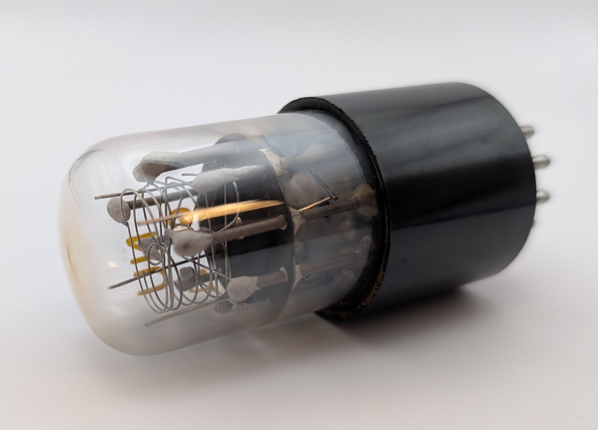
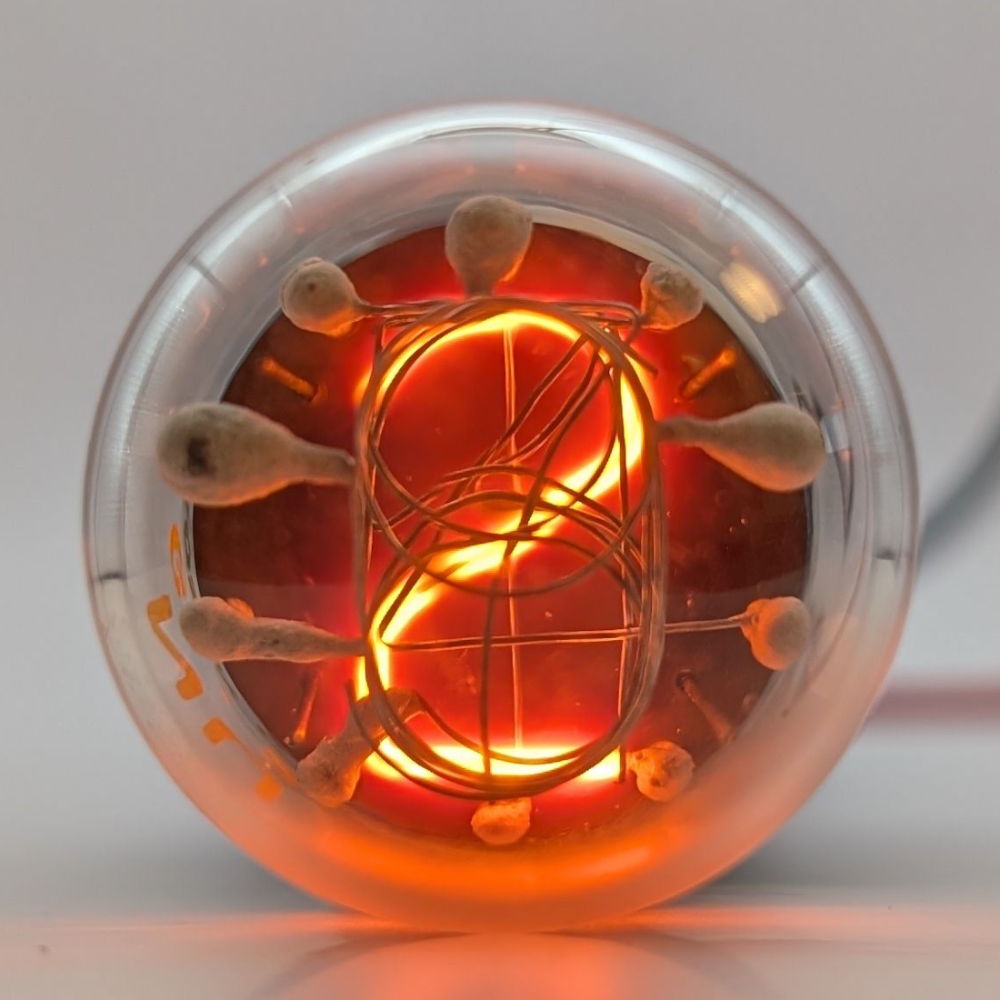
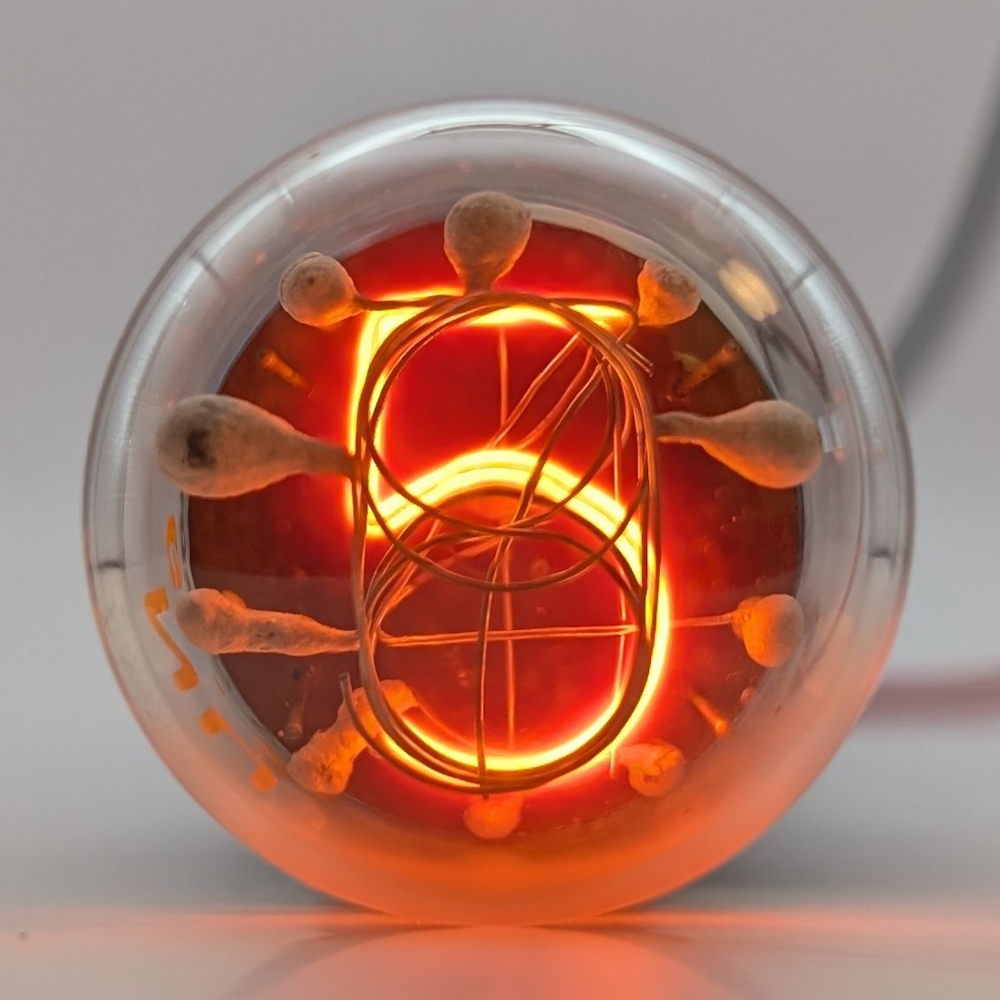

The GI-21 is the larger counterpart to the [GI-10](/nixie/nu-gi-10/), both manufactured by National Union as part of their "Inditron" line of display tubes. This places it among the earliest Nixie-style tubes ever produced, even predating the term "Nixie" itself that was coined by Haydu Brothers (later Burroughs) in the late 1950s. 

Like the GI-10, the GI-21 does not feature a dedicated anode cage, which became standard in later Nixie tubes. Instead, to illuminate a specific digit, all other digits must be held at anode potential while the desired digit is connected to ground. Interestingly, the GI-21 includes four metal rods connected to one of the pins on its phenolic base. In some examples, such as the one shown below, these rods can function as a dedicated anode, significantly simplifying the required driving circuitry. However, this functionality appears inconsistent across different units, suggesting that it may have been an experimental or partial implementation of a dedicated anode that did not fully meet expectations. 

Aside from that, the GI-21 shares an almost identical construction with the GI-10, including the use of ceramic-coated rods to support the various cathodes. Like the GI-10, its digits are not stamped from sheet metal but are instead hand-formed from wire which is a design feature typical of early Nixie tubes and can also be found in tubes such as the British [GN-1](/nixie/stc-gn-1/).

### Key Specifications

| Property          | Description    |
|-------------------|----------------|
| Manufacturer      | National Union |
| Time period       | Mid 1950s      |
| Digit height      | ~17mm          |
| Envelope diameter | ~29mm          |
| Socket            | ?              |

### References

- [National Union GI-10 datasheet](https://www.tube-tester.com/sites/nixie/dat_arch/GI-10.pdf) ([Archive](https://web.archive.org/web/20240424052319/https://www.tube-tester.com/sites/nixie/dat_arch/GI-10.pdf))

- [US Patent](https://lampes-et-tubes.info/cd/US2756366.pdf) ([Archive](https://web.archive.org/web/20240422001121/https://lampes-et-tubes.info/cd/US2756366.pdf))

- [Inditron Advertisment](https://www.tube-tester.com/sites/nixie/dat_arch/inditron.pdf) ([Archive](https://web.archive.org/web/20240424052327/http://tube-tester.com/sites/nixie/dat_arch/inditron.pdf))

- [jb-electronics.de](http://www.jb-electronics.de/html/elektronik/nixies/n_gi21.htm) ([Archive](https://web.archive.org/web/20240421194700/http://www.jb-electronics.de/html/elektronik/nixies/n_gi21.htm))

- [nixies.us](https://www.nixies.us/bwg_gallery/gi-21/) ([Archive](https://web.archive.org/web/20250428084458/https://www.nixies.us/bwg_gallery/gi-21/))

- [lampes-et-tubes.info](https://lampes-et-tubes.info/cd/cd043.php?l=e) ([Archive](https://web.archive.org/web/20240918202156/http://lampes-et-tubes.info/cd/cd043.php?l=e))

- [radiomuseum.org](https://www.radiomuseum.org/tubes/tube_gi-21.html) ([Archive](https://web.archive.org/web/20250515224040/https://www.radiomuseum.org/tubes/tube_gi-21.html))

<table>
    <tr>
        <td>
            
        </td>
        <td>
            
        </td>
        <td>
            
        </td>
         <td>
            
        </td>
        <td>
            
        </td>
    </tr>
    <tr>
        <td>
            
        </td>
        <td>
            
        </td>
        <td>
            
        </td>
         <td>
            
        </td>
        <td>
            
        </td>
    </tr>
</table>

