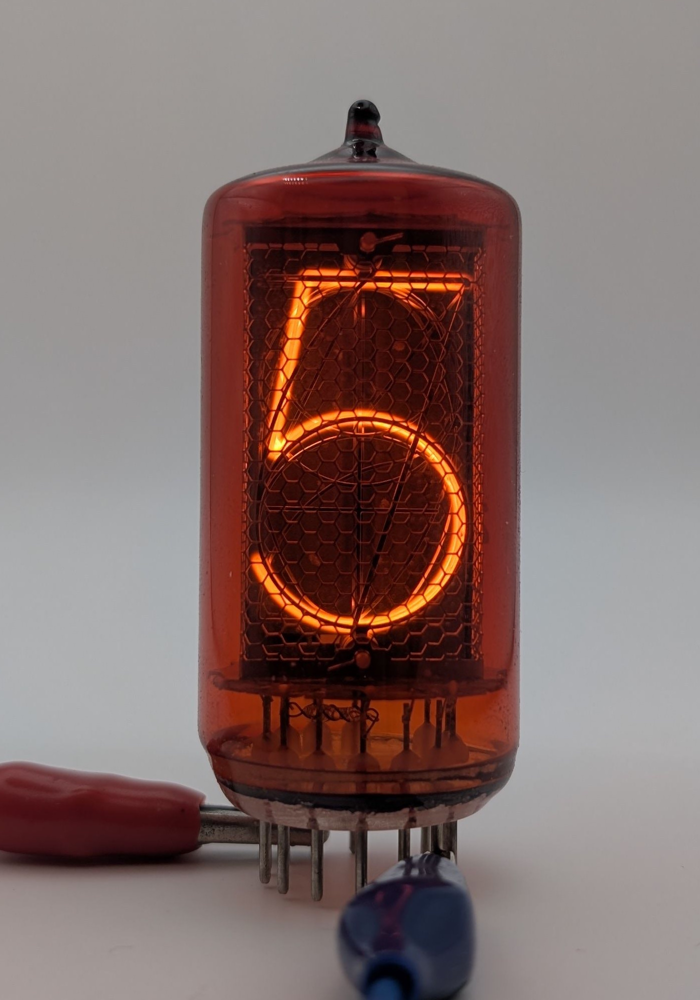

The Z566M is a large Nixie tube manufactured by RFT. It is pin compatible with the [ZM1040](/nixie/valvo-zm1040/) but differs in design, featuring a flatter top and a top-evacuation design, though some earlier units were evacuated from the bottom. In some instances, Z566Ms have even been rebranded and sold as ZM1040s (see picture at the end of this page). A variant without the pre-applied red filter was marketed as the Z5660M.

The Z566M was primarily utilized in laboratory equipment such as voltmeters and frequency counters. Its large size also made it well-suited for devices designed for use in educational settings, such as schools. A Nixie tube featuring various symbols, designed to complement the Z566M/Z5660M, was marketed under the names Z567M and Z5670M.

### Key Specifications

| Property          | Description |
|-------------------|-------------|
| Manufacturer      | RFT         |
| Time period       | Late 1960s  |
| Digit height      | 30mm        |
| Envelope diameter | 29.2mm      |
| Envelope height   | 62mm        |
| Socket            | B13B        |

### References

- [RFT Z566M datasheet](https://www.jogis-roehrenbude.de/Roehren-Geschichtliches/Nixie/Z560M.pdf) ([Archive](https://web.archive.org/web/20240804125247/https://www.jogis-roehrenbude.de/Roehren-Geschichtliches/Nixie/Z560M.pdf))

- [Hinweise zur Anwendung von Anzeigeröhren](/documents/hinweise-anwendung-anzeigeroehren/)

- [jogis-roehrenbude.de](https://www.jogis-roehrenbude.de/Roehren-Geschichtliches/Nixie/Z566M.htm) ([Archive](https://web.archive.org/web/20240421194602/https://www.jogis-roehrenbude.de/Roehren-Geschichtliches/Nixie/Z566M.htm))

- [tube-tester.com](https://www.tube-tester.com/sites/nixie/data/V600/Z566M/z566m.htm) ([Archive](https://web.archive.org/web/20240928090213/http://www.tube-tester.com/sites/nixie/data/V600/Z566M/z566m.htm))

- [swissnixie.com](https://www.swissnixie.com/tubes/Z566M/) ([Archive](https://web.archive.org/web/20240424051850/https://www.swissnixie.com/tubes/Z566M/))

- [radiomuseum.org](https://www.radiomuseum.org/tubes/tube_z566m.html) ([Archive](https://web.archive.org/web/20170803211050/http://www.radiomuseum.org/tubes/tube_z566m.html))

<table>
    <tr>
        <td>
            
        </td>
        <td>
            
        </td>
        <td>
            
        </td>
         <td>
            
        </td>
        <td>
            
        </td>
    </tr>
    <tr>
        <td>
            
        </td>
        <td>
            
        </td>
        <td>
            
        </td>
         <td>
            
        </td>
        <td>
            
        </td>
    </tr>
</table>

### Siemens Z566M

The Z566M was purchased and rebranded as the ZM1040 by Siemens, likely as a response to production shortages.

