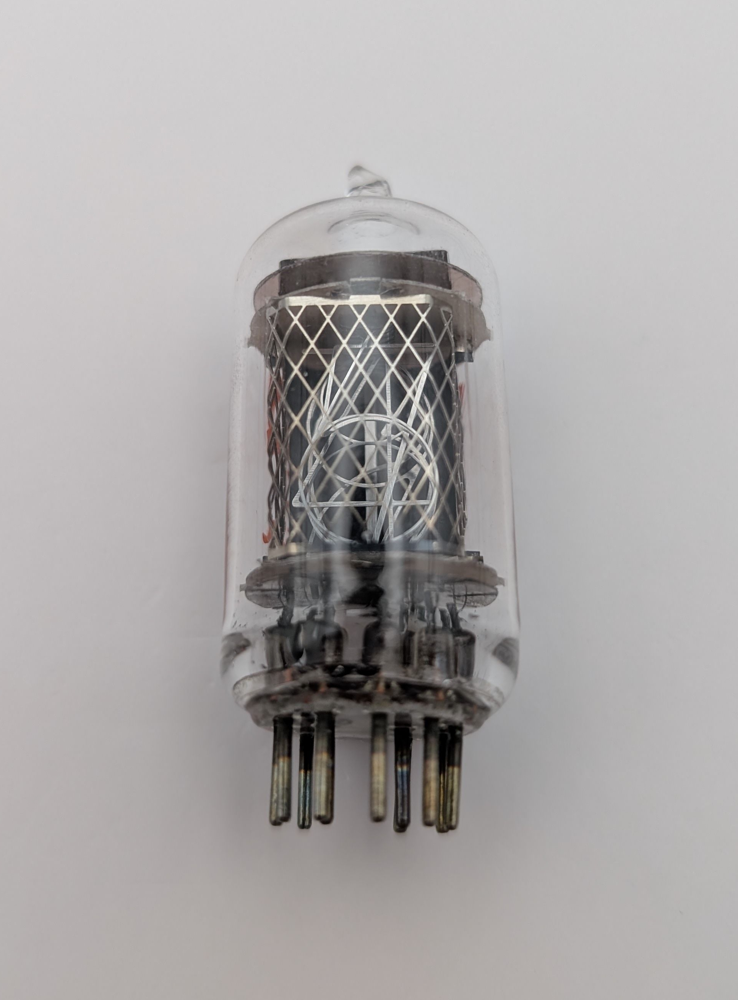

The CK8650 is a Nixie tube manufactured by Raytheon in the USA and sold under their "datavue" line as a Numerical Indicator Tube. Compared to other Nixie tubes with similarly sized digits, the CK8650 has a notably short and stubby appearance. Its hexagonal anode grid extends significantly beyond the frontmost digit, giving the tube a distinctive look. Not visible to the camera, glowing digits are surrounded by the characteristic blueish haze typically associated with the inclusion of mercury vapor which greatly extends the lifespan of Nixie tubes. The tube uses a standard 9-pin Noval base, along with two additional pins in the center, providing just enough connections to display digits 0 through 9, but lacking any decimal points.

Very little documentation exists for this tube. I was unable to locate a datasheet for it.

### Key Specifications

| Property          | Description    |
|-------------------|----------------|
| Manufacturer      | Raytheon       |
| Time period       | ?              |
| Digit height      | 15.5mm         |
| Envelope diameter | 21mm           |
| Envelope height   | ~44mm          |
| Socket            | Modified Noval |

### References

- [jb-electronics.de](http://www.jb-electronics.de/html/elektronik/nixies/n_ck8650.htm) ([Archive](https://web.archive.org/web/20240421194620/http://www.jb-electronics.de/html/elektronik/nixies/n_ck8650.htm))

<table>
    <tr>
        <td>
            
        </td>
        <td>
            
        </td>
        <td>
            
        </td>
         <td>
            
        </td>
        <td>
            
        </td>
    </tr>
    <tr>
        <td>
            
        </td>
        <td>
            
        </td>
        <td>
            
        </td>
         <td>
            
        </td>
        <td>
            
        </td>
    </tr>
</table>