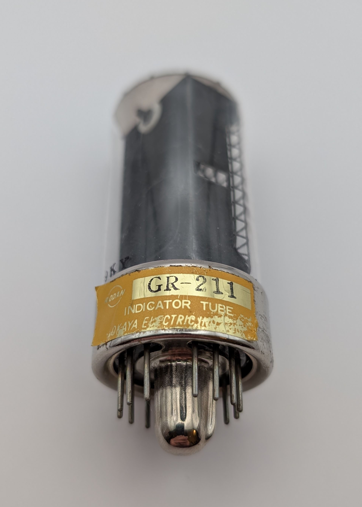

The GR-211 is a large Nixie tube produced by Rodan-Okaya in Japan. It ranks as the third-largest Nixie tube made by Rodan and succeeded the short-lived GR-11. Later models were rebranded as CD94. Notably, the GR-211 includes a left decimal point, which is uncommon for tubes of its size. In devices using larger Nixie tubes, a separate neon bulb typically represented the comma instead. Interestingly, the datasheet marks the decimal point's pin as "not connected."

Like most Rodan-manufactured Nixie tubes, the GR-211 features an unusually intricate design and the distinctive, warm glow characteristic of their tubes. Its aesthetic appeal is further enhanced by a chromium-plated base and the golden sticker, typical of Japanese tubes.

Originally, the GR-211 came packaged with a compatible socket in its box. Unfortunately, my unit is missing both the box and the included socket.

### Key Specifications

| Property          | Description |
|-------------------|-------------|
| Manufacturer      | Rodan       |
| Time period       | ?           |
| Digit height      | 35mm        |
| Envelope diameter | 30mm        |
| Envelope height   | ~78mm       |
| Base diameter     | 32mm        |
| Socket            | TSP-14B     |

### References

- [Rodan GR-211 datasheet](https://www.tube-tester.com/sites/nixie/dat_arch/Rodan_02.pdf) ([Archive](https://web.archive.org/web/20240615172130/http://www.tube-tester.com/sites/nixie/dat_arch/Rodan_02.pdf))

- [jb-electronics.de](http://www.jb-electronics.de/html/elektronik/nixies/n_cd94.htm) ([Archive](https://web.archive.org/web/20240421194558/http://www.jb-electronics.de/html/elektronik/nixies/n_cd94.htm))

- [nixies.us](https://www.nixies.us/bwg_gallery/gr-211/) ([Archive](https://web.archive.org/web/20240714195657/https://www.nixies.us/bwg_gallery/gr-211/))

- [swissnixie.com](https://www.swissnixie.com/tubes/GR211/) ([Archive](https://web.archive.org/web/20240424051850/https://www.swissnixie.com/tubes/GR211/))

<table>
    <tr>
        <td>
            
        </td>
        <td>
            
        </td>
        <td>
            
        </td>
         <td>
            
        </td>
        <td>
            
        </td>
    </tr>
    <tr>
        <td>
            
        </td>
        <td>
            
        </td>
        <td>
            
        </td>
         <td>
            
        </td>
        <td>
            
        </td>
    </tr>
</table>