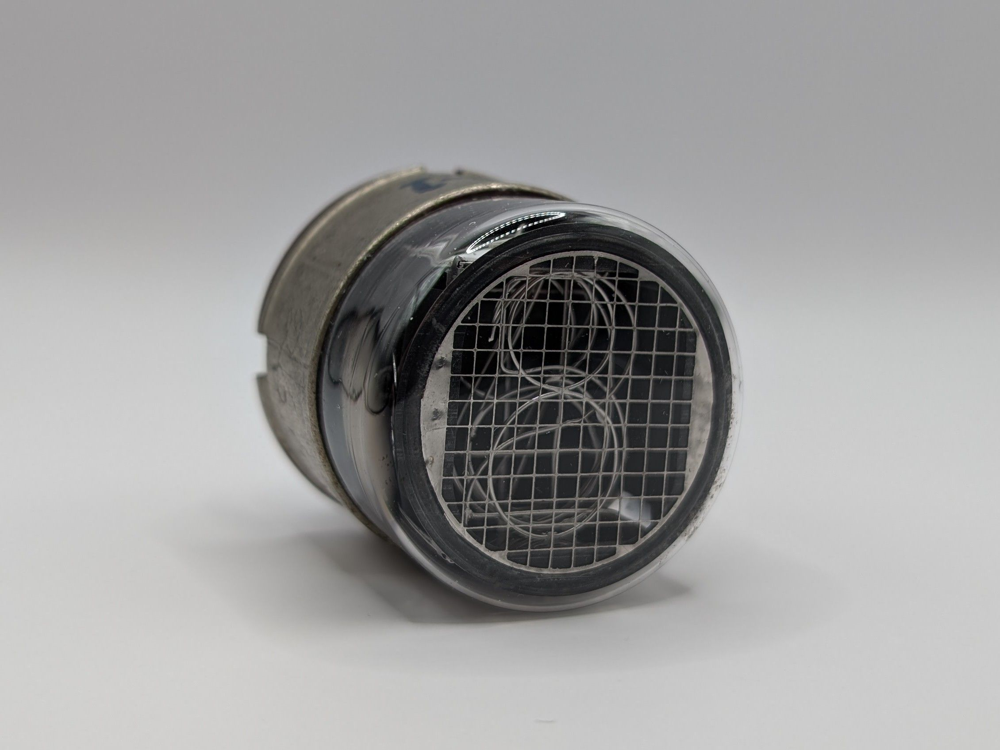

The GN-1, manufactured by STC and sold under the name 'Nodistron', was among the earliest commercially available Nixie tubes. The oldest documentation I could locate dates back to December 1959 (referenced below). The tube's design reflects its age, with the digits being formed from wire rather than stamped from sheet metal like in most later Nixies. The GN-1 emits a distinctly orange glow, indicative of a mercury-free design, which likely results in a shorter lifespan compared to later models. Unlike more modern Nixie tubes, the GN-1 includes two evaporative getters, clearly visible on the left and right sides of the glass envelope. Additionally, its numerals are not mounted on a metal pin insulated by spacers but are instead secured between two mica plates and connected to the tube's pins via thick wires. Interestingly, according to the datasheet, the tube has two anodes for use with direct and alternating currrent respectively.

The tube originally came with a black shrink wrap that contained the manufacturer's logo and the model description. A version without an anode grid was also available.

### Key Specifications

| Property          | Description |
|-------------------|-------------|
| Manufacturer      | STC         |
| Time period       | Late 1950s  |
| Digit height      | ~25mm       |
| Envelope diameter | 40mm        |
| Socket            | B12A        |

### References

- [STC GN-1 datasheet](/documents/numeral-indicator-tube-type-gn-1/)

- [Lorenz GN-1 datasheet](http://www.jb-electronics.de/downloads/elektronik/nixies/GN-1.pdf) ([Archive](https://web.archive.org/web/20240421194744/http://www.jb-electronics.de/downloads/elektronik/nixies/GN-1.pdf))

- [jb-electronics.de](http://www.jb-electronics.de/html/elektronik/nixies/n_gn1.htm) ([Archive](https://web.archive.org/web/20240421194441/http://www.jb-electronics.de/html/elektronik/nixies/n_gn1.htm?lang=en))

- [nixies.us](https://www.nixies.us/bwg_gallery/gn1/) ([Archive](https://web.archive.org/web/20240422043053/https://www.nixies.us/bwg_gallery/gn1/))

- [swissnixie.com](https://www.swissnixie.com/tubes/GN1/) ([Archive](https://web.archive.org/web/20240424051453/https://www.swissnixie.com/tubes/GN1/))

<table>
    <tr>
        <td>
            
        </td>
        <td>
            
        </td>
        <td>
            
        </td>
         <td>
            
        </td>
        <td>
            
        </td>
    </tr>
    <tr>
        <td>
            
        </td>
        <td>
            
        </td>
        <td>
            
        </td>
         <td>
            
        </td>
        <td>
            
        </td>
    </tr>
</table>