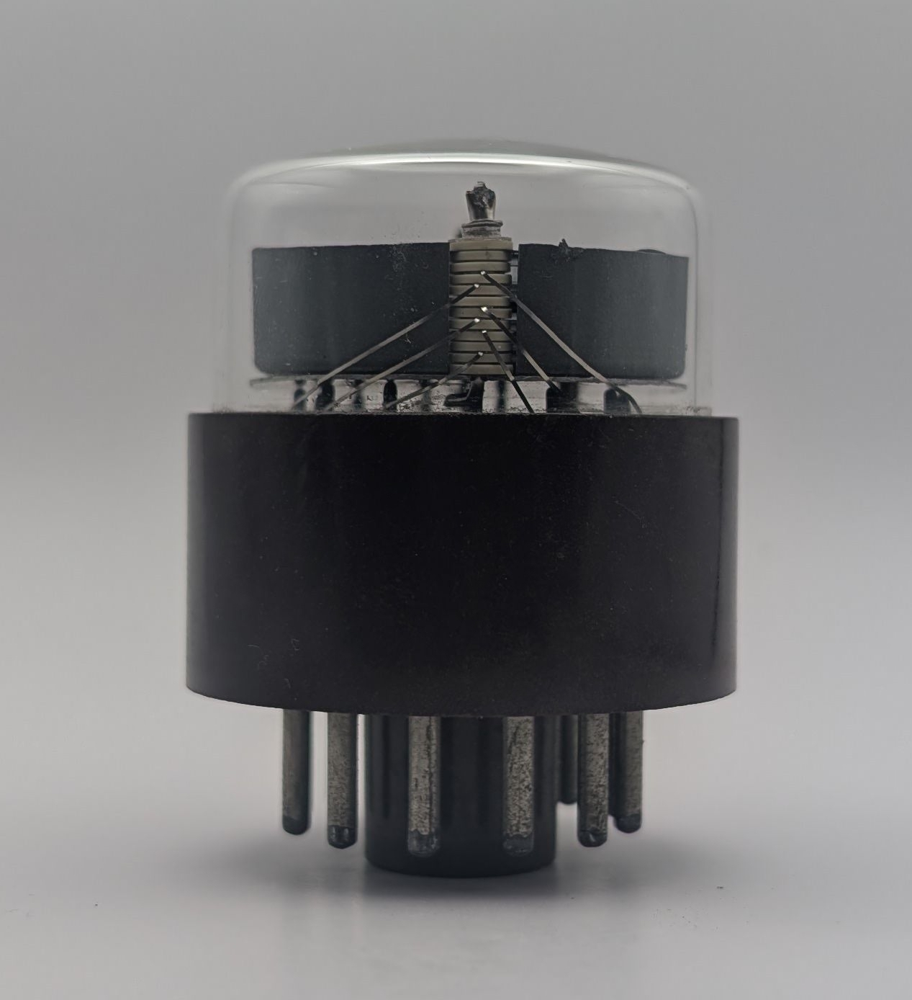

The GN-2 is a large Nixie tube produced by STC as part of their 'Nodistron' line of display tubes. It is pin-compatible with and the direct successor to the [GN-1](/nixie/stc-gn-1/) and already shows notable advancements in Nixie tube manufacturing. Unlike its predecessor, the GN-2 features digits stamped from sheet metal instead of ones made from bent wire. These digits are arranged in a more compact stack, separated by insulating rings. The thick wires previously used to connect the numerals to their corresponding pins have been replaced with the thinner leads seen in most later top-viewing Nixie tubes. Additionally, the GN-2 no longer employs evaporative getters and the pin connected to the anode meant for operation with rectified AC voltage on the GN-1 is now marked as NC in the tube's datasheet. The tube's numerals emit the same distinctive orange glow seen in the GN-1, indicative of a mercury-free production process suggesting a relatively short operational lifespan.

As with the GN-1, the GN-2 originally came wrapped in black shrink wrap bearing the model number and manufacturer logo. Unfortunately, it is missing from the unit shown below.

### Key Specifications

| Property          | Description |
|-------------------|-------------|
| Manufacturer      | STC         |
| Time period       | Early 1960s |
| Digit height      | ~25mm       |
| Envelope diameter | 40mm        |
| Socket            | B12A        |

### References

- [Lorenz GN-2 datasheet](https://www.tube-tester.com/sites/nixie/dat_arch/GN2.pdf) ([Archive](https://web.archive.org/web/20240424052334/http://tube-tester.com/sites/nixie/dat_arch/GN2.pdf))

- [jb-electronics.de](http://jb-electronics.de/html/elektronik/nixies//n_gn2a.htm) ([Archive](https://web.archive.org/web/20190324200605/http://jb-electronics.de/html/elektronik/nixies//n_gn2a.htm))

<table>
    <tr>
        <td>
            
        </td>
        <td>
            
        </td>
        <td>
            
        </td>
         <td>
            
        </td>
        <td>
            
        </td>
    </tr>
    <tr>
        <td>
            
        </td>
        <td>
            
        </td>
        <td>
            
        </td>
         <td>
            
        </td>
        <td>
            
        </td>
    </tr>
</table>