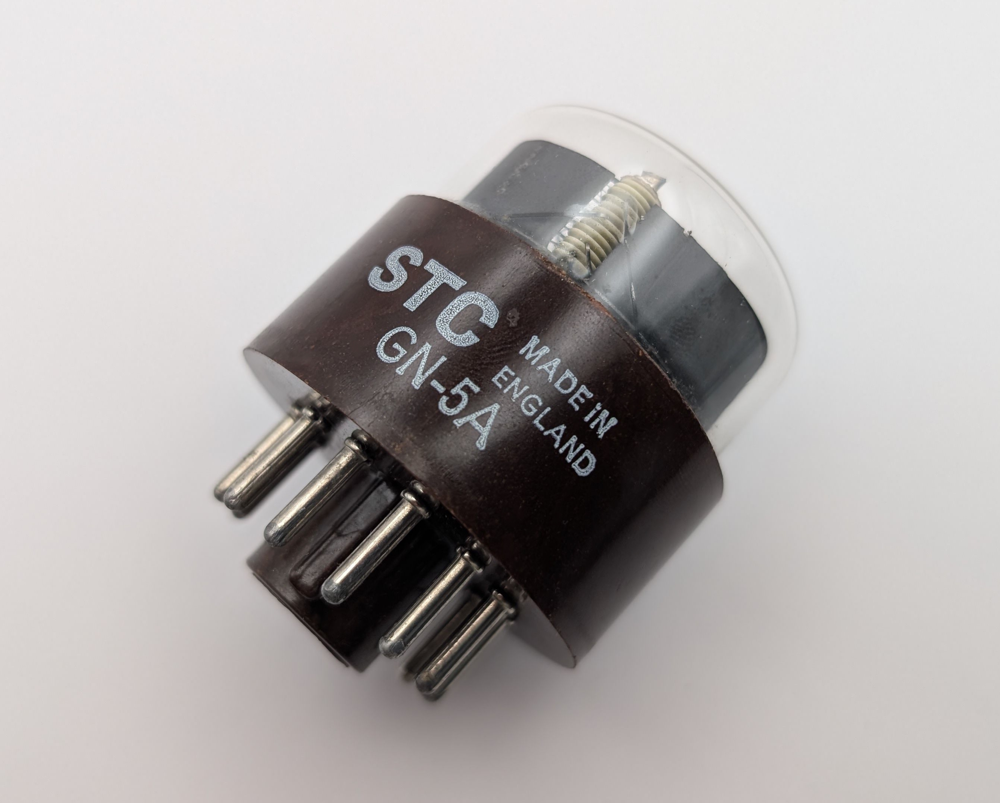
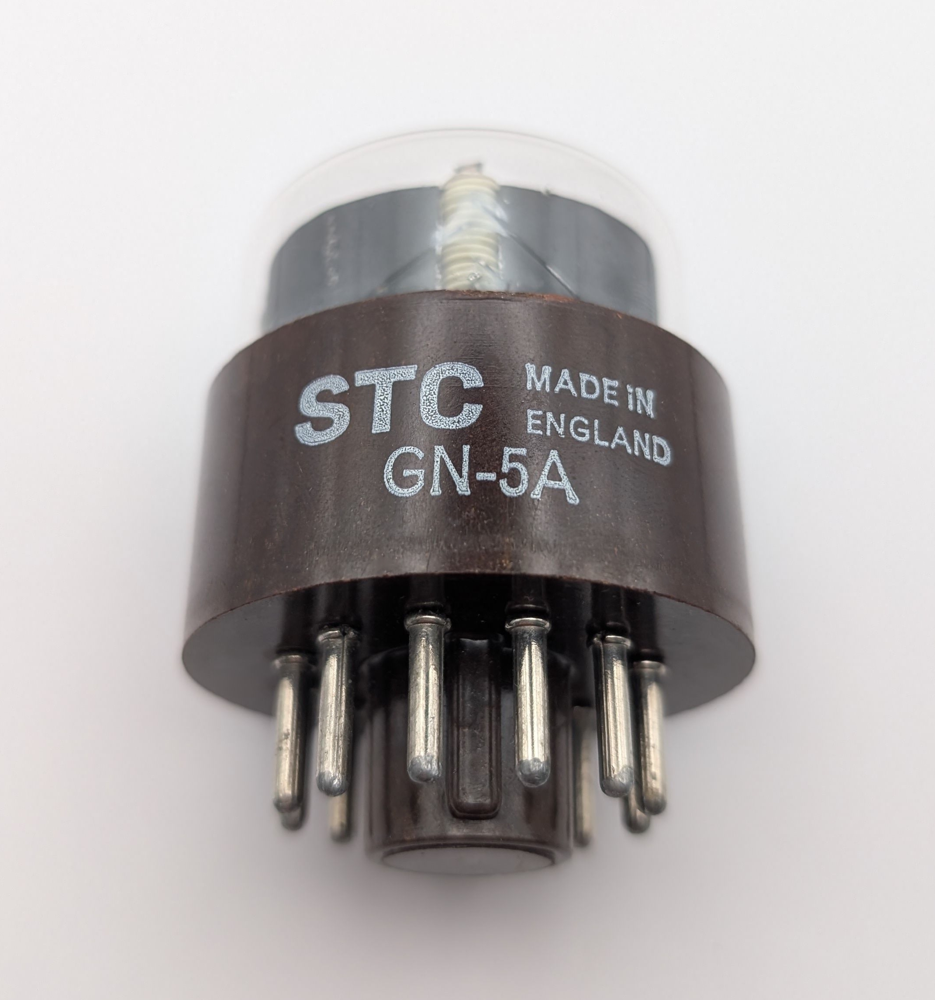

The GN-5A (military code CV5351) is a large top-viewing Nixie tube produced by the British manufacturer STC and marketed under the "Nodistron" brand. It succeeds the [GN-1](/nixie/stc-gn-1/) and [GN-2](/nixie/stc-gn-2/) models, maintaining the same pinout and compatible electrical specifications. A distinguishing feature of the GN-5A is the faint bluish glow emitted by its illuminated digits, indicating the presence of mercury in the gas mixture which was absent from its predecessors. This mercury addition likely contributes to a significantly extended lifespan. Visually, the GN-5A closely resembles the GN-2, with the main external difference being the addition of a non-evaporative getter, a feature commonly found in later-generation Nixie tubes.

A variant of the GN-5A with a red-coated glass envelope was also available, designated as the GN-5.

### Key Specifications

| Property          | Description |
|-------------------|-------------|
| Manufacturer      | STC         |
| Time period       | Mid 1960s  |
| Digit height      | ~25mm       |
| Envelope diameter | 40mm        |
| Socket            | B12A        |

### References

- [Lorenz GN-5A datasheet](https://www.tube-tester.com/sites/nixie/dat_arch/GN5_GN5A.pdf) ([Archive](https://web.archive.org/web/20241014114846/https://www.tube-tester.com/sites/nixie/dat_arch/GN5_GN5A.pdf))

- [jb-electronics.de](http://www.jb-electronics.de/html/elektronik/nixies/n_gn5a.htm) ([Archive](https://web.archive.org/web/20240421194549/http://www.jb-electronics.de/html/elektronik/nixies/n_gn5a.htm))

- [nixies.us](https://www.nixies.us/bwg_gallery/gn5/) ([Archive](https://web.archive.org/web/20250428094829/https://www.nixies.us/bwg_gallery/gn5/))

- [swissnixie.com](https://www.swissnixie.com/tubes/GN5A/) ([Archive](https://web.archive.org/web/20250226160316/https://www.swissnixie.com/tubes/GN5A/))

<table>
    <tr>
        <td>
            
        </td>
        <td>
            
        </td>
        <td>
            
        </td>
         <td>
            
        </td>
        <td>
            
        </td>
    </tr>
    <tr>
        <td>
            
        </td>
        <td>
            
        </td>
        <td>
            
        </td>
         <td>
            
        </td>
        <td>
            
        </td>
    </tr>
</table>
