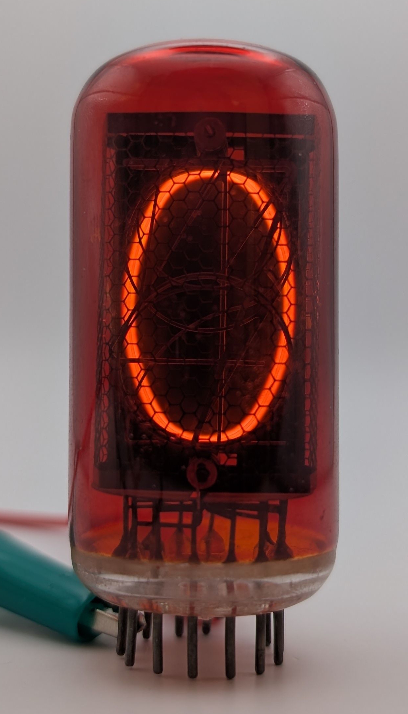

The ZM1040 is a large Nixie tube produced by various European manufacturers, with this particular unit made by Valvo. Tesla, a Czechoslovakian manufacturer, produced a version of the ZM1040 that featured a square anode grid, setting it apart from the one shown here. To enhance contrast and filter out blue light emitted by the included mercury vapor, the tube is covered with a red filter. A variant without this filter was also available under the designation ZM1042.

The ZM1040 is pin-compatible with and visually similar to the East German [Z566M](/nixie/rft-z566m/), produced by RFT. In some cases, Z566M tubes were even rebranded as ZM1040s, likely to meet high demand, as evidenced by one of the pictures below. The main difference between the two models is that the Z566M was evacuated from the top, whereas the ZM1040 was evacuated from the bottom.

Thanks to its large size. aesthetically pleasing shape, and exceptionally reliability, the ZM1040 has become a popular choice for Nixie clock builders.

### Key Specifications

| Property          | Description |
|-------------------|-------------|
| Manufacturer      | Valvo       |
| Time period       | Mid 1960s   |
| Digit height      | 31mm        |
| Envelope diameter | ~30mm       |
| Envelope height   | 62mm        |
| Socket            | B13B        |

### References

- [Philips ZM1040 datasheet](https://www.tube-tester.com/sites/nixie/dat_arch/ZM1040_01.pdf) ([Archive](https://web.archive.org/web/20241007103446/https://www.tube-tester.com/sites/nixie/dat_arch/ZM1040_01.pdf))

- [tube-tester.com](https://www.tube-tester.com/sites/nixie/data/V600/ZM1040-sie/zm1040-sie.htm) ([Archive](https://web.archive.org/web/20241211062740/https://www.tube-tester.com/sites/nixie/data/V600/ZM1040-sie/zm1040-sie.htm))

- [nixies.us](https://www.nixies.us/bwg_gallery/zm1040/) ([Archive](https://web.archive.org/web/20250120123925/https://www.nixies.us/bwg_gallery/zm1040/))

- [swissnixie.com](https://www.swissnixie.com/tubes/ZM1040SIEMENS/) ([Archive](https://web.archive.org/web/20250224235651/https://www.swissnixie.com/tubes/ZM1040SIEMENS/))
 
- [jb-electronic.de](http://www.jb-electronics.de/html/elektronik/nixies/n_zm1040_tesla.htm) ([Archive](https://web.archive.org/web/20240421194549/http://www.jb-electronics.de/html/elektronik/nixies/n_zm1040_tesla.htm))

- [radiomuseum.org](https://www.radiomuseum.org/tubes/tube_zm1040.html) ([Archive](https://web.archive.org/web/20250224131408/https://www.radiomuseum.org/tubes/tube_zm1040.html))

<table>
    <tr>
        <td>
            
        </td>
        <td>
            
        </td>
        <td>
            
        </td>
         <td>
            
        </td>
        <td>
            
        </td>
    </tr>
    <tr>
        <td>
            
        </td>
        <td>
            
        </td>
        <td>
            
        </td>
         <td>
            
        </td>
        <td>
            
        </td>
    </tr>
</table>

### Comparison between the Z566M (left) and ZM1040 (right).

### A Z566M restamped as a ZM1040.