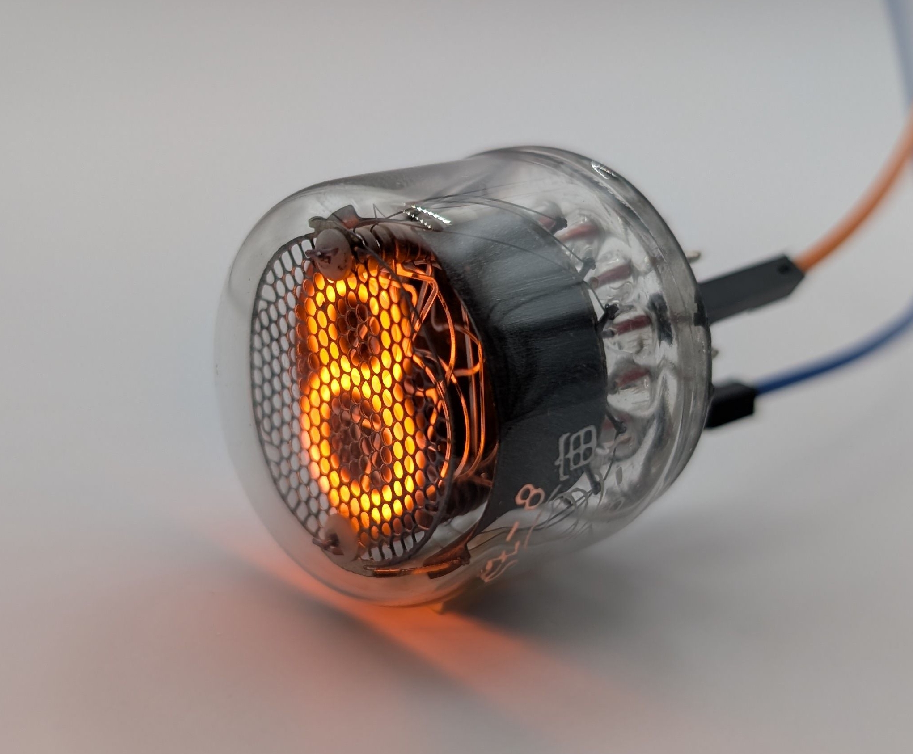

The SZ-8 is a medium-sized Nixie tube manufactured by the Chinese company Zhishiguan (somtimes called Universe). Among the few Nixie tube models produced in China, the SZ-8 is by far the most common. Alongside the Soviet Union, China was one of the last countries to continue manufacturing Nixie tubes in significant quantities into the early 1980s.

Visually and electrically, the SZ-8 resembles European models like the ZM1022 and Z5600M, and it shares the same pin configuration. However, unlike these European counterparts, the SZ-8 has a shorter lifespan due to the absence of mercury vapor in its gas mixture. This omission makes it unsuitable for continuous-use applications such as clocks. Nevertheless, the lack of mercury results in a uniquely vivid and pure orange glow from the digits which partly makes up for the poor internal construction many units exhibit.

### Key Specifications

| Property          | Description |
|-------------------|-------------|
| Manufacturer      | Zhishiguan  |
| Time period       | ?           |
| Digit height      | 15.5mm      |
| Envelope diameter | 30mm        |
| Socket            | B13B        |

### References

- [SZ-8 datasheet](https://www.tube-tester.com/sites/nixie/dat_arch/SZ-8.pdf) ([Archive](https://web.archive.org/web/20241014112608/https://www.tube-tester.com/sites/nixie/dat_arch/SZ-8.pdf))

- [swissnixie.com](https://www.swissnixie.com/tubes/SZ8/) ([Archive](https://web.archive.org/web/20240907040056/https://www.swissnixie.com/tubes/SZ8/))

- [jb-electronics.de](http://www.jb-electronics.de/html/elektronik/nixies/n_sz8.htm) ([Archive](https://web.archive.org/web/20250422031242/http://jb-electronics.de/html/elektronik/nixies/n_sz8.htm))

- [nixies.us](https://www.nixies.us/bwg_gallery/sz8/) ([Archive](https://web.archive.org/web/20250428084806/https://www.nixies.us/bwg_gallery/sz8/))

<table>
    <tr>
        <td>
            
        </td>
        <td>
            
        </td>
        <td>
            
        </td>
         <td>
            
        </td>
        <td>
            
        </td>
    </tr>
    <tr>
        <td>
            
        </td>
        <td>
            
        </td>
        <td>
            
        </td>
         <td>
            
        </td>
        <td>
            
        </td>
    </tr>
</table>

