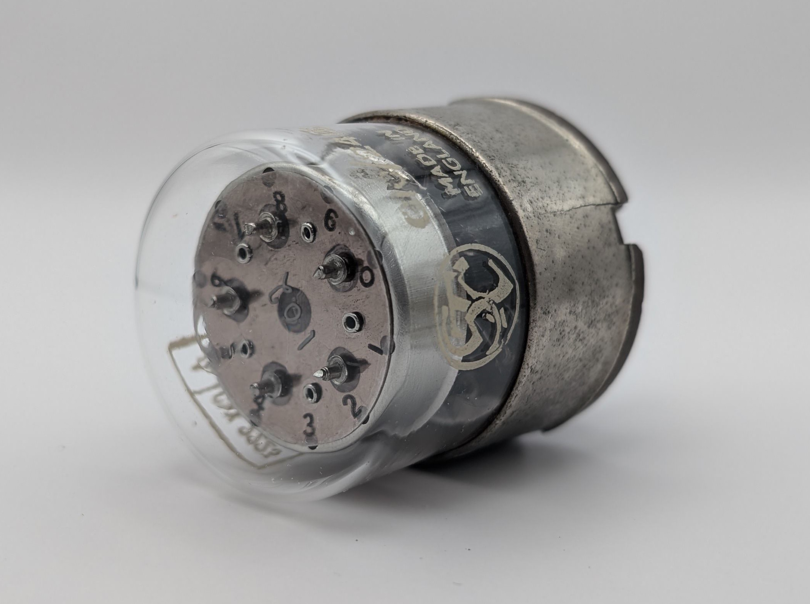
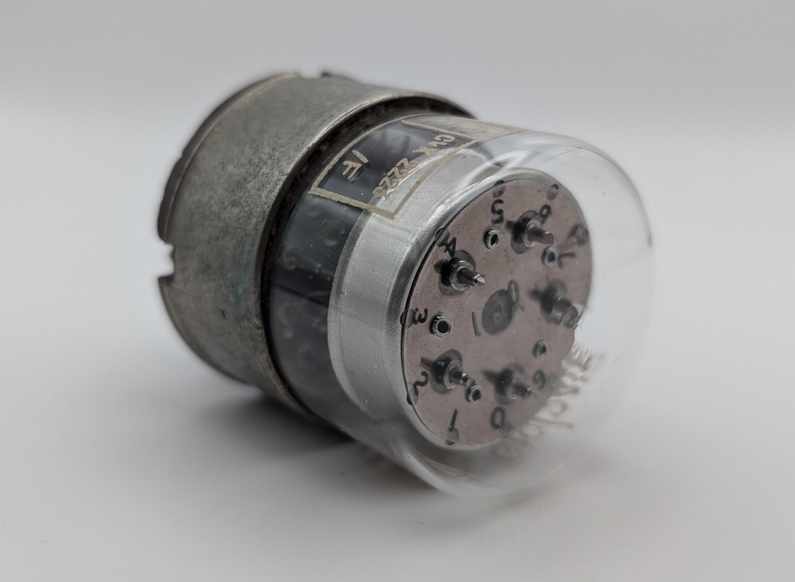
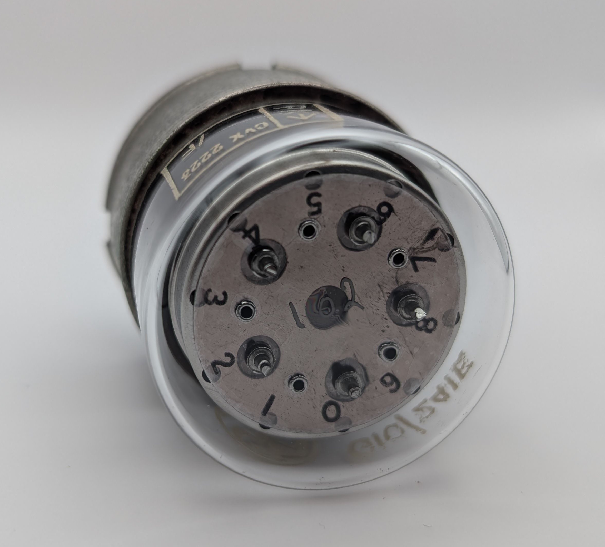
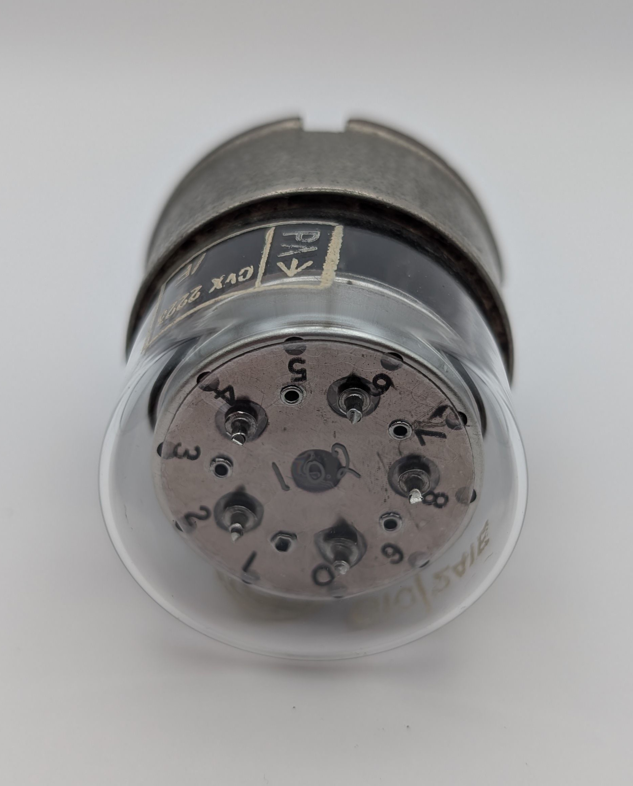
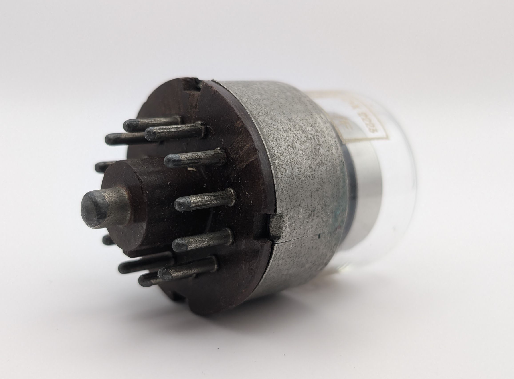
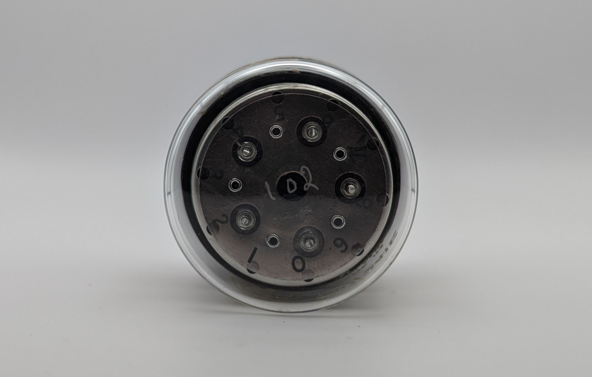
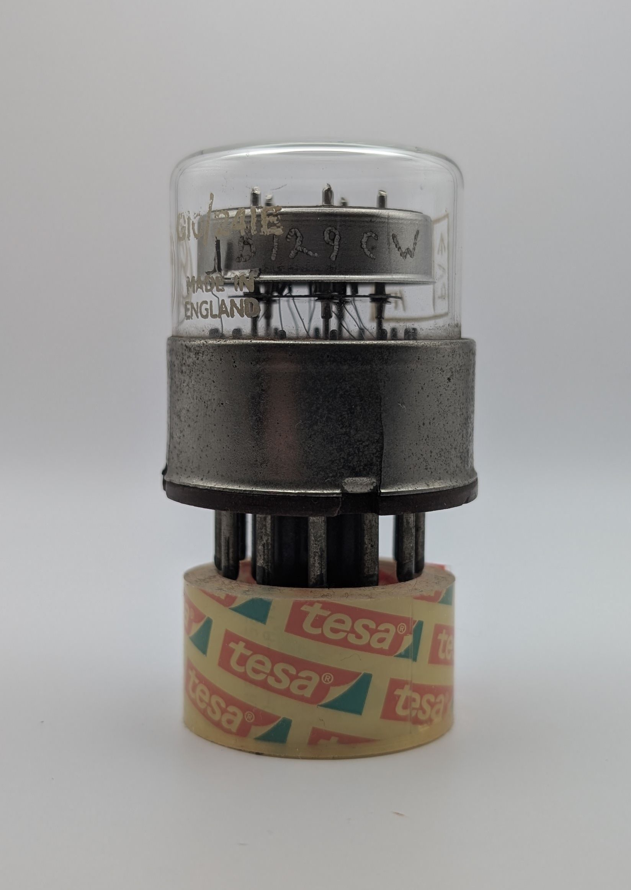

The STC G10/241E is an early neon-filled counting tube, classified as a Nomotron, allowing for up to 20,000 counts/second. It operates in a unidirectional, single-pulse mode, advancing the discharge by one position with each pulse and featuring ten stable positions. Unlike conventional decadic counting tubes (Dekatrons), its guiding electrodes are concealed behind a metal shell. Only the stable cathodes are visible through circular openings, each marked with its corresponding value on a transparent mica shield.

The tube features a specialized socket design based on the B12A socket, incorporating an additional central pin that connects to the tube's anode.

This particular unit includes two handwritten markings: one labeled "162" in the center of the mica shield and another, "B129CW," etched into the metal shell. The production of these tubes likely required significant manual craftsmanship.

A full scan of the document "STC Valves Appilcation Report - G10/241E" containing much more information on the tube can be found [here](http://localhost:1313/documents/g10-241e-application-report/).

### Key Specifications

| Property          | Description       |
|-------------------|-------------------|
| Manufacturer      | STC               |
| Time period       | mid 1950s         |
| Filling           | Neon              |
| Counting speed    | <20,000 c/s       |
| Envelope diameter | 41mm              |
| Socket            | McMurdo type X12E |

### References

- [STC G10/241E Appplication Report](http://localhost:1313/documents/g10-241e-application-report/)

- [STC G10/241E datasheet](https://www.industrialalchemy.org/pdf2/G10241E.pdf) ([Archive](https://web.archive.org/web/20240421194458/https://www.industrialalchemy.org/pdf2/G10241E.pdf))

- [industrialalchemy.org](https://www.industrialalchemy.org/articleview.php?item=472) ([Archive](https://web.archive.org/web/20240421194630/https://www.industrialalchemy.org/articleview.php?item=472))

- [lampes-et-tubes.info](https://lampes-et-tubes.info/cd/cd055.php?l=)

- [tubecollection.de](https://www.tubecollection.de/ura/nomotron.htm) ([Archive](https://web.archive.org/web/20240424053103/https://www.tubecollection.de/ura/nomotron.htm))

- [tube-tester.com](https://www.tube-tester.com/sites/nixie/datdekat/G10-241E/g10-241e.htm) ([Archive](https://web.archive.org/web/20240424052246/https://www.tube-tester.com/sites/nixie/datdekat/G10-241E/g10-241e.htm))

- [radiomuesum.org](https://www.radiomuseum.org/tubes/tube_g10241e.html)

