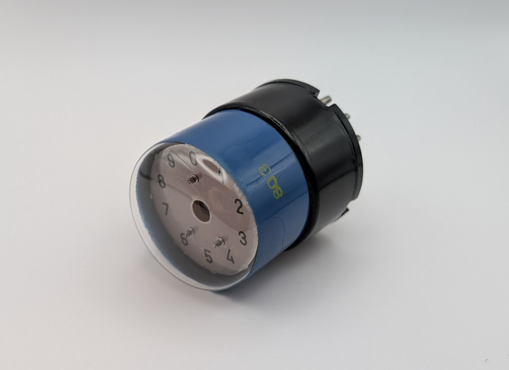
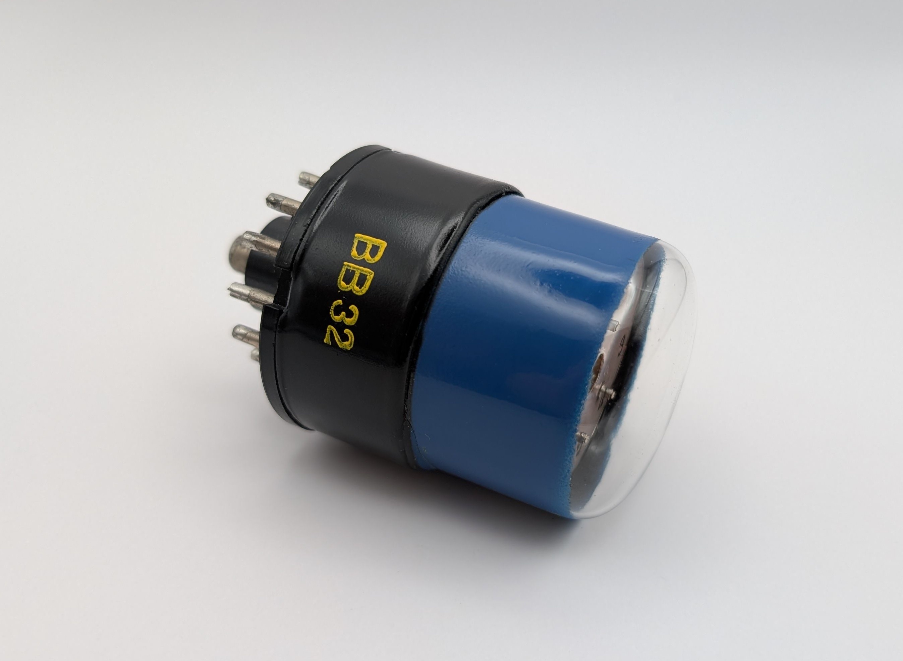
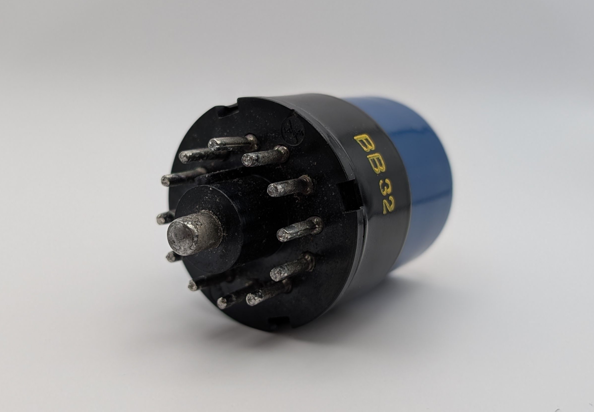
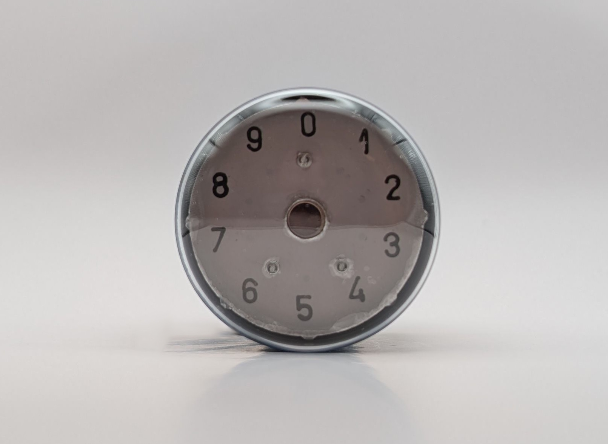
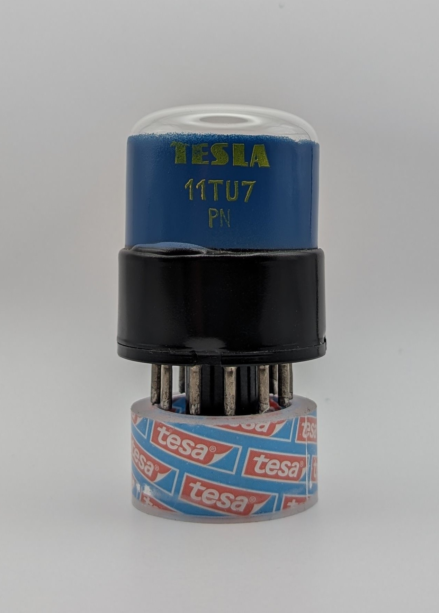
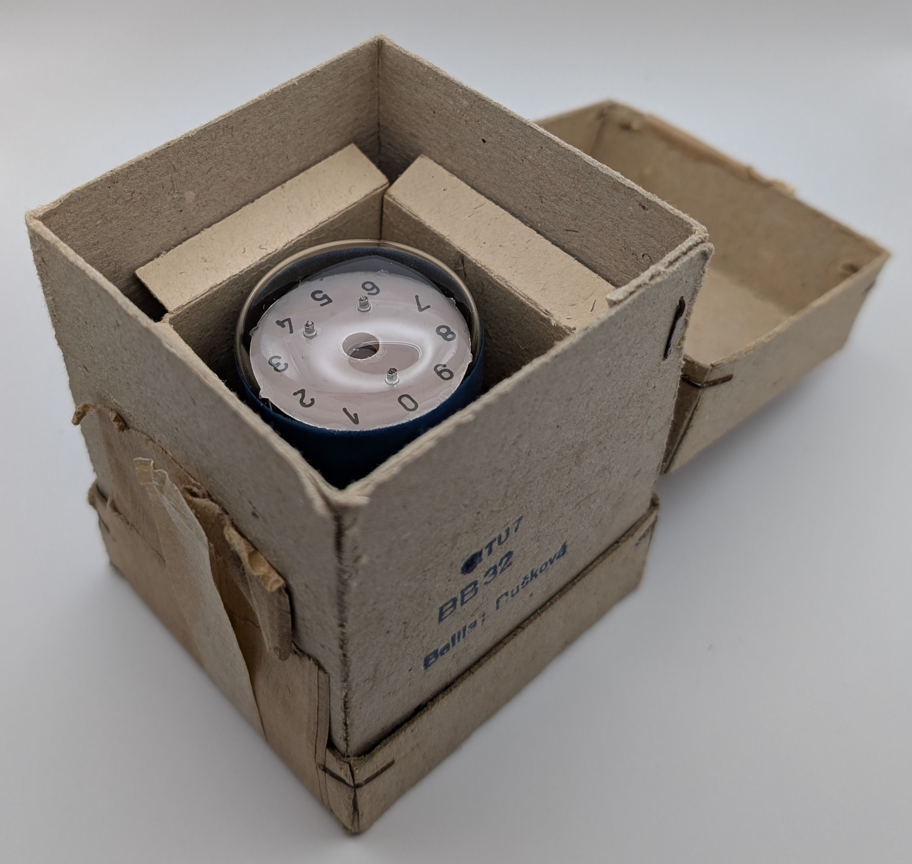
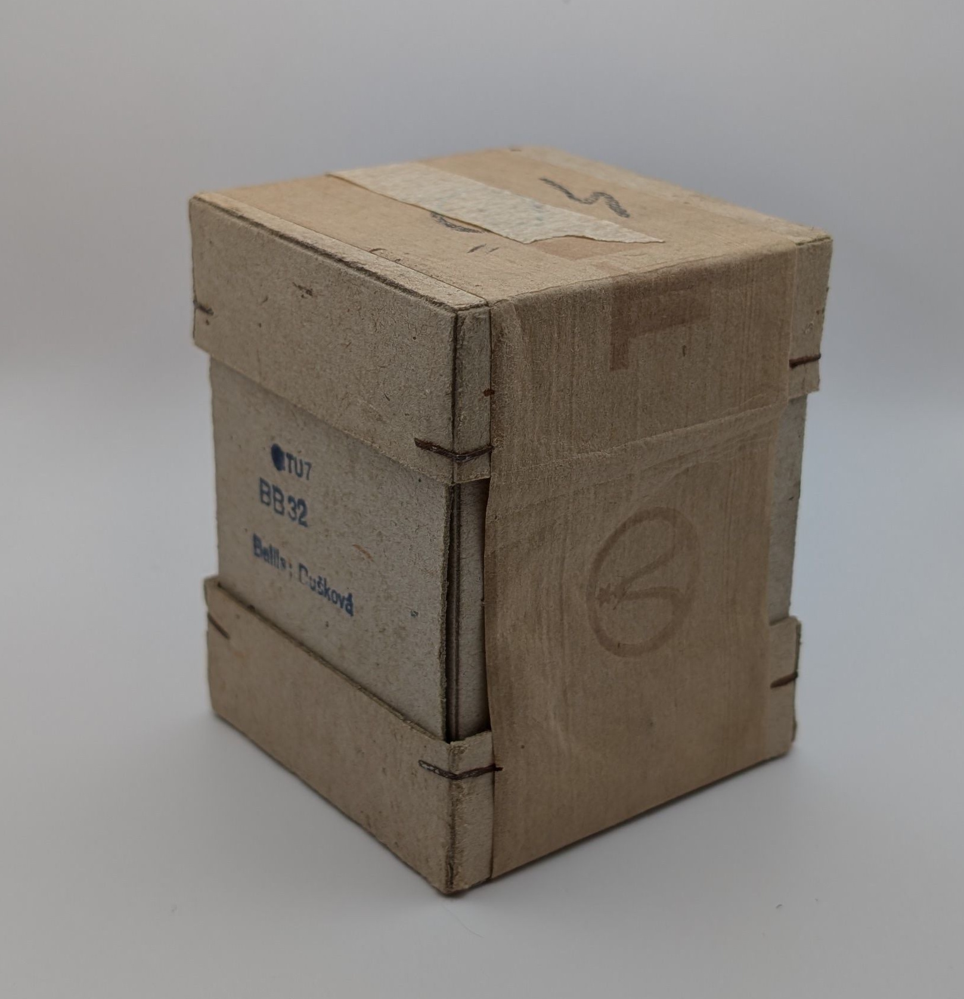

The Tesla 11TU7 is an early neon-filled Nomotron counting tube allowing for up to 20,000 counts/second. It operates in a unidirectional, single-pulse mode, advancing the discharge by one position with each pulse and featuring ten stable positions. Unlike conventional decadic counting tubes (Dekatrons), its guiding electrodes are concealed behind a metal shell. Only the stable cathodes are visible through circular openings, each marked with its corresponding value on a transparent mica shield.

The tube features a specialized socket design based on the B12A socket, incorporating an additional central pin that connects to the tube's anode.

The 11TU7 is pin compatible with the [STC G10/241E](/nomotron/stc-g10-241e/). Therefore, information from the document "STC Valves Appilcation Report - G10/241E" should also be applicable to this tube, a scan of which can be found [here](/documents/g10-241e-application-report/). The 11TU7 features a slightly different front plate design, where the electrode holes are covered by a semi-transparent mica shield. The digits are directly printed above their respective electrodes, enabling them to be illuminated from behind. This should improve readability, particularly in low-light conditions. The blue coating on the glass envelope combined with its plastic base gives the tube a distinctly industrial appearance.

Unfortunately, this unit, though new old stock, has lost its neon and is no longer operational. A video linked below shows the 11TU7 in operation.

### Key Specifications

| Property          | Description       |
|-------------------|-------------------|
| Manufacturer      | Tesla             |
| Time period       | late 1950s        |
| Filling           | Neon              |
| Counting speed    | <20,000 c/s       |
| Envelope diameter | 41mm              |
| Socket            | McMurdo type X12E |

### References

- [STC G10/241E Appplication Report](/documents/g10-241e-application-report/)

- [Tesla 11TU7 datasheet](https://frank.pocnet.net/sheets/183/1/11TU7.pdf) ([Archive](https://web.archive.org/web/20240713144639/https://frank.pocnet.net/sheets/183/1/11TU7.pdf))

- [Video of 11TU7 in operation](https://www.youtube.com/watch?v=HDNAVtl_MZ8)

- [industrialalchemy.org](https://www.industrialalchemy.org/articleview.php?item=1032) ([Archive](https://web.archive.org/web/20240421194630/http://industrialalchemy.org/articleview.php?item=1032))

- [tube-tester.com](https://www.tube-tester.com/sites/nixie/datdekat/11TU7/11tu7.htm) ([Archive](https://web.archive.org/web/20240616021328/https://www.tube-tester.com/sites/nixie/datdekat/11TU7/11tu7.htm))

- [lampes-et-tubes.info](https://lampes-et-tubes.info/cd/cd045.php?l) ([Archive](https://web.archive.org/web/20241208183123/https://lampes-et-tubes.info/cd/cd045.php?l))

- [radiomuseum.org](https://www.radiomuseum.org/tubes/tube_11tu7.html)

