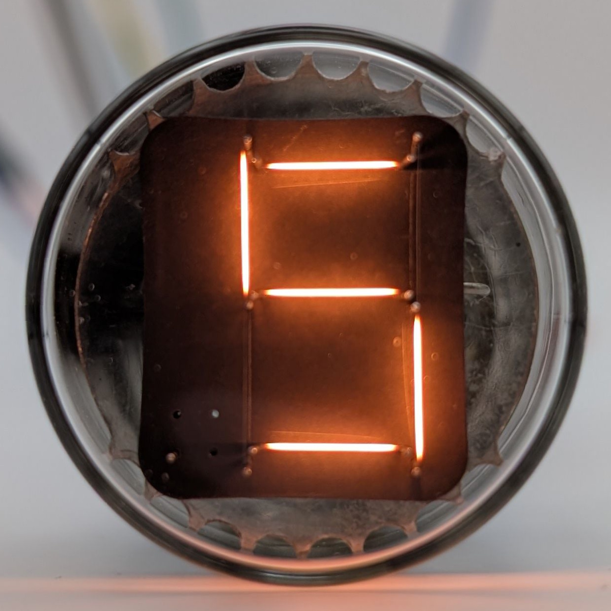

The DTF104B is a Numitron display tube produced by RCA. Internally, it is nearly identical to the more common DR2000 and similar to the [DR2010](/numitron/rca-dr2010/), but it is designed to be read from the top rather than the side. A spot exists on the backplate where a left decimal point could have been included, but it lacks filaments and is therefore non-functional on this model. Its flat top gives the DTF104B a distinct look and helps reducing reflections from adjacent tubes.

RCA and Apollo used the "DTF" prefix to denote experimental development tubes, suggesting that this model likely never went into mass production.

RCA's Numitrons were typically rated for a minimum of 100,000 hours of operation, so it's likely this model can achieve similar longevity. As with all devices using incandescent filaments, their lifespan can be extended greatly by reducing stress from thermal expansion. This can be done by maintaining a small current through inactive filaments to prevent them from cooling completely. Additionally, lowering the general filament current can also have a positive effect on longevity.

| Property          | Description    |
|-------------------|----------------|
| Manufacturer      | RCA            |
| Time period       | Early 1970s    |
| Digit height      | 15mm           |
| Envelope diameter | ~30mm          |
| Envelope height   | ~49mm          |
| Socket            | B9A            |

### References

- [RCA DR2000 datasheet](https://www.tube-tester.com/sites/nixie/dat_arch/Numitron_RCA_01.pdf) ([Archive](https://web.archive.org/web/20240923193536/http://www.tube-tester.com/sites/nixie/dat_arch/Numitron_RCA_01.pdf))

- [tube-tester.com](https://www.tube-tester.com/sites/nixie/data/dtf104b.htm) ([Archive](https://web.archive.org/web/20240616015026/https://www.tube-tester.com/sites/nixie/data/dtf104b.htm))

- [industrialalchemy.org](https://www.industrialalchemy.org/articleview.php?item=829) ([Archive](https://web.archive.org/web/20240421194702/http://industrialalchemy.org/articleview.php?item=829))

<table>
    <tr>
        <td>
            
        </td>
        <td>
            
        </td>
        <td>
            
        </td>
         <td>
            
        </td>
        <td>
            
        </td>
    </tr>
    <tr>
        <td>
            
        </td>
        <td>
            
        </td>
        <td>
            
        </td>
         <td>
            
        </td>
        <td>
            
        </td>
    </tr>
</table>
