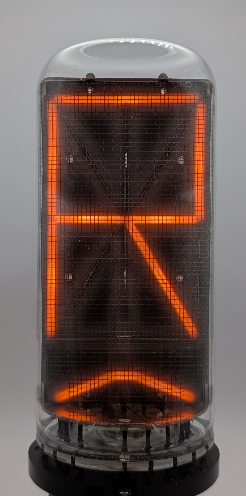

The B-7971 is a very large alphanumeric display tube developed by Burroughs, originally designed for use in stock tickers. Unlike regular Nixie tubes with numerals arranged on a stack, the B-7971 contains 14 individual segments that can be combined to display every letter of the English alphabet as well as the digits 0 through 9. An additional segment in the bottom can be used to display an underscore. 

Known for its exceptional longevity, with later models—distinguished by an "antenna" on the anode cage—supposedly lasting even longer, the B-7971's has become a popular choice among collectors for creating large Nixie clocks. Since the tube's total current draw varies with the number of segments lit, a single anode resistor cannot effectively limit the current. Instead, each cathode must be connected to its own resistor. The datasheet suggests using different resistor values for different segments to ensure uniform brightness. The most frequent failure mode of a B-7971 appears to be two or more cathodes shorting together. This may occur due to physical impact or the tube being overdriven for prolonged periodes of time. New old stock of B-7971 tubes is virtually nonexistent, as nearly all units available today have been salvaged from the aforementioned stock tickers.

The B-7971 was the largest member of a family of alphanumeric display tubes produced by Burroughs. Its smaller counterparts being the B-5971 and the exceptionally rare B-8971.

### Key Specifications

| Property          | Description   |
|-------------------|---------------|
| Manufacturer      | Burroughs     |
| Time period       | mid 1960s     |
| Digit height      | 63.5mm        |
| Envelope diameter | ~55mm         |
| Envelope height   | ~116mm        |
| Socket            | SK-137        |

### References

- [Burroughs B-7971 datasheet](https://lampes-et-tubes.info/cd/B-7971.pdf) ([Archive](https://web.archive.org/web/20240921201941/https://lampes-et-tubes.info/cd/B-7971.pdf))

- [tube-tester.com](https://www.tube-tester.com/sites/nixie/data/b-7971/b7971.htm) ([Archive](https://web.archive.org/web/20240620131800/https://www.tube-tester.com/sites/nixie/data/b-7971/b7971.htm))

- [industrialalchemy.org](https://www.industrialalchemy.org/articleview.php?item=890) ([Archive](https://web.archive.org/web/20240421194443/http://industrialalchemy.org/articleview.php?item=890))

- [jb-electronics.de](http://www.jb-electronics.de/html/elektronik/nixies/n_b7971.htm) ([Archive](https://web.archive.org/web/20240929105033/http://www.jb-electronics.de/html/elektronik/nixies/n_b7971.htm))

- [swissnixie.com](https://www.swissnixie.com/tubes/B7971BURROUGHS/) ([Archive](https://web.archive.org/web/20240517134519/https://www.swissnixie.com/tubes/B7971BURROUGHS/))

<table>
    <tr>
        <td>
            
        </td>
        <td>
            
        </td>
        <td>
            
        </td>
         <td>
            
        </td>
        <td>
            
        </td>
         <td>
            
        </td>
    </tr>
    <tr>
        <td>
            
        </td>
        <td>
            
        </td>
        <td>
            
        </td>
         <td>
            
        </td>
        <td>
            
        </td>
        <td>
            
        </td>
    </tr>
    <tr>
        <td>
            
        </td>
        <td>
            
        </td>
        <td>
            
        </td>
         <td>
            
        </td>
        <td>
            
        </td>
        <td>
            
        </td>
    </tr>
    <tr>
        <td>
            
        </td>
        <td>
            
        </td>
        <td>
            
        </td>
         <td>
            
        </td>
        <td>
            
        </td>
        <td>
            
        </td>
    </tr>
    <tr>
        <td>
            
        </td>
        <td>
            
        </td>
        <td>
            
        </td>
         <td>
            
        </td>
        <td>
            
        </td>
        <td>
            
        </td>
    </tr>
    <tr>
        <td>
            
        </td>
        <td>
            
        </td>
        <td>
            
        </td>
         <td>
            
        </td>
        <td>
            
        </td>
        <td>
            
        </td>
    </tr>
</table>