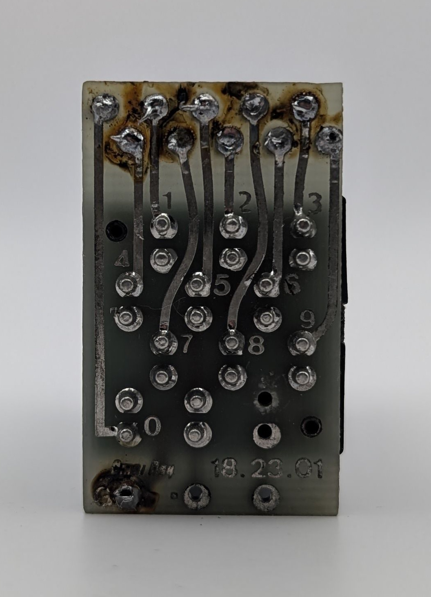

The OmniRay SAO M 40 is a so-called Sphericular Optic Display. While similar in both appereance and operation to projection displays like the IEE one-plane readout, the theory behind the M 40 is vastly different. It employs the principle of geometric optics to produce a character on a flat viewing screen. The screen area is subdivided into more than a thousand tiny convex lenses, each focusing light from its specific focal plane. Characters are displayed by illuminating only certain sections of the screen from different angles, which selectively allows light to pass through areas, producing a character composed of many tiny dots.  A comprehensive explanation of the operational theory behind this device is available in the description of a similar model manufactured by Burroughs, accessible via the link provided below.

In addition to displaying the ten digits, the unit is capable of showing a left decimal point. Interestingly, the light bulb for the decimal point is not connected to a solder pad.

The device's PCB backplate is designed to be removable, allowing convenient access to the eleven socketed miniature light bulbs inside. The installed light bulbs, as indicated on the device's metal housing, are rated for 14 volts. OmniRay also manufactured at least one related model, the SD 12 W, which was rated for 28 volts. One of the pictures below also shows a version of the M 40 with a different, more modern PCB design.

| Property          | Description    |
|-------------------|----------------|
| Manufacturer      | OmniRay        |
| Time period       | ?              |
| Digit height      | 15mm           |

### References

- [tube-tester.com on the SD 12 W](https://www.tube-tester.com/sites/nixie/data/SD12W/SD12W-28V.htm) ([Archive](https://web.archive.org/web/20240424052210/https://www.tube-tester.com/sites/nixie/data/SD12W/SD12W-28V.htm))

- [industrialalchemy.org on an IEE projection display](https://www.industrialalchemy.org/articleview.php?item=511) ([Archive](https://web.archive.org/web/20240914033648/https://www.industrialalchemy.org/articleview.php?item=511))

<table>
    <tr>
        <td>
            
        </td>
        <td>
            
        </td>
        <td>
            
        </td>
         <td>
            
        </td>
        <td>
            
        </td>
    </tr>
    <tr>
        <td>
            
        </td>
        <td>
            
        </td>
        <td>
            
        </td>
         <td>
            
        </td>
        <td>
            
        </td>
    </tr>
</table>
