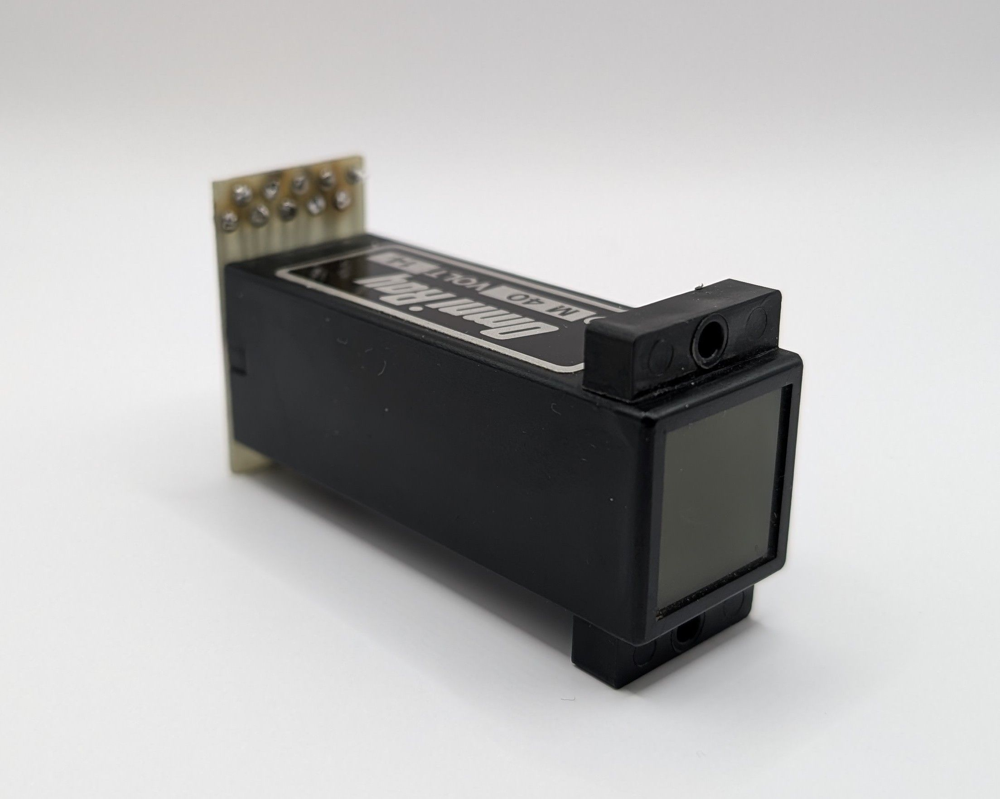

The STC GN-1 is one of the earliest Nixie tubes produced. The tube's design reflects its age, with the digits being formed from wire rather than stamped from sheet metal like in most later Nixies. Its perfectly orange glow indicates the absence of mercury, likely making it a comperatively short lived tube. The tube originally came with a black shrink wrap that contained the manufacturer's logo and the model description.

