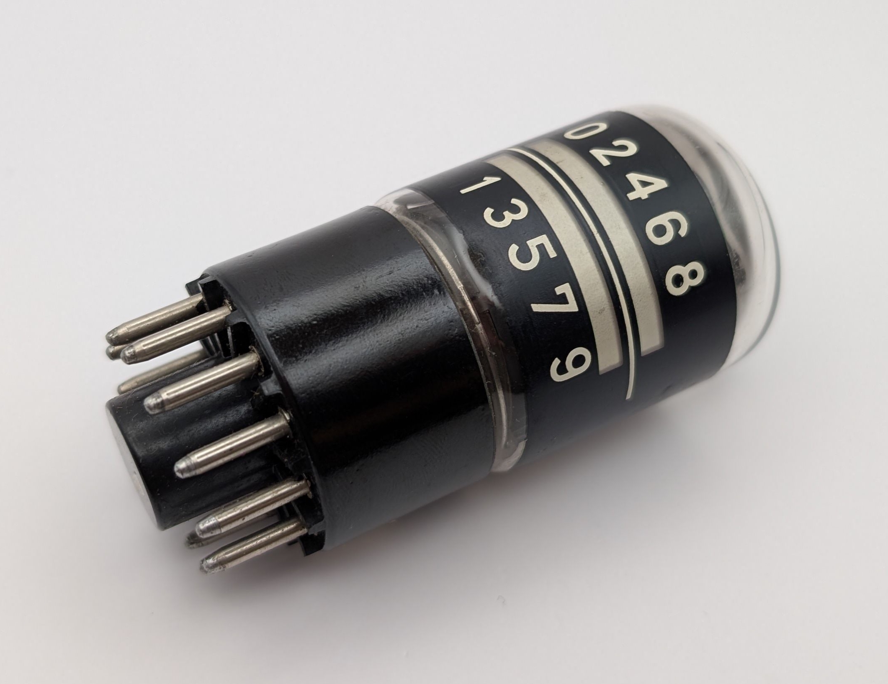
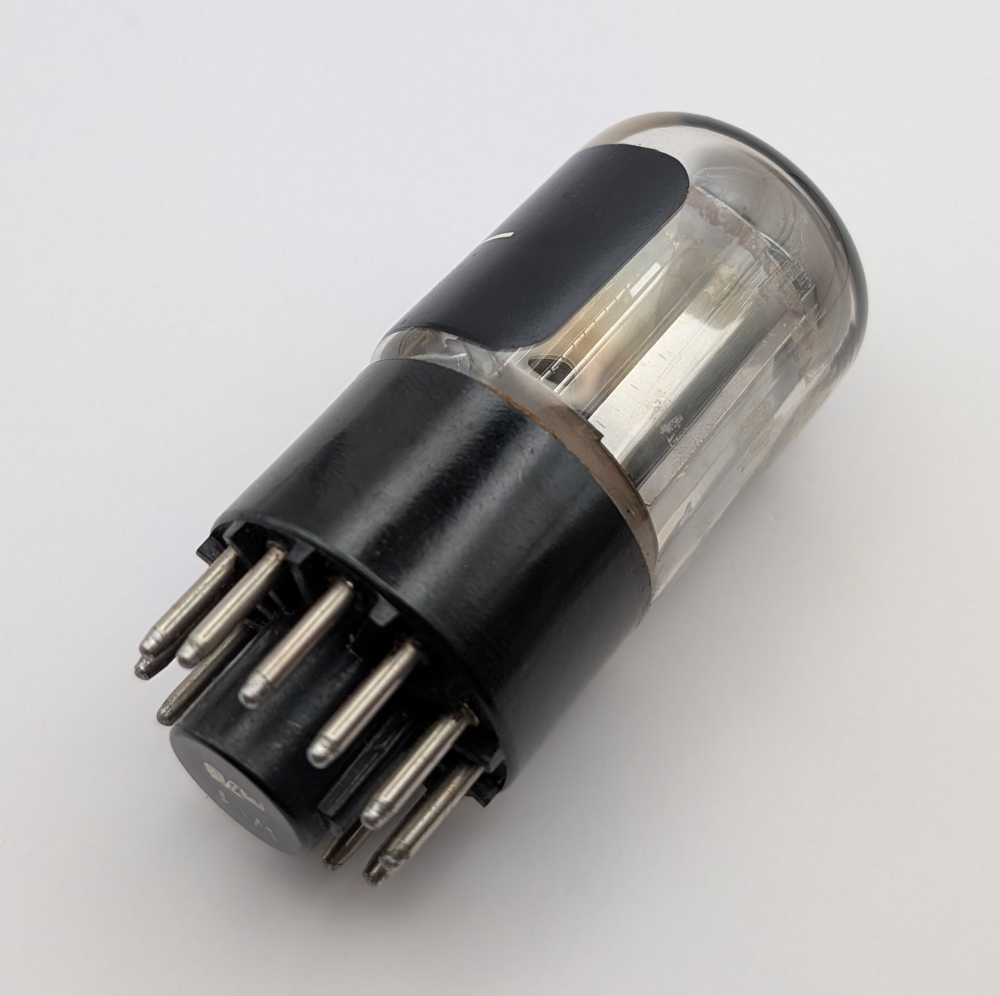
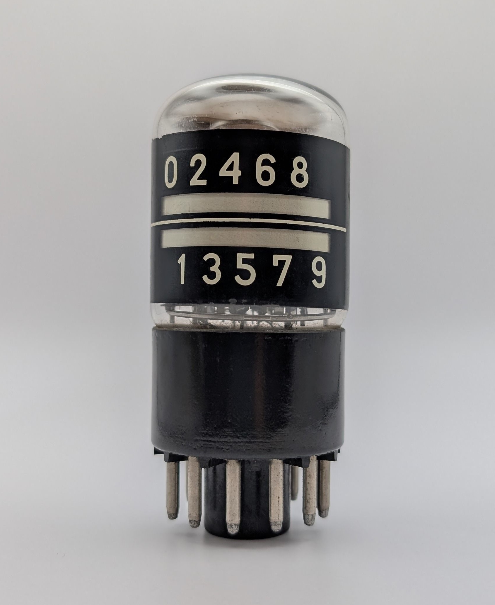
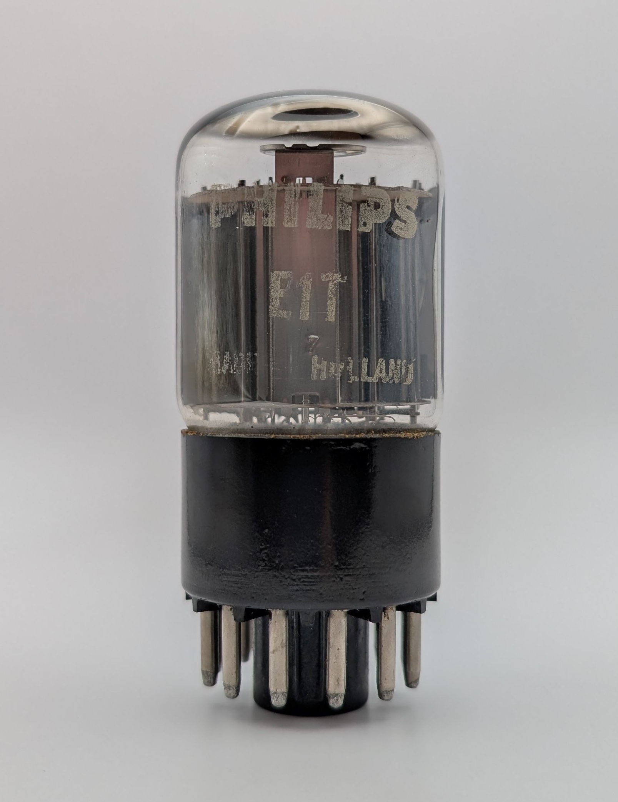
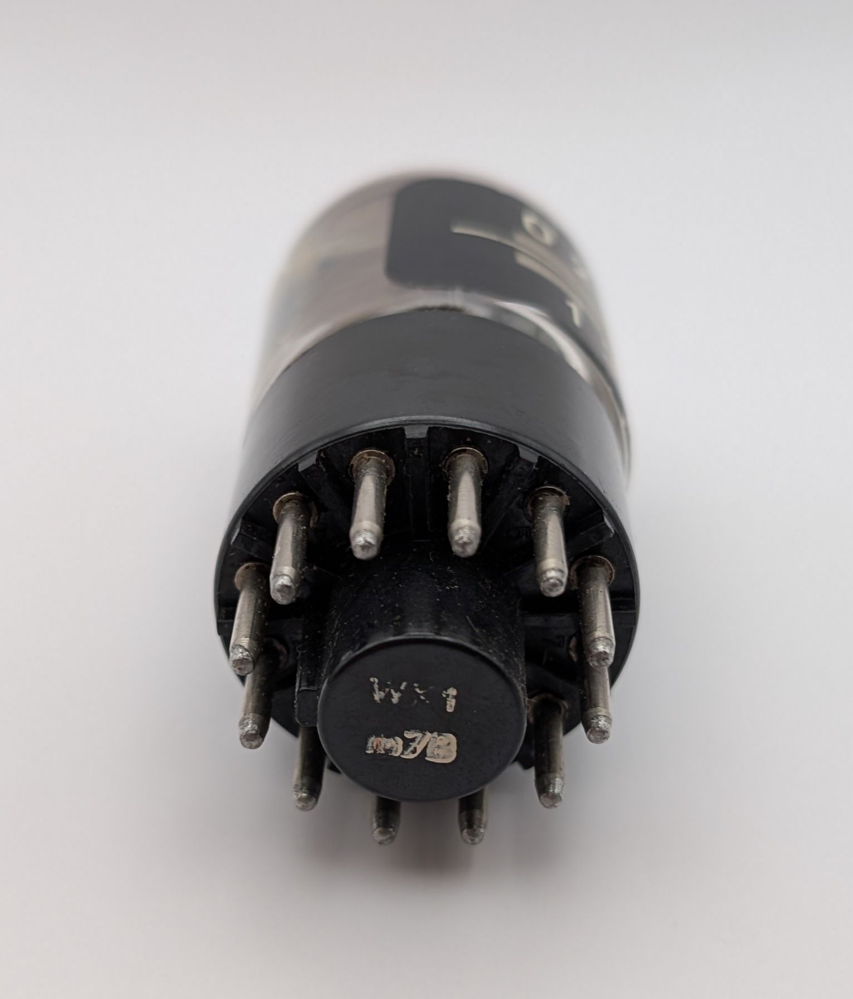
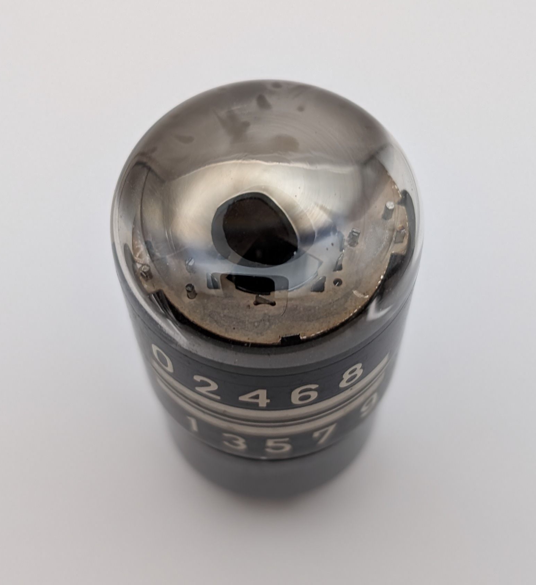
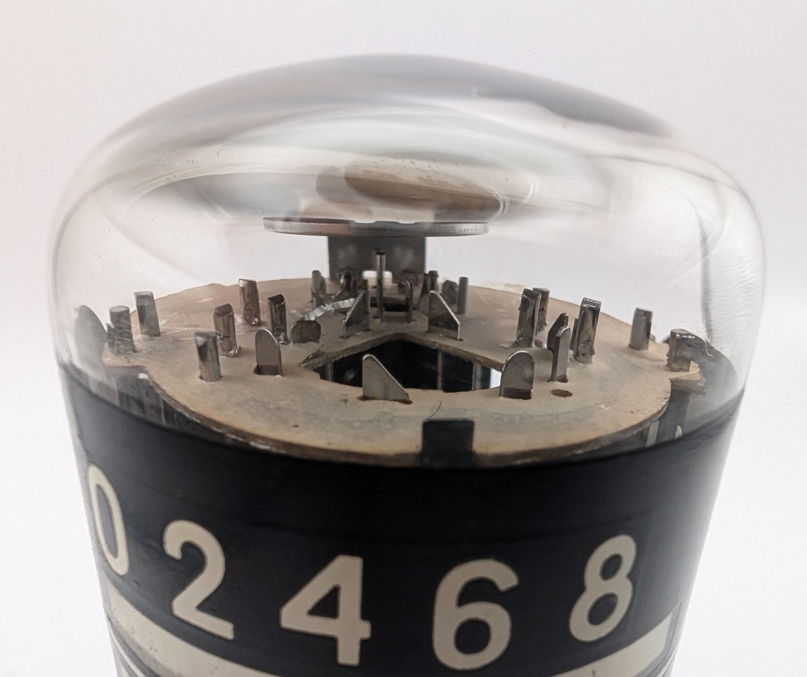

The E1T is a decadic counting tube developed by Philips, predating the invention of gas-filled Dekatrons. Each pulse advances the tube's internal count by one and generates a voltage spike, which can be used to trigger specific actions. Internally, the E1T operates as a small cathode ray tube with a ribbon-shaped electron beam that occupies one of ten stable positions. The current position of the beam is indicated as a glowing strip, with each position marked with its corresponding value on a piece of film affixed to the tube's glass envelope. The tube's envelope is coated with a transparent protective layer, which is prone to cracking over time, particularly in damp environments. Consequently, E1Ts in pristine condition have become increasingly rare.

The E1T supports high counting speeds, being capable of up to 30,000 counts per second in normal use, with certain units being able to reach 100,000 counts per second in specialized circuits.

Both RFT and the Polish manufacturer PIE produced clones of the E1T, marketed under the names S10S1 and ELW-1, respectively.

Much more information on E1Ts can be found in Ronald Dekker's amazing articles ["The making of the E1T"](https://www.dos4ever.com/E1T/E1T.html) and ["A E1T Decade Scaler Tube raised from the dead"](https://www.dos4ever.com/trochotron/TROCH.html).

| Property          | Description       |
|-------------------|-------------------|
| Manufacturer      | Philips           |
| Time period       | early 1950s       |
| Counting speed    | <100,000 c/s      |
| Envelope diameter | 37mm              |
| Socket            | B12A              |

### References

- [The making of the E1T](https://www.dos4ever.com/E1T/E1T.html) ([Archive](https://web.archive.org/web/20241013085143/https://www.dos4ever.com/E1T/E1T.html))

- [A E1T Decade Scaler Tube raised from the dead](https://www.dos4ever.com/trochotron/TROCH.html) ([Archive](https://web.archive.org/web/20241013085057/https://www.dos4ever.com/trochotron/TROCH.html))

- [The E1T Decade Counter Tube](https://frank.pocnet.net/other/Philips/Philips_E1T_DecadeCounterTube.pdf) ([Archive](https://web.archive.org/web/20240223081308/https://frank.pocnet.net/other/Philips/Philips_E1T_DecadeCounterTube.pdf))

- [Zeitschriftenartikel zur E1T in "ELEKTRONIK" 1954](https://www.radiomuseum.org/forum/zeitschriftenartikel_zur_e1t_in_elektronik_1954_1.html) ([Archive](https://web.archive.org/web/20250111223018/https://www.radiomuseum.org/forum/zeitschriftenartikel_zur_e1t_in_elektronik_1954_1.html))

- [tube-tester.com](https://www.tube-tester.com/sites/nixie/different/e1t-tubes/E1T_philips/e1t-phil.htm) ([Archive](https://web.archive.org/web/20240929062514/http://www.tube-tester.com/sites/nixie/different/e1t-tubes/E1T_philips/e1t-phil.htm))

- [radiomuseum.org](https://www.radiomuseum.org/tubes/tube_e1t.html) ([Archive](https://web.archive.org/web/20250103000601/https://www.radiomuseum.org/tubes/tube_e1t.html))

<video controls width="50%" loop="true" autoplay="true" muted="muted">
  <source src="assets/video.mp4" type="video/mp4" />
</video>

An E1T operating in one of [Grahame Marsh's E1T testers](https://www.sgitheach.org.uk/crttester2.html) exhibits a common behavior towards the upper digits: additional glowing strips appear near the currently active one. This is a normal characteristic of E1Ts and occurs because the electron beam widens as the deflection increases in strength.