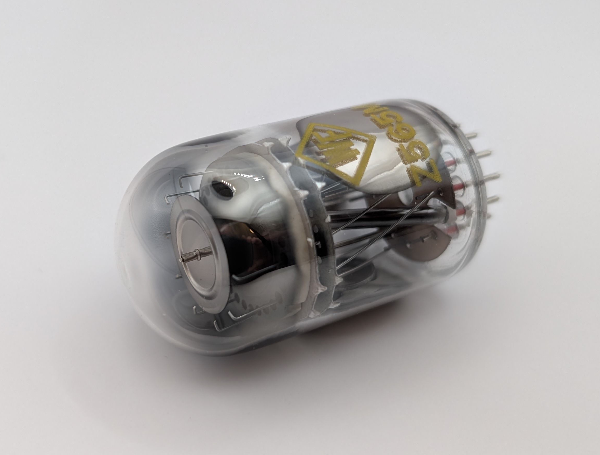
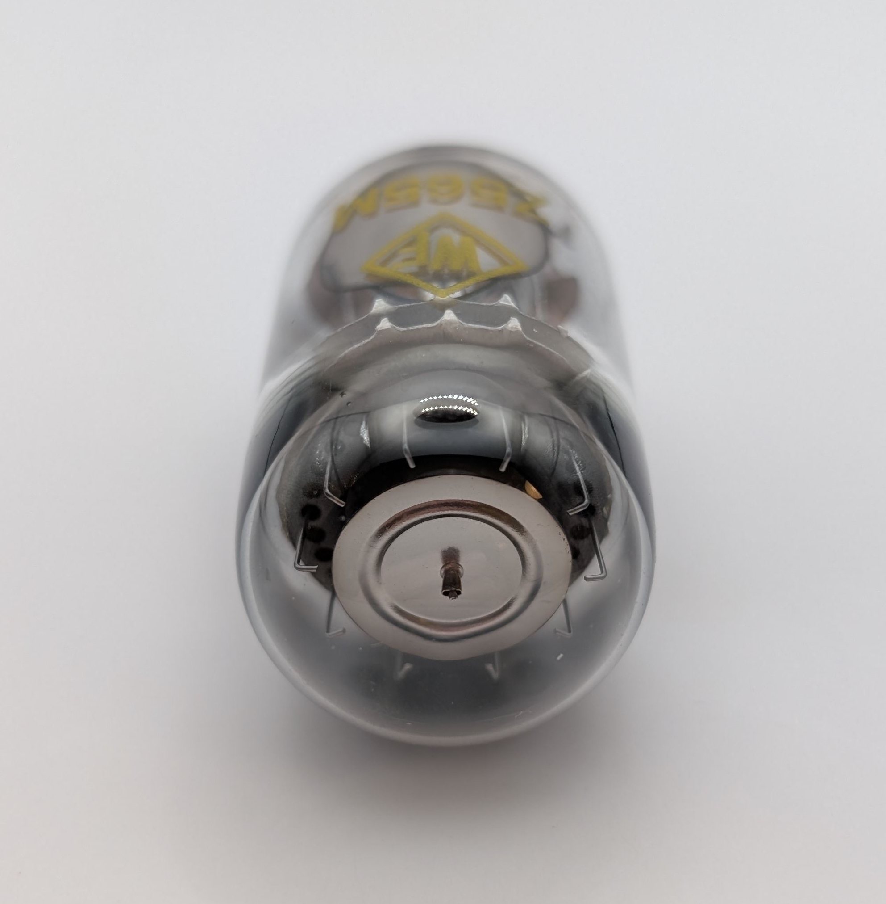
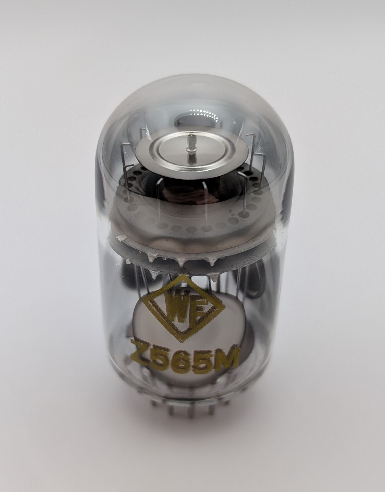

The Z565M is a neon-filled decadic display tube produced by RFT in East Germany and sometimes referred to as a "Register Tube". Although it resembles a Dekatron, it lacks any kind of counting capability. Unlike Pixie tubes such as the [ZM1050/Z550M](/other/valvo-z550m/), it also cannot be controlled using logic-level signals. Instead, it operates more like a regular Nixie tube. 

It features ten wire-formed cathodes arranged in a circle around a common anode, with each cathode activated by connecting it to ground. When viewed from the front, the tube shows two empty holes between each cathode. In a full Dekatron tube, these positions would have been occupied by the transfer electrodes. To ensure consistent ignition regardless of ambient light or background radiation, the Z565M includes a small amount of radioactive material to improve the rate of spontaneous ionization of the neon gas.

The Z565M is visually compatible with Dekatron-based counting circuits, making it a suitable display component in such systems. Similar tubes include the GR10A and Z503M.

### Key Specifications

| Property          | Description    |
|-------------------|----------------|
| Manufacturer      | RFT            |
| Time period       | Late 1960s     |
| Envelope diameter | 30mm           |
| Envelope height   | 53mm           |
| Socket            | B13B           |

### References

- [RFT Z565M datasheet](https://frank.pocnet.net/sheets/182/z/Z565M.pdf) ([Archive](https://web.archive.org/web/20240727032540/https://frank.pocnet.net/sheets/182/z/Z565M.pdf))

- [radiomuseum.org](https://www.radiomuseum.org/tubes/tube_z565m.html) ([Archive](https://web.archive.org/web/20250301073051/https://www.radiomuseum.org/tubes/tube_z565m.html))

