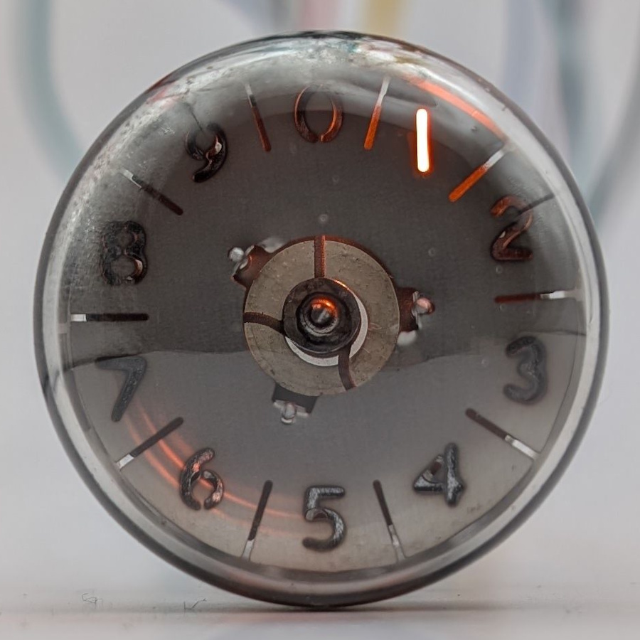

When the Nixie tube was introduced in the 1950s, it faced a significant drawback: its driving circuitry required transistors with relatively high breakdown voltages capable of handling the elevated operating voltages. At the time, such transistors were not widely available. This limitation created a demand for an alternative display technology that could operate with low-voltage, low-current logic circuitry. The solution was the Pixie tube, initially designated as the Z550M and later renamed the ZM1050.

The Pixie tube works by combining multiple neon bulbs within a single enclosure, each illuminating a digit cut out of the front plate when activated. The tube operates with a common anode maintained at around 140 V. To light up a specific digit, the corresponding electrode's potential is increased by at least 5 V relative to the others. This small bias ensures the electrode preferentially ignites during the next cycle of the unsmoothed rectified AC voltage driving the tube. This also allows the tube to be directly controlled by the I/O pins of most modern microcontrollers.

In theory, a Pixie tube can be driven similarly to a Nixie tube by utilizing the starter electrodes as anodes with a common cathode. With high-voltage transistors now readily available, this approach becomes a more straightforward driving mechanism. It is important to note that the Z550M/ZM1050 functions solely as a display device. Despite its visual similarity to Nomotrons, it lacks any counting capability.

Linked below is an in-depth article on the development and operation of the Pixie tube.

| Property          | Description    |
|-------------------|----------------|
| Manufacturer      | Valvo          |
| Time period       | Mid 1960s      |
| Digit height      | 3mm            |
| Envelope diameter | ~30mm          |
| Envelope height   | ~25mm          |
| Socket            | B13B           |

### References

- [The making of the Z550M/ZM1050](https://www.dos4ever.com/Z550M/Z550M.html) ([Archive](https://web.archive.org/web/20241017000315/https://www.dos4ever.com/Z550M/Z550M.html))

- [ZM1050 datasheet](https://www.tube-tester.com/sites/nixie/dat_arch/ZM1050_Z550M_philips_01.pdf) ([Archive](https://web.archive.org/web/20240712014010/http://www.tube-tester.com/sites/nixie/dat_arch/ZM1050_Z550M_philips_01.pdf))

- [tubecollection.de](https://www.tubecollection.de/ura/pixie.htm) ([Archive](https://web.archive.org/web/20240424052957/https://www.tubecollection.de/ura/pixie.htm))

- [industrialalchemy.org](https://www.industrialalchemy.org/articleview.php?item=1116) ([Archive](https://web.archive.org/web/20240929185838/https://www.industrialalchemy.org/articleview.php?item=1116))

<table>
    <tr>
        <td>
            
        </td>
        <td>
            
        </td>
        <td>
            
        </td>
         <td>
            
        </td>
        <td>
            
        </td>
    </tr>
    <tr>
        <td>
            
        </td>
        <td>
            
        </td>
        <td>
            
        </td>
         <td>
            
        </td>
        <td>
            
        </td>
    </tr>
</table>
