The DG12B is a VFD tube manufactured in Japan by the Itron Corporation, the company that originally invented VFD technology in 1966. What makes this tube stand out in particular is the distinctive appearance of its digits. Rather than using the seven-segment design still commonly found in digital readouts today, it employs a more intricate nine-segment arrangement that gives the digits an almost hand-written look. Among collectors, VFD tubes featuring this design are commonly referred to as "Alien VFDs."

In addition to the nine segments forming the digits, the tube incorporates a decimal point on the right side and a comma indicator in the upper-left corner.

With its 10mm digits, the DG12B is a relatively large display tube. A smaller variant featuring a similar segmented design was also produced by Itron under the designation DG10B. Soviet engineers would go on to copy Itron's design for their first generation of VFD tubes, specifically the IV-2.

Despite being among the earliest models of VFD tube, the DG12B's design already appears highly refined. It includes a control grid, which is absent from many other early VFD tubes, preventing them from being multiplexed. By comparison, early VFD tubes manufactured by companies such as Sylvania and Tung-Sol, including the [8894](/vfd/sylvania-8894/) and DT-1704 respectively, appear almost experimental in their eclectic construction.

### Key Specifications

| Property          | Description   |
|-------------------|---------------|
| Manufacturer      | Itron         |
| Time period       | mid 1960s     |
| Digit height      | 10mm          |
| Envelope diameter | 15.mm         |
| Envelope height   | ~50mm         |
| Socket            | Leads         |

### References

- [DG12B datasheet](https://lampes-et-tubes.info/cd/DG12B.pdf) ([Archive](https://web.archive.org/web/20250513093938/https://lampes-et-tubes.info/cd/DG12B.pdf))

- [jogis-roehrenbude.de](https://www.jogis-roehrenbude.de/Roehren-Geschichtliches/Nixie/DG12B.htm) ([Archive](https://web.archive.org/web/20240421201513/https://www.jogis-roehrenbude.de/Roehren-Geschichtliches/Nixie/DG12B.htm))

- [lampes-et-tubes.info](https://lampes-et-tubes.info/cd/cd193.php?l) ([Archive](https://web.archive.org/web/20260606193943/https://lampes-et-tubes.info/cd/cd193.php?l))

- [radiomuseum.org](https://www.radiomuseum.org/tubes/tube_dg12b.html) ([Archive](https://web.archive.org/web/20250519022806/https://www.radiomuseum.org/tubes/tube_dg12b.html))

- [The Most Beautiful Tubes Were The First! (YouTube)](https://www.youtube.com/shorts/sUiIbZEGRqY)

[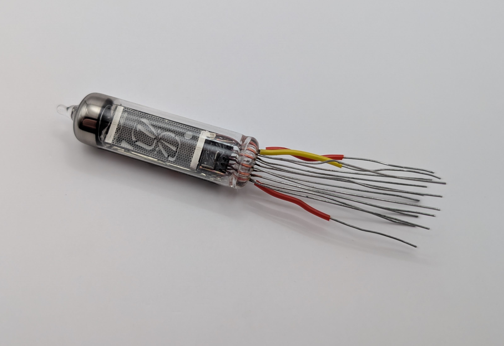](assets/1.jpg)

[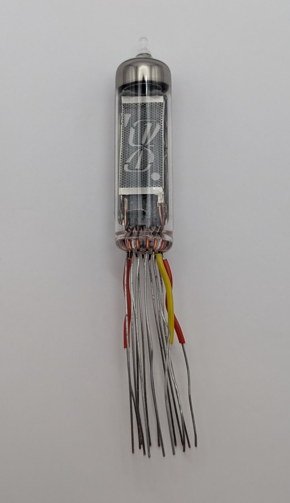](assets/2.jpg)

[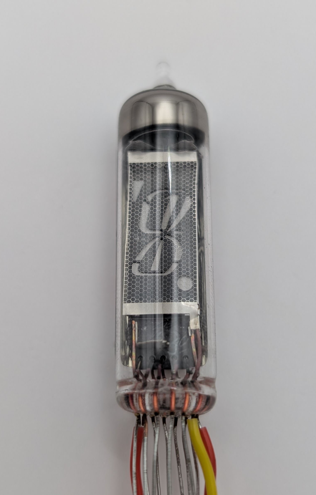](assets/3.jpg)

[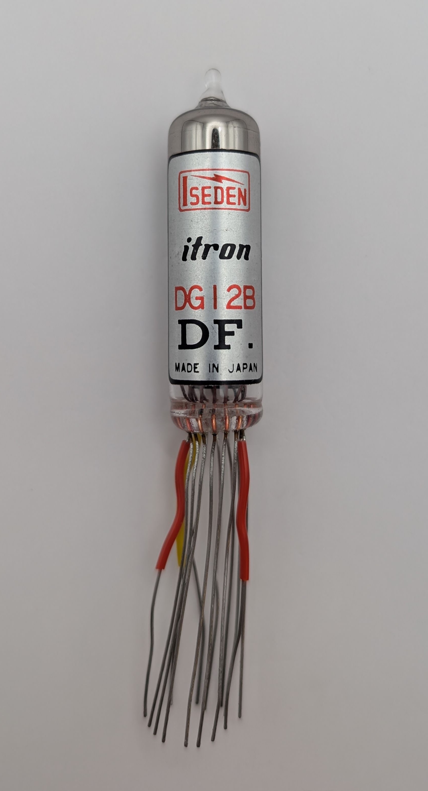](assets/4.jpg)

[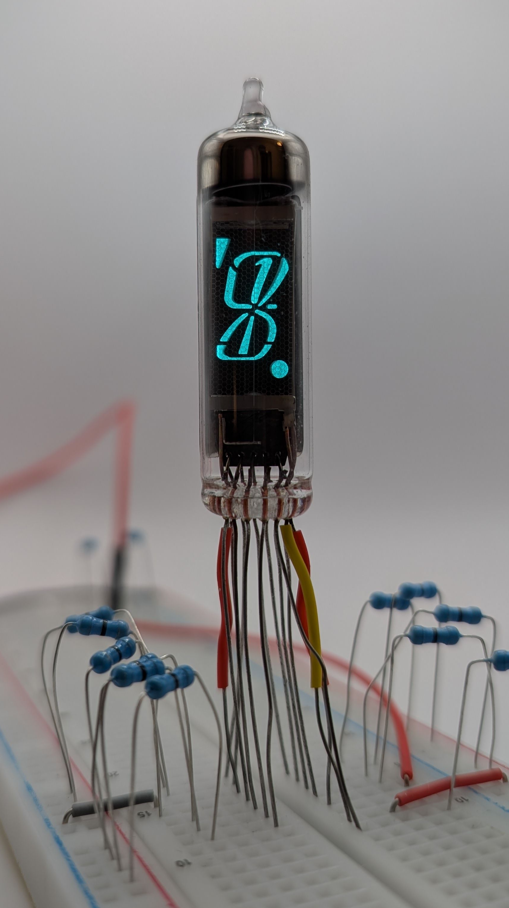](assets/5.jpg)

<table>
    <tr>
        <td>
            <a href="assets/6.jpg">
                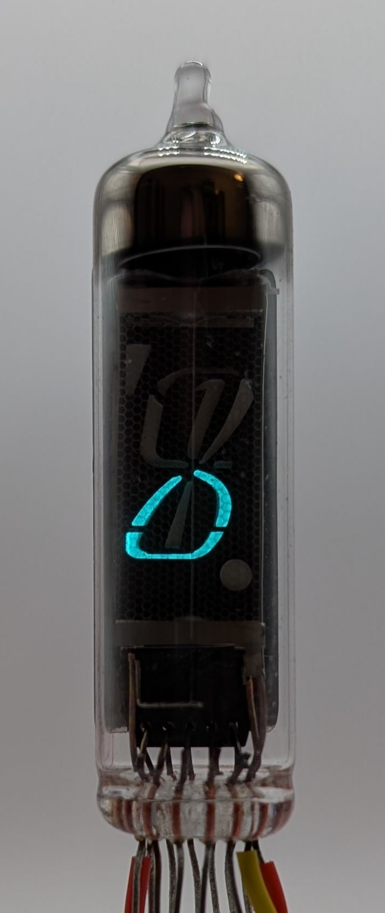
            </a>
        </td>
        <td>
            <a href="assets/7.jpg">
                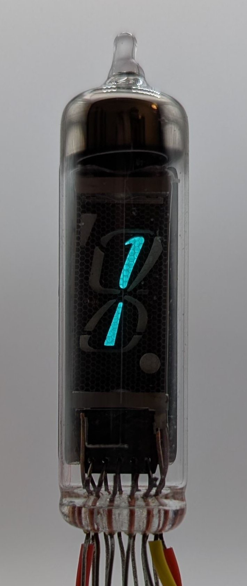
            </a>
        </td>
        <td>
            <a href="assets/8.jpg">
                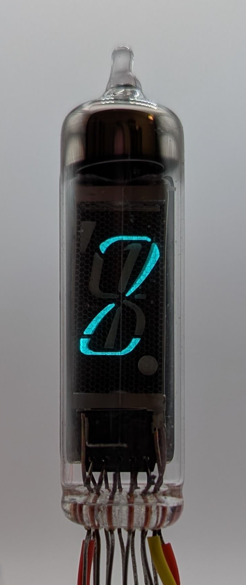
            </a>
        </td>
         <td>
            <a href="assets/9.jpg">
                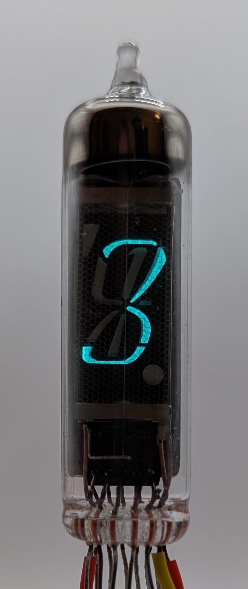
            </a>
        </td>
        <td>
            <a href="assets/10.jpg">
                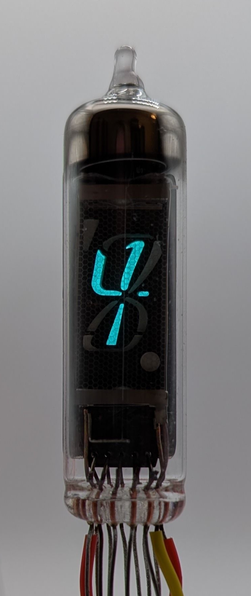
            </a>
        </td>
    </tr>
    <tr>
        <td>
            <a href="assets/11.jpg">
                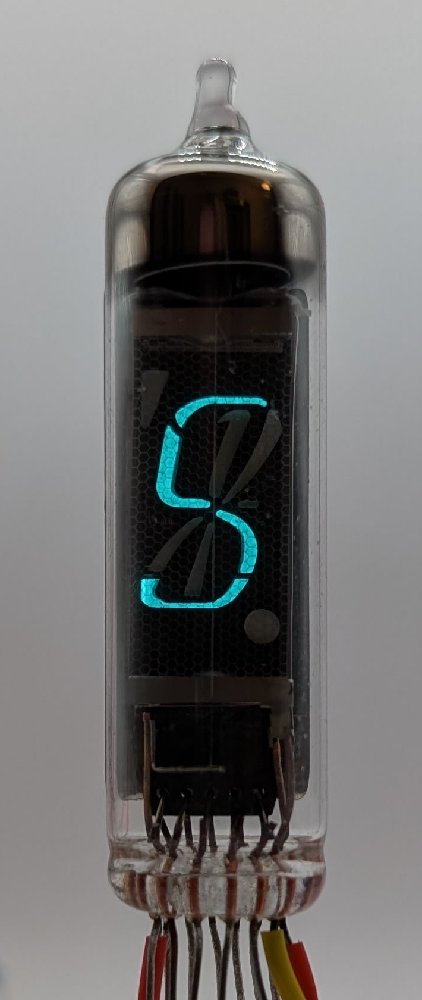
            </a>
        </td>
        <td>
            <a href="assets/12.jpg">
                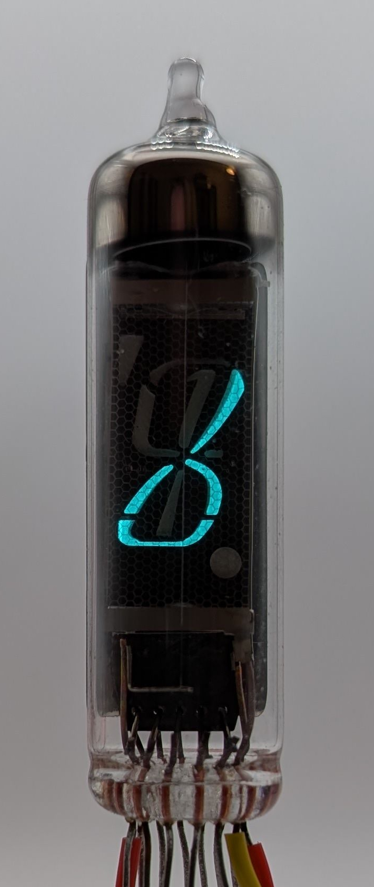
            </a>
        </td>
        <td>
            <a href="assets/13.jpg">
                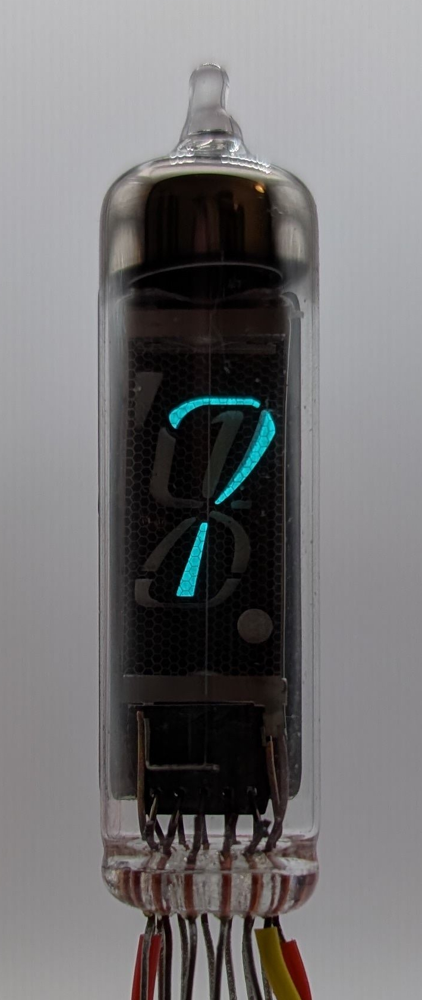
            </a>
        </td>
         <td>
            <a href="assets/14.jpg">
                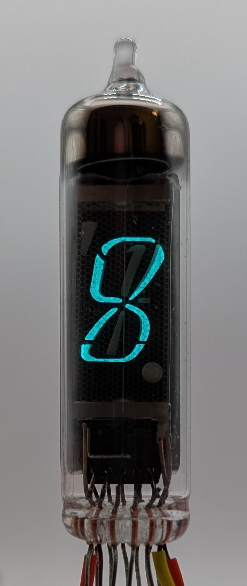
            </a>
        </td>
        <td>
            <a href="assets/15.jpg">
                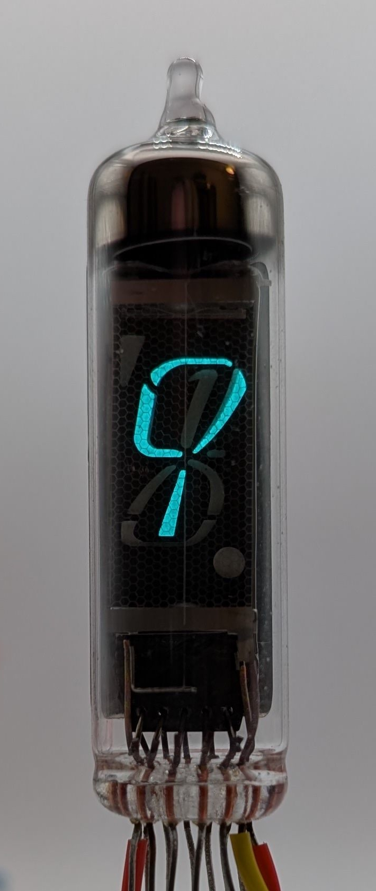
            </a>
        </td>
    </tr>
</table>