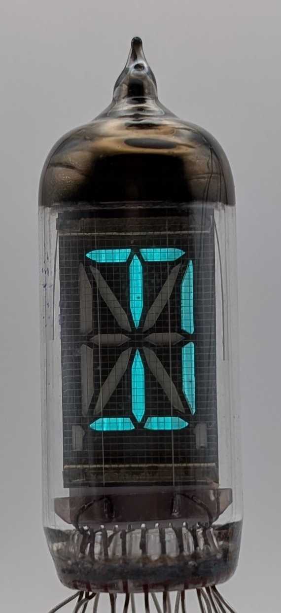
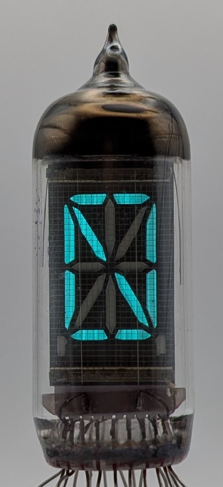

The IV-17 ("NB-17") is a medium-sized sixteen-plus-two segment VFD tube manufactured in the Soviet Union by Reflector, known today as Sovtek. Unlike the [IV-12](/vfd/reflector-iv-12/) seven-segment tube, the IV-17 can display all letters of the English alphabet in addition to the numbers zero through nine. Sixteen segments are dedicated to displaying characters, while the remaining two are used for the left and right decimal points. The character set used in the photos below is based on the one suggested by the datasheet of the Burroughs B-7971 sixteen-segment Nixie tube.

With 18 separate segments, and therefore 18 individual anodes, the tube features numerous leads. Including two additional leads for the filament and one for the grid, the total number of leads reaches 21, making socketing or soldering the tube quite challenging. Some tubes include an unused 22nd lead, which is typically shortened.

The IV-17 is almost identical to the IV-4, with the key difference being its rated operational lifetime: the IV-17 is rated for at least 3,000 hours, compared to the IV-4's 1,000 hours. However, in practice, both models usually exceed their specified lifetimes.

### Key Specifications

| Property          | Description   |
|-------------------|---------------|
| Manufacturer      | Reflector     |
| Time period       | 1970s         |
| Digit height      | 16mm          |
| Envelope diameter | 18mm          |
| Envelope height   | ~48mm         |
| Socket            | N/A           |

### References

- [IV-17 datasheet (translated)](https://www.tube-tester.com/sites/nixie/dat_arch/IV-17.pdf) ([Archive](https://web.archive.org/web/20240424052409/http://tube-tester.com/sites/nixie/dat_arch/IV-17.pdf))

- [IV-17 datasheet](https://www.spark-tube.com/wp-content/uploads/2018/08/iv-17-datasheet.jpg) ([Archive](https://web.archive.org/web/20240424051641/https://www.spark-tube.com/wp-content/uploads/2018/08/iv-17-datasheet.jpg))

- [IV-4 datasheet](https://www.tube-tester.com/sites/nixie/dat_arch/IV-4.pdf) ([Archive](https://web.archive.org/web/20240424052333/http://tube-tester.com/sites/nixie/dat_arch/IV-4.pdf))

- [Burroughs B-7971 datasheet](http://www.askjanfirst.com/rd/B7971.pdf) ([Archive](https://web.archive.org/web/20240609143218/http://www.askjanfirst.com/rd/B7971.pdf))

- [The difference between IV4 and IV17 vfd tubes (Neonixie)](https://groups.google.com/g/neonixie-l/c/FDi-QAGAKJA) ([Archive](https://web.archive.org/web/20241225201318/https://groups.google.com/g/neonixie-l/c/FDi-QAGAKJA))

- [radiomuseum.org](https://www.radiomuseum.org/tubes/tube_iv-17.html) ([Archive](https://web.archive.org/web/20170429182845/http://www.radiomuseum.org/tubes/tube_iv-17.html))

<table>
    <tr>
        <td>
            
        </td>
        <td>
            
        </td>
        <td>
            
        </td>
         <td>
            
        </td>
        <td>
            
        </td>
         <td>
            
        </td>
    </tr>
    <tr>
        <td>
            
        </td>
        <td>
            
        </td>
        <td>
            
        </td>
         <td>
            
        </td>
        <td>
            
        </td>
        <td>
            
        </td>
    </tr>
    <tr>
        <td>
            
        </td>
        <td>
            
        </td>
        <td>
            
        </td>
         <td>
            
        </td>
        <td>
            
        </td>
        <td>
            
        </td>
    </tr>
    <tr>
        <td>
            
        </td>
        <td>
            
        </td>
        <td>
            
        </td>
         <td>
            
        </td>
        <td>
            
        </td>
        <td>
            
        </td>
    </tr>
    <tr>
        <td>
            
        </td>
        <td>
            
        </td>
        <td>
            
        </td>
         <td>
            
        </td>
        <td>
            
        </td>
        <td>
            
        </td>
    </tr>
    <tr>
        <td>
            
        </td>
        <td>
            
        </td>
        <td>
            
        </td>
         <td>
            
        </td>
        <td>
            
        </td>
        <td>
            
        </td>
    </tr>
</table>